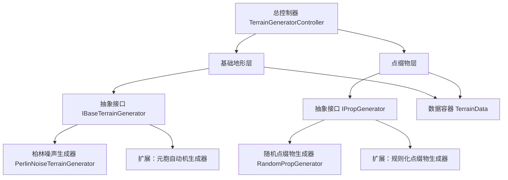

<br />
# Unity 2D 瓦片地图 + 程序化生成 全流程总结

（可直接复制到 Markdown 文档，作为开发手册/对话上下文）

## 一、核心需求总览

1. 批量分割 Sprite 并实现批量重命名
2. 使用 Rule Tile 并实现同规则下多瓦片按概率/权重随机显示
3. 基于柏林噪声生成 2D 瓦片地形
4. 在地形上生成专属点缀物（房子/告示牌/宝箱、仅水上生成船）
5. 最终目标：设计分层、高可扩展、结构清晰的地形生成系统

## 二、关键技术要点

### 1. Sprite 批量重命名

- **快捷操作**：Unity 编辑器中框选 Sprite → 按 F2 → 输入命名模板（如 `Tile_{0}`）实现批量序号重命名；
- **脚本实现**：可编写编辑器脚本，按 Sprite 坐标、自定义前缀/后缀自动重命名，适配大批量素材管理。

### 2. Rule Tile 与权重随机

#### 核心前提

原生 Rule Tile 不支持概率，需安装 Unity 官方 `2D Extras` 扩展包（地址：`https://github.com/Unity-Technologies/2d-extras.git`），使用其中的 `Weighted Rule Tile`。

#### 关键配置

- **规则匹配**：通过 8 方向邻居（Up/UpRight/Right 等）设置匹配条件：
  - `This`：邻居必须是当前 Rule Tile；
  - `Not This`：邻居必须不是当前 Rule Tile；
  - `Don't Care`：忽略该方向邻居（最常用）；
- **权重设置**：每个规则下可添加多个 Sprite，通过 `Weight` 字段设置概率（权重为相对值，如 90 和 10 对应 90%/10%）；
- **规则优先级**：特殊规则（拐角、单格连接）放前，通用规则（单格、全屏）放后，保证匹配准确性。

### 3. 柏林噪声生成地形

#### 核心原理

柏林噪声是伪随机平滑噪声算法，通过「网格梯度向量 + 平滑插值」生成 0\~1 连续随机值，模拟自然地形的平缓过渡（区别于纯随机的破碎效果）。

#### Unity 实现

- **核心 API**：`Mathf.PerlinNoise(float x, float y)`，返回 0\~1 平滑随机值；
- **关键参数**：
  - `noiseScale`：缩放值越小，地形起伏越平滑（大尺度）；值越大，细节越多（碎片化），推荐 0.01\~0.1；
  - `seed`：固定种子可生成相同地图，随机种子每次生成不同地形；
- **多层噪声叠加**：叠加低频（大尺度）+ 中频（细节）+ 高频（纹理）噪声，提升地形自然度；
- **地形映射**：将噪声值映射为地形类型：
  - 噪声值 < 0.3 → 水域；
  - 0.3 ≤ 噪声值 < 0.6 → 草地；
  - 0.6 ≤ 噪声值 < 0.85 → 山脉；
  - 0.85 ≤ 噪声值 < 0.95 → 岩石；
  - 噪声值 ≥ 0.95 → 沙滩。

### 4. 点缀物生成规则

#### 核心约束

- 船：仅在**水域（Water）** 生成；
- 房子/告示牌/宝箱：仅在**草地（Grass）/沙滩（Sand）** 生成；
- 通用控制：
  - `spawnChance`：生成概率（0\~1，如 0.01 为 1%）；
  - `minDistanceBetweenProps`：点缀物最小间距（避免扎堆）；
  - 随机旋转：生成时添加 `Quaternion.Euler(0, 0, Random.Range(0, 360))`，提升自然度；
  - 每个瓦片仅生成一个点缀物。

## 三、分层地形生成系统架构

### 架构设计原则

- 单一职责：基础地形层/点缀物层各司其职，互不依赖；
- 开闭原则：新增功能只需扩展接口，无需修改原有代码；
- 配置驱动：所有规则可视化配置，无需修改代码即可调整参数。

### 整体架构



### 核心模块说明

| 模块/类                        | 层级    | 核心功能                                    |
| --------------------------- | ----- | --------------------------------------- |
| TerrainData                 | 数据层   | 存储网格坐标-地形类型映射，作为两层唯一数据交互通道，避免重复计算       |
| IBaseTerrainGenerator       | 抽象层   | 基础地形生成接口，定义「生成基础地形」契约，所有地形生成器需实现此接口     |
| PerlinNoiseTerrainGenerator | 基础地形层 | 实现抽象接口，通过柏林噪声生成瓦片地形，将地形数据写入 TerrainData |
| IPropGenerator              | 抽象层   | 点缀物生成接口，定义「生成点缀物」契约，所有点缀物生成器需实现此接口      |
| RandomPropGenerator         | 点缀物层  | 实现抽象接口，读取 TerrainData 地形信息，按配置生成专属点缀物   |
| TerrainGeneratorController  | 控制层   | 对外唯一入口，初始化生成器、管理配置、调度两层生成逻辑，屏蔽内部细节      |
| 各类 Config 配置类               | 配置层   | 可视化管理规则（地形阈值、点缀物概率/间距），支持滑动条/枚举配置       |

### 核心枚举

```csharp
// 地形类型
public enum TerrainType { Water, Grass, Mountain, Rock, Sand }
// 点缀物类型
public enum PropType { House, Sign, Chest, Boat }
```

### 核心流程

1. 控制器初始化：创建 TerrainData 容器，实例化地形/点缀物生成器；
2. 基础地形层：生成瓦片地图，将每个网格的地形类型写入 TerrainData；
3. 点缀物层：读取 TerrainData 地形信息，按「地形匹配+概率+间距」生成点缀物；
4. 层间交互：仅通过 TerrainData 传递数据，两层完全解耦。

## 四、扩展方式（高可扩展设计）

### 1. 新增基础地形算法

- 步骤1：新建类实现 `IBaseTerrainGenerator` 接口；
- 步骤2：编写自定义地形生成逻辑（如元胞自动机、迷宫算法）；
- 步骤3：在控制器中替换地形生成器实例，无需修改原有代码。

### 2. 新增点缀物生成规则

- 步骤1：新建类实现 `IPropGenerator` 接口；
- 步骤2：编写规则化生成逻辑（如“草地中心生成城镇”）；
- 步骤3：在控制器中替换点缀物生成器实例。

### 3. 新增地形/点缀物类型

- 步骤1：在 `TerrainType`/`PropType` 枚举中添加新值；
- 步骤2：新增对应配置（如阈值、预制体、概率）；
- 步骤3：在生成器中补充“枚举-瓦片/预制体”映射逻辑。

### 4. 新增分层（如道路/河流装饰层）

- 步骤1：新增抽象接口 `ITerrainDecorationGenerator`；
- 步骤2：实现具体生成器并读取 TerrainData；
- 步骤3：在控制器中新增该层调用逻辑。

## 五、核心功能总结

1. 支持编辑器/运行时一键生成地形+点缀物，支持随机种子重生成；
2. 地形自动分水域/草地/山脉/岩石/沙滩，占比可通过阈值可视化调节；
3. 点缀物严格匹配地形生成（船仅在水上），支持概率/间距/旋转控制；
4. 架构满足工业级设计：低耦合、高扩展、配置驱动、职责清晰。

## 六、快速复用说明

- 复制所有代码模块到 Unity 项目，按注释赋值 Tilemap/瓦片/预制体；
- 调整 Config 配置类参数（无需改核心逻辑），即可适配不同地图需求；
- 新增功能时遵循“实现接口→替换实例”的扩展方式，保证原有逻辑稳定。

<br />

# 基础架构示例

以下结果基于下属要求生成：

> 我希望能够将整个地图生成流程划分为层次的结构，例如：
> 首先通过地形层生成大致的地形划分，例如草原、山地或者海洋
> 之后执行精细地形层，用来生成房屋、高墙、溪流等精细结构（不同结构最好分别构建相关的类）
> 再之后执行装饰层，生成例如花朵、船只等装饰物品
> 。。。
> 如上，整个流程按照层级顺序依次执行，同时兼顾可扩展性，通过增加、减少或修改层次能够改变最终的生成效果。

### 一、分层地形生成系统设计思路

基于你的需求，我设计了一套**可插拔、可排序、高扩展**的分层生成架构，核心是通过「生成器抽象基类 + 层级管理器」实现：

1. **抽象统一接口**：所有生成层（地形/精细结构/装饰）都实现同一套接口，保证可替换性；
2. **层级配置化**：通过列表配置生成层的执行顺序、是否启用，支持动态增删；
3. **数据共享容器**：所有层通过统一的数据容器交互，避免重复计算和数据耦合；
4. **单一职责**：每个生成层只负责自己的功能（如地形层只生成基础瓦片，房屋层只生成房屋）。

### 二、核心代码实现

#### 1. 基础定义（枚举/数据容器/抽象接口）

```csharp
using System.Collections.Generic;
using UnityEngine;

// 地形类型枚举（基础地形）
public enum TerrainType { Water, Grass, Mountain, Rock, Sand }

// 精细结构类型枚举
public enum FineStructureType { House, Wall, Stream, Sign, Chest }

// 装饰类型枚举
public enum DecorationType { Flower, Boat, Stone, Tree }

// 全局数据容器（所有生成层共享，核心交互媒介）
[System.Serializable]
public class MapGeneratorData
{
    // 基础地形数据：坐标 → 地形类型
    public Dictionary<Vector2Int, TerrainType> baseTerrainData = new Dictionary<Vector2Int, TerrainType>();
    
    // 精细结构数据：坐标 → 精细结构类型
    public Dictionary<Vector2Int, FineStructureType> fineStructureData = new Dictionary<Vector2Int, FineStructureType>();
    
    // 装饰数据：坐标 → 装饰类型
    public Dictionary<Vector2Int, DecorationType> decorationData = new Dictionary<Vector2Int, DecorationType>();
    
    // 地图基础配置
    public int mapWidth = 100;
    public int mapHeight = 100;
    public int seed; // 全局种子，保证所有层生成结果一致
    
    // 清空数据（重新生成时调用）
    public void Clear()
    {
        baseTerrainData.Clear();
        fineStructureData.Clear();
        decorationData.Clear();
    }
}

// 所有生成层的抽象基类（核心接口）
public abstract class MapGeneratorLayer : ScriptableObject
{
    [Header("基础配置")]
    public string layerName; // 层名称（便于管理）
    public bool isEnabled = true; // 是否启用该层
    
    // 核心生成方法（所有层必须实现）
    public abstract void Generate(MapGeneratorData data);
    
    // 可选：层初始化（如预加载资源）
    public virtual void Initialize(MapGeneratorData data) { }
    
    // 可选：层清理（如销毁临时对象）
    public virtual void Cleanup() { }
}
```

#### 2. 具体生成层实现（示例）

##### （1）基础地形层（柏林噪声生成）

```csharp
using UnityEngine;

[CreateAssetMenu(fileName = "BaseTerrainLayer", menuName = "MapGenerator/Layers/BaseTerrainLayer")]
public class BaseTerrainLayer : MapGeneratorLayer
{
    [Header("柏林噪声配置")]
    public float noiseScale = 0.02f;
    [Header("地形阈值（0~1）")]
    public float waterThreshold = 0.3f;
    public float grassThreshold = 0.6f;
    public float mountainThreshold = 0.85f;
    public float rockThreshold = 0.95f;

    public override void Generate(MapGeneratorData data)
    {
        if (!isEnabled) return;
        
        // 固定种子，保证生成结果可复现
        Random.InitState(data.seed);
        float offsetX = Random.Range(0f, 100000f);
        float offsetY = Random.Range(0f, 100000f);
        
        // 遍历所有网格生成基础地形
        for (int x = 0; x < data.mapWidth; x++)
        {
            for (int y = 0; y < data.mapHeight; y++)
            {
                Vector2Int pos = new Vector2Int(x, y);
                // 计算柏林噪声值
                float noiseValue = Mathf.PerlinNoise(
                    (x + offsetX) * noiseScale, 
                    (y + offsetY) * noiseScale
                );
                
                // 映射为地形类型
                TerrainType terrainType = GetTerrainTypeByNoise(noiseValue);
                data.baseTerrainData[pos] = terrainType;
            }
        }
        
        Debug.Log($"[{layerName}] 基础地形生成完成，共生成 {data.baseTerrainData.Count} 个网格");
    }

    // 噪声值 → 地形类型映射
    private TerrainType GetTerrainTypeByNoise(float noiseValue)
    {
        if (noiseValue < waterThreshold) return TerrainType.Water;
        if (noiseValue < grassThreshold) return TerrainType.Grass;
        if (noiseValue < mountainThreshold) return TerrainType.Mountain;
        if (noiseValue < rockThreshold) return TerrainType.Rock;
        return TerrainType.Sand;
    }
}
```

##### （2）精细结构层-房屋生成

```csharp
using UnityEngine;
using System.Collections.Generic;

[CreateAssetMenu(fileName = "HouseStructureLayer", menuName = "MapGenerator/Layers/FineStructure/HouseLayer")]
public class HouseStructureLayer : MapGeneratorLayer
{
    [Header("房屋生成配置")]
    public float spawnChance = 0.01f; // 生成概率（1%）
    public float minDistance = 5f; // 房屋最小间距
    public List<TerrainType> allowedTerrains = new List<TerrainType>() { TerrainType.Grass, TerrainType.Sand }; // 允许生成的地形

    public override void Generate(MapGeneratorData data)
    {
        if (!isEnabled) return;
        
        Random.InitState(data.seed);
        List<Vector2Int> spawnedHouses = new List<Vector2Int>();
        
        // 遍历所有网格
        foreach (var pos in data.baseTerrainData.Keys)
        {
            // 检查地形是否允许
            if (!allowedTerrains.Contains(data.baseTerrainData[pos])) continue;
            
            // 随机概率
            if (Random.value > spawnChance) continue;
            
            // 检查间距
            bool isTooClose = false;
            foreach (var housePos in spawnedHouses)
            {
                if (Vector2.Distance(pos, housePos) < minDistance)
                {
                    isTooClose = true;
                    break;
                }
            }
            if (isTooClose) continue;
            
            // 生成房屋
            data.fineStructureData[pos] = FineStructureType.House;
            spawnedHouses.Add(pos);
        }
        
        Debug.Log($"[{layerName}] 房屋生成完成，共生成 {spawnedHouses.Count} 栋房屋");
    }
}
```

##### （3）装饰层-船只生成

```csharp
using UnityEngine;

[CreateAssetMenu(fileName = "BoatDecorationLayer", menuName = "MapGenerator/Layers/Decoration/BoatLayer")]
public class BoatDecorationLayer : MapGeneratorLayer
{
    [Header("船只生成配置")]
    public float spawnChance = 0.005f; // 生成概率（0.5%）
    public float minDistance = 8f; // 船只最小间距

    public override void Generate(MapGeneratorData data)
    {
        if (!isEnabled) return;
        
        Random.InitState(data.seed);
        List<Vector2Int> spawnedBoats = new List<Vector2Int>();
        
        // 遍历所有网格
        foreach (var pos in data.baseTerrainData.Keys)
        {
            // 仅在水域生成
            if (data.baseTerrainData[pos] != TerrainType.Water) continue;
            
            // 随机概率
            if (Random.value > spawnChance) continue;
            
            // 检查间距
            bool isTooClose = false;
            foreach (var boatPos in spawnedBoats)
            {
                if (Vector2.Distance(pos, boatPos) < minDistance)
                {
                    isTooClose = true;
                    break;
                }
            }
            if (isTooClose) continue;
            
            // 生成船只
            data.decorationData[pos] = DecorationType.Boat;
            spawnedBoats.Add(pos);
        }
        
        Debug.Log($"[{layerName}] 船只生成完成，共生成 {spawnedBoats.Count} 艘船只");
    }
}
```

#### 3. 全局生成控制器（核心调度器）

```csharp
using UnityEngine;
using System.Collections.Generic;

public class MapGeneratorController : MonoBehaviour
{
    [Header("全局配置")]
    public int mapWidth = 100;
    public int mapHeight = 100;
    public int seed = 0;
    public bool useRandomSeed = true; // 是否使用随机种子
    
    [Header("生成层配置（执行顺序 = 列表顺序）")]
    public List<MapGeneratorLayer> generatorLayers; // 生成层列表（可在Inspector拖拽调整顺序）
    
    // 全局数据容器
    private MapGeneratorData mapData;

    private void Awake()
    {
        // 初始化数据容器
        mapData = new MapGeneratorData()
        {
            mapWidth = mapWidth,
            mapHeight = mapHeight
        };
    }

    // 一键生成地图（对外暴露的唯一入口）
    [ContextMenu("Generate Map")]
    public void GenerateMap()
    {
        // 1. 重置数据
        mapData.Clear();
        
        // 2. 设置种子
        mapData.seed = useRandomSeed ? Random.Range(0, int.MaxValue) : seed;
        
        // 3. 按顺序执行所有生成层
        foreach (var layer in generatorLayers)
        {
            if (layer == null) continue;
            
            // 初始化层
            layer.Initialize(mapData);
            
            // 执行生成
            layer.Generate(mapData);
            
            // 清理层临时数据
            layer.Cleanup();
        }
        
        // 4. 可视化生成结果（瓦片/物体实例化，根据项目需求实现）
        VisualizeMap();
        
        Debug.Log("地图生成完成！");
    }

    // 可视化生成结果（核心逻辑：根据数据容器生成瓦片/物体）
    private void VisualizeMap()
    {
        // 示例：遍历基础地形数据生成瓦片
        // 实际项目中需替换为你的Tilemap实例化逻辑
        foreach (var pos in mapData.baseTerrainData.Keys)
        {
            TerrainType terrainType = mapData.baseTerrainData[pos];
            // 1. 生成对应地形的瓦片（Rule Tile）
            // 2. 检查是否有精细结构，生成对应物体（如房屋预制体）
            // 3. 检查是否有装饰，生成对应物体（如船只预制体）
        }
    }

    // 清空地图（用于重新生成）
    [ContextMenu("Clear Map")]
    public void ClearMap()
    {
        mapData.Clear();
        // 销毁所有生成的瓦片/物体
        // ...
        Debug.Log("地图已清空");
    }
}
```

### 三、使用与扩展指南

#### 1. 基础使用步骤

1. **创建生成层**：在Project窗口右键 → `MapGenerator/Layers` → 选择对应层类型（如基础地形层、房屋层、船只层）；
2. **配置生成层**：在Inspector中调整各层参数（如生成概率、间距、允许的地形）；
3. **配置控制器**：
   - 在场景中创建空物体，挂载`MapGeneratorController`；
   - 将创建的生成层拖拽到`generatorLayers`列表中（列表顺序 = 执行顺序）；
   - 调整全局配置（地图尺寸、种子等）；
4. **生成地图**：点击控制器的`Generate Map`按钮，一键生成。

#### 2. 扩展新生成层（核心优势）

如需新增「高墙层」「溪流层」「花朵层」等，只需：

1. 新建类继承`MapGeneratorLayer`；
2. 实现`Generate`方法（编写自定义生成逻辑）；
3. 添加`CreateAssetMenu`特性，允许在编辑器创建该层；
4. 将新层拖拽到控制器的`generatorLayers`列表中，调整执行顺序即可。

**示例：新增高墙层**

```csharp
[CreateAssetMenu(fileName = "WallStructureLayer", menuName = "MapGenerator/Layers/FineStructure/WallLayer")]
public class WallStructureLayer : MapGeneratorLayer
{
    [Header("高墙生成配置")]
    public float spawnChance = 0.02f;
    public List<TerrainType> allowedTerrains = new List<TerrainType>() { TerrainType.Mountain, TerrainType.Rock };

    public override void Generate(MapGeneratorData data)
    {
        if (!isEnabled) return;
        
        Random.InitState(data.seed);
        foreach (var pos in data.baseTerrainData.Keys)
        {
            if (!allowedTerrains.Contains(data.baseTerrainData[pos])) continue;
            if (Random.value > spawnChance) continue;
            
            data.fineStructureData[pos] = FineStructureType.Wall;
        }
    }
}
```

### 四、架构优势

1. **高可扩展**：新增/删除/修改层无需改动核心逻辑，只需调整列表或新增类；
2. **可排序**：通过拖拽列表调整层的执行顺序（如先生成地形，再生成房屋，最后生成装饰）；
3. **可配置**：每个层的参数独立配置，支持启用/禁用，灵活调整生成效果；
4. **低耦合**：所有层通过`MapGeneratorData`交互，层与层之间无直接依赖；
5. **可复现**：全局种子保证同一套配置生成完全相同的地图。

### 总结

1. 核心架构：「抽象基类 + 具体生成层 + 全局控制器 + 共享数据容器」，实现分层解耦；
2. 扩展方式：新增层只需继承`MapGeneratorLayer`并实现`Generate`方法，拖拽到控制器列表即可；
3. 核心优势：支持动态调整层的执行顺序、启用/禁用状态，参数可视化配置，完全满足“增删改层次改变生成效果”的需求。

你可以基于这套架构，继续实现「溪流层」「花朵层」「树木层」等，所有层都遵循同一套逻辑，保证系统的一致性和可维护性。

# 地形平滑处理解决方案

### 一、问题分析与解决方案思路

你遇到的「边缘太碎导致 Rule Tile 匹配失败」问题，核心原因是**柏林噪声生成的地形像素级跳变过多**，Rule Tile 无法识别连续的地形边缘。解决方案是在层级架构中新增「地形平滑层」，放在**基础地形层之后、精细结构层之前**执行，通过以下两种核心逻辑优化地形：

1. **邻域投票平滑**：对每个网格，统计周围8邻域的地形类型占比，将当前网格替换为占比最高的类型（减少孤立碎块）；
2. **连通域过滤**：删除面积过小的孤立地形块（如1-2格的水域/草地碎块），保留连续的大区域；
3. **噪声模糊（可选）**：在生成基础地形前，对柏林噪声值进行高斯模糊，从源头减少跳变。

### 二、扩展实现：新增地形平滑层

#### 1. 第一步：扩展抽象层（无需修改原有接口）

地形平滑层本质是对 `MapGeneratorData` 中的基础地形数据进行修改，因此直接继承 `MapGeneratorLayer` 即可，无需改动原有抽象接口，完全符合「开闭原则」。

#### 2. 第二步：实现核心平滑层（两种核心算法）

##### （1）邻域投票平滑层（基础版，优先推荐）

```csharp
using UnityEngine;
using System.Collections.Generic;

// 右键可创建该层：MapGenerator/Layers/Smoothing/NeighborhoodSmoothingLayer
[CreateAssetMenu(fileName = "NeighborhoodSmoothingLayer", menuName = "MapGenerator/Layers/Smoothing/NeighborhoodSmoothingLayer")]
public class NeighborhoodSmoothingLayer : MapGeneratorLayer
{
    [Header("平滑配置")]
    public int smoothIterations = 2; // 平滑迭代次数（次数越多越平滑，建议1-3）
    public int neighborhoodRadius = 1; // 邻域半径（1=8邻域，2=24邻域）
    [Tooltip("是否保留主要地形类型的优先级（如水域优先于草地）")]
    public bool useTerrainPriority = true;
    [Tooltip("地形优先级（从上到下优先级越高）")]
    public List<TerrainType> terrainPriority = new List<TerrainType>() 
    { 
        TerrainType.Water, TerrainType.Mountain, TerrainType.Rock, TerrainType.Grass, TerrainType.Sand 
    };

    public override void Generate(MapGeneratorData data)
    {
        if (!isEnabled) return;

        Debug.Log($"[{layerName}] 开始地形平滑，迭代次数：{smoothIterations}");
        
        // 多次迭代平滑（迭代越多越平滑）
        for (int i = 0; i < smoothIterations; i++)
        {
            // 必须基于「上一轮的快照」修改，避免实时修改影响计算
            Dictionary<Vector2Int, TerrainType> newTerrainData = new Dictionary<Vector2Int, TerrainType>(data.baseTerrainData);
            
            // 遍历所有网格
            foreach (var pos in data.baseTerrainData.Keys)
            {
                // 统计邻域地形类型
                Dictionary<TerrainType, int> terrainCount = new Dictionary<TerrainType, int>();
                // 初始化所有地形类型的计数为0
                foreach (TerrainType type in System.Enum.GetValues(typeof(TerrainType)))
                {
                    terrainCount[type] = 0;
                }

                // 遍历邻域网格（半径范围内）
                for (int xOffset = -neighborhoodRadius; xOffset <= neighborhoodRadius; xOffset++)
                {
                    for (int yOffset = -neighborhoodRadius; yOffset <= neighborhoodRadius; yOffset++)
                    {
                        // 跳过自身
                        if (xOffset == 0 && yOffset == 0) continue;
                        
                        Vector2Int neighborPos = new Vector2Int(pos.x + xOffset, pos.y + yOffset);
                        // 检查邻域是否在地图范围内
                        if (data.baseTerrainData.ContainsKey(neighborPos))
                        {
                            TerrainType neighborType = data.baseTerrainData[neighborPos];
                            terrainCount[neighborType]++;
                        }
                    }
                }

                // 找到邻域中占比最高的地形类型
                TerrainType mostCommonType = GetMostCommonTerrain(terrainCount);
                // 更新当前网格的地形类型
                newTerrainData[pos] = mostCommonType;
            }

            // 将平滑后的结果赋值回数据容器
            data.baseTerrainData = newTerrainData;
        }
        
        Debug.Log($"[{layerName}] 地形平滑完成，共处理 {data.baseTerrainData.Count} 个网格");
    }

    // 找到占比最高的地形类型（支持优先级）
    private TerrainType GetMostCommonTerrain(Dictionary<TerrainType, int> terrainCount)
    {
        int maxCount = -1;
        TerrainType result = TerrainType.Grass;

        if (useTerrainPriority)
        {
            // 按优先级遍历，优先选择高优先级且计数最高的类型
            foreach (TerrainType type in terrainPriority)
            {
                if (terrainCount[type] > maxCount)
                {
                    maxCount = terrainCount[type];
                    result = type;
                }
            }
        }
        else
        {
            // 无优先级，直接选计数最高的类型
            foreach (var kvp in terrainCount)
            {
                if (kvp.Value > maxCount)
                {
                    maxCount = kvp.Value;
                    result = kvp.Key;
                }
            }
        }

        return result;
    }
}
```

##### （2）连通域过滤层（进阶版，清理孤立碎块）

```csharp
using UnityEngine;
using System.Collections.Generic;

// 右键可创建该层：MapGenerator/Layers/Smoothing/ConnectedComponentFilterLayer
[CreateAssetMenu(fileName = "ConnectedComponentFilterLayer", menuName = "MapGenerator/Layers/Smoothing/ConnectedComponentFilterLayer")]
public class ConnectedComponentFilterLayer : MapGeneratorLayer
{
    [Header("连通域过滤配置")]
    public int minComponentSize = 5; // 最小连通域面积（小于该值的碎块会被清理）
    [Tooltip("需要过滤的地形类型（如只清理小水域/小草地碎块）")]
    public List<TerrainType> filteredTerrainTypes = new List<TerrainType>() 
    { 
        TerrainType.Water, TerrainType.Grass, TerrainType.Sand 
    };
    [Tooltip("碎块替换为哪种地形（如小水域碎块替换为草地）")]
    public TerrainType replaceWith = TerrainType.Grass;

    public override void Generate(MapGeneratorData data)
    {
        if (!isEnabled) return;

        Debug.Log($"[{layerName}] 开始连通域过滤，最小面积：{minComponentSize}");
        
        // 记录已检查的网格
        HashSet<Vector2Int> checkedPositions = new HashSet<Vector2Int>();
        // 存储需要替换的碎块网格
        List<Vector2Int> blocksToReplace = new List<Vector2Int>();

        // 遍历所有网格
        foreach (var pos in data.baseTerrainData.Keys)
        {
            if (checkedPositions.Contains(pos)) continue;
            
            TerrainType currentType = data.baseTerrainData[pos];
            // 只处理需要过滤的地形类型
            if (!filteredTerrainTypes.Contains(currentType))
            {
                checkedPositions.Add(pos);
                continue;
            }

            // 查找当前连通域的所有网格（BFS广度优先搜索）
            List<Vector2Int> component = new List<Vector2Int>();
            Queue<Vector2Int> queue = new Queue<Vector2Int>();
            queue.Enqueue(pos);
            checkedPositions.Add(pos);

            while (queue.Count > 0)
            {
                Vector2Int currentPos = queue.Dequeue();
                component.Add(currentPos);

                // 遍历8邻域
                int[] dx = { -1, 0, 1, -1, 1, -1, 0, 1 };
                int[] dy = { -1, -1, -1, 0, 0, 1, 1, 1 };
                for (int i = 0; i < 8; i++)
                {
                    Vector2Int neighborPos = new Vector2Int(currentPos.x + dx[i], currentPos.y + dy[i]);
                    if (data.baseTerrainData.ContainsKey(neighborPos) 
                        && !checkedPositions.Contains(neighborPos)
                        && data.baseTerrainData[neighborPos] == currentType)
                    {
                        checkedPositions.Add(neighborPos);
                        queue.Enqueue(neighborPos);
                    }
                }
            }

            // 如果连通域面积过小，标记为需要替换
            if (component.Count < minComponentSize)
            {
                blocksToReplace.AddRange(component);
            }
        }

        // 替换所有碎块网格
        foreach (var pos in blocksToReplace)
        {
            data.baseTerrainData[pos] = replaceWith;
        }
        
        Debug.Log($"[{layerName}] 连通域过滤完成，共清理 {blocksToReplace.Count} 个碎块网格");
    }
}
```

##### （3）噪声模糊层（可选，从源头优化）

如果想从柏林噪声生成阶段就减少跳变，可扩展基础地形层，在计算噪声值时增加高斯模糊：

```csharp
// 新增方法：高斯模糊噪声值
private float BlurPerlinNoise(float x, float y, float noiseScale, float blurRadius = 1)
{
    float total = 0;
    float weightTotal = 0;
    
    // 遍历模糊半径内的邻域
    for (int dx = -1; dx <= 1; dx++)
    {
        for (int dy = -1; dy <= 1; dy++)
        {
            // 高斯权重（中心权重最高，边缘最低）
            float weight = Mathf.Exp(-(dx*dx + dy*dy) / (2 * blurRadius * blurRadius));
            total += Mathf.PerlinNoise((x + dx) * noiseScale, (y + dy) * noiseScale) * weight;
            weightTotal += weight;
        }
    }
    
    return total / weightTotal;
}

// 在BaseTerrainLayer的Generate方法中替换原噪声计算：
// float noiseValue = Mathf.PerlinNoise((x + offsetX) * noiseScale, (y + offsetY) * noiseScale);
// 改为：
float noiseValue = BlurPerlinNoise(x + offsetX, y + offsetY, noiseScale);
```

### 三、层级执行顺序调整

将新增的平滑层插入到层级列表中，**正确的执行顺序**应为：

1. 基础地形层（柏林噪声生成原始地形）
2. 噪声模糊层（可选，源头优化）
3. 邻域投票平滑层（核心，减少边缘跳变）
4. 连通域过滤层（进阶，清理孤立碎块）
5. 精细结构层（房屋/高墙/溪流）
6. 装饰层（花朵/船只）

在 `MapGeneratorController` 的 `generatorLayers` 列表中，按上述顺序拖拽层即可。

### 四、参数调优建议

| 参数                 | 作用       | 推荐值           |
| ------------------ | -------- | ------------- |
| smoothIterations   | 邻域投票迭代次数 | 1-3（次数越多越平滑）  |
| neighborhoodRadius | 邻域投票半径   | 1（8邻域，足够用）    |
| minComponentSize   | 最小连通域面积  | 3-8（根据地图尺寸调整） |
| blurRadius         | 噪声模糊半径   | 1（避免过度模糊丢失细节） |

### 五、Rule Tile 匹配优化补充

除了地形平滑，还可以对 Rule Tile 本身做小调整，进一步提升匹配成功率：

1. **放宽规则条件**：将边缘规则的「This」改为「Don't Care」，只保留核心连接规则；
2. **增加过渡瓦片**：为地形边缘设计专门的过渡 Rule Tile（如水-草过渡、草-山过渡）；
3. **降低规则优先级**：将通用规则（如单格）的优先级调低，优先匹配边缘规则。

### 总结

1. 扩展方式：新增平滑层只需继承 `MapGeneratorLayer`，实现 `Generate` 方法，无需修改原有代码，符合开闭原则；
2. 核心逻辑：通过「邻域投票」减少像素级跳变，通过「连通域过滤」清理孤立碎块，从根本上解决 Rule Tile 匹配失败问题；
3. 执行顺序：平滑层必须放在基础地形层之后、精细结构层之前，保证后续层级基于平滑后的地形生成。

你可以先尝试「邻域投票平滑层」（基础版），如果仍有孤立碎块，再叠加「连通域过滤层」，两种层组合使用效果最佳。

# 地图生成分层架构优化--tileMap管理

### 一、核心结论

**强烈建议为不同层级的地图对象使用独立的 Tilemap**，这是 Unity 2D 瓦片地图开发的最佳实践。独立 Tilemap 不仅能解决渲染层级、碰撞体、编辑维护的问题，还能完美契合你分层生成的架构设计，让各层逻辑彻底解耦。

### 二、为什么要分多个 Tilemap？

#### 1. 核心优势（对应你的分层生成需求）

| 优势维度      | 单 Tilemap 问题                 | 多 Tilemap 解决方案                                          |
| --------- | ---------------------------- | ------------------------------------------------------- |
| **渲染层级**  | 所有对象挤在同一层，装饰物会被地形遮挡，无法控制显示顺序 | 按「基础地形→精细结构→装饰物」设置 Tilemap 的 `Order in Layer`，精准控制显示优先级 |
| **逻辑解耦**  | 生成/修改某一层会影响其他层，调试困难          | 各层独立生成、独立清理，完全契合你「分层生成」的架构，某层出错不影响整体                    |
| **性能优化**  | 批量操作时需遍历所有瓦片，效率低             | 仅操作目标层的 Tilemap，生成/销毁更高效                                |
| **编辑维护**  | 不同类型瓦片混在一起，难以单独调整/隐藏         | 可单独隐藏/显示某一层（如隐藏装饰层调试地形），编辑更灵活                           |
| **碰撞体管理** | 所有对象共用一套碰撞体，无法区分地形/装饰        | 可为基础地形层加碰撞体，精细结构层加触发器，装饰层无碰撞体                           |

#### 2. 贴合你的分层架构

你的生成流程是「基础地形→精细地形→装饰物」，对应独立 Tilemap 后：

- 每一层生成器只操作自己的 Tilemap，无需关心其他层；
- 数据容器只需记录坐标和类型，可视化时按层分发到对应 Tilemap；
- 新增/删除层只需新增/删除 Tilemap，完全符合「开闭原则」。

### 三、多 Tilemap 设计与实现方案

#### 1. Tilemap 分层规划（适配你的生成层级）

建议按以下结构创建 Tilemap 层级（在 Unity 场景中创建空物体作为父节点，下挂多个 Tilemap）：

```
MapRoot（空物体）
├─ BaseTerrainTilemap（基础地形：水/草/山/岩/沙）
├─ FineStructureTilemap（精细地形：房屋/高墙/溪流）
└─ DecorationTilemap（装饰物：花朵/船只/宝箱）
```

**关键设置**：

- 在 Inspector 中为每个 Tilemap 设置 `Order in Layer`（数值越大越靠上）：
  - BaseTerrainTilemap：0（最底层）
  - FineStructureTilemap：10（中间层）
  - DecorationTilemap：20（最上层）
- 为需要碰撞的 Tilemap（如 BaseTerrainTilemap）添加 `Tilemap Collider 2D`，精细结构层可加 `Composite Collider 2D`，装饰层无需碰撞体。

#### 2. 代码实现（适配多 Tilemap 分层绘制）

##### （1）扩展数据容器（记录各层类型，无需修改核心结构）

```csharp
// 原有数据容器无需大幅修改，只需新增层类型标记（或保持原有字典）
public class MapGeneratorData
{
    // 基础地形数据（对应 BaseTerrainTilemap）
    public Dictionary<Vector2Int, TerrainType> baseTerrainData = new Dictionary<Vector2Int, TerrainType>();
    // 精细结构数据（对应 FineStructureTilemap）
    public Dictionary<Vector2Int, FineStructureType> fineStructureData = new Dictionary<Vector2Int, FineStructureType>();
    // 装饰数据（对应 DecorationTilemap）
    public Dictionary<Vector2Int, DecorationType> decorationData = new Dictionary<Vector2Int, DecorationType>();

    public int mapWidth = 100;
    public int mapHeight = 100;
    public int seed;
    public int tilemapZLayer = 0; // 所有 Tilemap 共用 Z 层（平面场景）
}
```

##### （2）可视化层（封装多 Tilemap 绘制逻辑）

创建专门的 `MapVisualizer` 类，负责将各层数据分发到对应 Tilemap，与生成逻辑解耦：

```csharp
using UnityEngine;
using UnityEngine.Tilemaps;

public class MapVisualizer : MonoBehaviour
{
    [Header("Tilemap 引用（按层级赋值）")]
    public Tilemap baseTerrainTilemap;    // 基础地形层
    public Tilemap fineStructureTilemap;  // 精细结构层
    public Tilemap decorationTilemap;     // 装饰层

    [Header("瓦片配置")]
    // 基础地形瓦片
    public RuleTile waterTile;
    public RuleTile grassTile;
    public RuleTile mountainTile;
    public RuleTile rockTile;
    public RuleTile sandTile;

    // 精细结构瓦片
    public Tile houseTile;
    public Tile wallTile;
    public Tile streamTile;

    // 装饰瓦片
    public Tile boatTile;
    public Tile flowerTile;
    public Tile chestTile;

    // 坐标转换工具方法（统一处理 2D→3D 转换）
    private Vector3Int ConvertToTilemapPos(Vector2Int pos2D, int zLayer)
    {
        // 根据 Tilemap 配置调整 Y 轴方向（若 Tilemap 翻转则取反）
        return new Vector3Int(pos2D.x, pos2D.y, zLayer);
    }

    // 一键绘制所有层
    public void DrawAllLayers(MapGeneratorData data)
    {
        // 先清空所有 Tilemap
        ClearAllTilemaps();
        
        // 绘制基础地形层
        DrawBaseTerrainLayer(data);
        // 绘制精细结构层
        DrawFineStructureLayer(data);
        // 绘制装饰层
        DrawDecorationLayer(data);
        
        Debug.Log("所有层级绘制完成！");
    }

    // 绘制基础地形层
    private void DrawBaseTerrainLayer(MapGeneratorData data)
    {
        foreach (var kvp in data.baseTerrainData)
        {
            Vector2Int pos2D = kvp.Key;
            TerrainType type = kvp.Value;
            Vector3Int pos3D = ConvertToTilemapPos(pos2D, data.tilemapZLayer);

            switch (type)
            {
                case TerrainType.Water:
                    baseTerrainTilemap.SetTile(pos3D, waterTile);
                    break;
                case TerrainType.Grass:
                    baseTerrainTilemap.SetTile(pos3D, grassTile);
                    break;
                case TerrainType.Mountain:
                    baseTerrainTilemap.SetTile(pos3D, mountainTile);
                    break;
                case TerrainType.Rock:
                    baseTerrainTilemap.SetTile(pos3D, rockTile);
                    break;
                case TerrainType.Sand:
                    baseTerrainTilemap.SetTile(pos3D, sandTile);
                    break;
            }
        }
    }

    // 绘制精细结构层
    private void DrawFineStructureLayer(MapGeneratorData data)
    {
        foreach (var kvp in data.fineStructureData)
        {
            Vector2Int pos2D = kvp.Key;
            FineStructureType type = kvp.Value;
            Vector3Int pos3D = ConvertToTilemapPos(pos2D, data.tilemapZLayer);

            switch (type)
            {
                case FineStructureType.House:
                    fineStructureTilemap.SetTile(pos3D, houseTile);
                    break;
                case FineStructureType.Wall:
                    fineStructureTilemap.SetTile(pos3D, wallTile);
                    break;
                case FineStructureType.Stream:
                    fineStructureTilemap.SetTile(pos3D, streamTile);
                    break;
            }
        }
    }

    // 绘制装饰层
    private void DrawDecorationLayer(MapGeneratorData data)
    {
        foreach (var kvp in data.decorationData)
        {
            Vector2Int pos2D = kvp.Key;
            DecorationType type = kvp.Value;
            Vector3Int pos3D = ConvertToTilemapPos(pos2D, data.tilemapZLayer);

            switch (type)
            {
                case DecorationType.Boat:
                    decorationTilemap.SetTile(pos3D, boatTile);
                    break;
                case DecorationType.Flower:
                    decorationTilemap.SetTile(pos3D, flowerTile);
                    break;
                case DecorationType.Chest:
                    decorationTilemap.SetTile(pos3D, chestTile);
                    break;
            }
        }
    }

    // 清空所有 Tilemap
    public void ClearAllTilemaps()
    {
        baseTerrainTilemap.ClearAllTiles();
        fineStructureTilemap.ClearAllTiles();
        decorationTilemap.ClearAllTiles();
    }
}
```

##### （3）生成控制器适配（调用可视化层）

修改 `MapGeneratorController` 的 `VisualizeMap` 方法，调用封装好的可视化逻辑：

```csharp
public class MapGeneratorController : MonoBehaviour
{
    [Header("可视化组件")]
    public MapVisualizer mapVisualizer; // 拖拽挂载了MapVisualizer的物体

    // 原有生成逻辑不变，修改VisualizeMap方法
    private void VisualizeMap()
    {
        // 调用可视化层绘制所有层
        mapVisualizer.DrawAllLayers(mapData);
    }
}
```

### 三、进阶优化（可选）

#### 1. 动态加载 Tilemap

如果地图尺寸很大，可将 Tilemap 按区块拆分（如 32x32 区块），只加载视野内的 Tilemap 区块，提升性能。

#### 2. 混合使用 Tilemap 和 GameObject

对于不规则的装饰物（如3D模型、非瓦片的2D精灵），可在装饰层不使用 Tilemap，而是直接实例化 GameObject：

```csharp
// 装饰层生成时实例化GameObject（替代Tilemap）
public GameObject boatPrefab;
public void SpawnDecorationGameObjects(MapGeneratorData data)
{
    foreach (var kvp in data.decorationData)
    {
        if (kvp.Value == DecorationType.Boat)
        {
            Vector2Int pos2D = kvp.Key;
            // 转换为世界坐标（根据Tilemap的单元格大小调整）
            Vector3 worldPos = decorationTilemap.CellToWorld(ConvertToTilemapPos(pos2D, data.tilemapZLayer));
            // 实例化船只并随机旋转
            Instantiate(boatPrefab, worldPos, Quaternion.Euler(0, 0, Random.Range(0, 360)));
        }
    }
}
```

#### 3. 层叠遮罩/混合

为不同 Tilemap 设置不同的 `Color` 或 `Alpha`，实现层叠效果（如精细结构层半透明、装饰层高亮）。

### 总结

1. **核心建议**：为基础地形、精细地形、装饰物分别创建独立 Tilemap，这是契合你分层生成架构的最佳实践；
2. **关键配置**：通过 `Order in Layer` 控制渲染层级，为不同 Tilemap 配置独立的碰撞体/触发器；
3. **代码适配**：封装可视化层统一处理多 Tilemap 绘制，生成层只负责数据生成，与绘制逻辑解耦，符合单一职责原则。

这种设计不仅能解决渲染遮挡、编辑维护的问题，还能让你的分层生成系统更灵活——比如单独重新生成装饰层，而无需重新生成整个地形，大幅提升开发和调试效率。

<br />

# 总结

<br />

\# Unity 2D 瓦片地图程序化生成系统 - 开发备忘录 ## 一、核心架构设计 ### 1. 分层生成架构（核心原则：解耦、可扩展、配置驱动） \`\`\`mermaid graph TD     A\[MapGeneratorController 总控制器] --> B\[生成层抽象基类 MapGeneratorLayer]     B --> B1\[基础地形层 BaseTerrainLayer]     B --> B2\[地形平滑层（邻域投票/连通域过滤）]     B --> B3\[精细结构层（房屋/高墙/溪流）]     B --> B4\[装饰层（花朵/船只/宝箱）]     A --> C\[MapVisualizer 可视化层]     A --> D\[MapGeneratorData 数据容器]     C --> E\[多Tilemap绘制（基础/精细/装饰）] \`\`\`  ### 2. 核心类职责 | 类名                  | 核心职责                                                                 | |-----------------------|--------------------------------------------------------------------------| | MapGeneratorLayer     | 所有生成层的抽象基类，定义 Generate/Initialize/Cleanup 接口              | | MapGeneratorData      | 全局数据容器，存储各层坐标-类型映射，层间唯一交互媒介                     | | MapGeneratorController| 对外唯一入口，按顺序调度各生成层，控制生成流程                           | | MapVisualizer         | 封装多Tilemap绘制逻辑，提供默认瓦片兜底，处理坐标转换                     |  ## 二、核心功能实现 ### 1. 基础地形生成（柏林噪声+多频率叠加） #### 核心参数与算法 - \*\*基础噪声配置\*\*：\`baseNoiseScale=0.01\~0.03\`（控制地形平滑度）、随机种子（保证可复现） - \*\*多频率叠加（FBM分形布朗运动）\*\*：   - \`octaves=3\~5\`（叠加层数，3层最佳）   - \`frequencyLacunarity=2\`（频率倍率，每层×2）   - \`amplitudeGain=0.5\`（振幅倍率，每层×0.5）   - 必须开启 \`normalizeResult=true\`（归一化到0\~1） - \*\*地形类型映射\*\*：   \`\`\`   噪声值 < 0.3 → 水域 | 0.3 ≤ 值 < 0.6 → 草地 | 0.6 ≤ 值 < 0.85 → 山脉   0.85 ≤ 值 < 0.95 → 岩石 | 值 ≥ 0.95 → 沙滩   \`\`\`  #### 关键优化 - 噪声扭曲（可选）：\`warpScale=0.01\`、\`warpStrength=10\`，增强地形自然度 - 平滑层处理：叠加噪声后适当调大 \`smoothIterations=2\~3\`  ### 2. 地形平滑层（解决Rule Tile匹配失败） #### （1）邻域投票平滑层 - \`smoothIterations=1\~3\`（迭代次数，越多越平滑） - \`neighborhoodRadius=1\`（8邻域，基础款） - 支持地形优先级配置，避免关键地形被覆盖  #### （2）连通域过滤层 - \`minComponentSize=3\~8\`（最小连通域面积，清理孤立碎块） - 可指定过滤地形类型（如水/草/沙），碎块替换为主要地形  ### 3. 精细结构+装饰层生成规则 #### 核心约束 - 水域专属：船只（生成概率0.005，最小间距8） - 草地/沙滩专属：房屋（0.01/5）、告示牌、宝箱 - 通用规则：随机旋转、单瓦片仅生成一个、最小间距避免扎堆  #### 扩展方式 新增结构/装饰类型只需： 1. 扩展枚举（FineStructureType/DecorationType） 2. 实现对应生成层（继承MapGeneratorLayer） 3. 配置到控制器列表，调整执行顺序  ### 4. 多Tilemap绘制（最佳实践） #### Tilemap分层规划 | Tilemap名称          | Order in Layer | 碰撞体配置               | 用途               | |----------------------|----------------|--------------------------|--------------------| | BaseTerrainTilemap   | 0              | Tilemap Collider 2D      | 基础地形（水/草/山）| | FineStructureTilemap | 10             | Composite Collider 2D    | 房屋/高墙/溪流     | | DecorationTilemap    | 20             | 无                       | 花朵/船只/宝箱     |  #### 坐标处理（3D项目中的2D适配） - 平面场景：保留Vector2Int存储，绘制时转换为Vector3Int（Z固定） - 分层场景：直接使用Vector3Int，按地形类型指定Z层 - 转换工具方法：   \`\`\`csharp   private Vector3Int ConvertToTilemapPos(Vector2Int pos2D, int zLayer)   {       return new Vector3Int(pos2D.x, pos2D.y, zLayer); // 需适配Tilemap Y轴翻转   }   \`\`\`  #### 默认瓦片机制（容错+调试） - 为每个Tilemap层级配置独立默认瓦片（建议高对比度颜色） - switch匹配逻辑增加default分支，未匹配类型自动使用默认瓦片 - 空值保护+分级日志（Warning提示未匹配，Error提示空瓦片）  ## 三、关键开发规范 ### 1. 扩展原则（开闭原则） - 新增生成层：继承MapGeneratorLayer，实现Generate方法，无需修改核心逻辑 - 新增地形/装饰类型：扩展枚举→新增瓦片配置→补充switch分支（默认瓦片兜底） - 新增Tilemap层级：在MapVisualizer中添加引用，扩展Draw方法  ### 2. 性能优化 - 噪声叠加：octaves≤5，大地图（200×200+）建议异步生成 - 平滑层：neighborhoodRadius=1足够，避免过度迭代 - 批量操作：ClearAllTiles替代逐格删除，减少GC  ### 3. 调试技巧 - 分层预览：先单层级生成（如仅基础地形），确认后叠加其他层 - 日志分级：未匹配类型→Warning，空瓦片→Error，快速定位问题 - 种子固定：测试阶段关闭useRandomSeed，保证结果可复现  ## 四、核心代码模板（关键片段） ### 1. 多频率噪声叠加核心方法 \`\`\`csharp private float CalculateFractalNoise(float x, float y, Vector2\[] octaveOffsets, float maxPossibleValue) {     // 可选：噪声扭曲     if (enableNoiseWarp)     {         float warpX = Mathf.PerlinNoise(x \* warpScale, y \* warpScale) \* warpStrength;         float warpY = Mathf.PerlinNoise((x + 5.2f) \* warpScale, (y + 1.3f) \* warpScale) \* warpStrength;         x += warpX;         y += warpY;     }      float totalNoise = 0;     float currentFrequency = baseNoiseScale;     float currentAmplitude = 1;      for (int i = 0; i < octaves; i++)     {         float noiseX = (x + octaveOffsets\[i].x) \* currentFrequency;         float noiseY = (y + octaveOffsets\[i].y) \* currentFrequency;         float perlinValue = Mathf.PerlinNoise(noiseX, noiseY) \* 2 - 1;         totalNoise += perlinValue \* currentAmplitude;          currentFrequency \*= frequencyLacunarity;         currentAmplitude \*= amplitudeGain;     }      // 归一化到0\~1     if (normalizeResult)     {         totalNoise = (totalNoise + 1) / 2;         totalNoise /= maxPossibleValue;     }     return Mathf.Clamp01(totalNoise); } \`\`\`  ### 2. 默认瓦片绘制封装 \`\`\`csharp private void SetBaseTerrainTile(Vector3Int tilemapPos, TerrainType terrainType) {     RuleTile targetTile = baseTerrainDefaultTile;     string typeName = terrainType.ToString();      switch (terrainType)     {         case TerrainType.Water: targetTile = waterTile; break;         case TerrainType.Grass: targetTile = grassTile; break;         // 其他地形类型...         default:             Debug.LogWarning($"未找到地形类型 {typeName} 对应的瓦片，使用默认瓦片");             break;     }      // 空值保护     if (targetTile == null)     {         targetTile = baseTerrainDefaultTile;         if (targetTile == null)         {             Debug.LogError($"地形类型 {typeName} 瓦片和默认瓦片均为空，跳过绘制");             return;         }     }      baseTerrainTilemap.SetTile(tilemapPos, targetTile); } \`\`\`  ### 3. 控制器核心生成流程 \`\`\`csharp public void GenerateMap() {     // 重置数据     mapData.Clear();     // 设置种子     mapData.seed = useRandomSeed ? Random.Range(0, int.MaxValue) : seed;     // 按顺序执行生成层     foreach (var layer in generatorLayers)     {         if (layer == null || !layer.isEnabled) continue;         layer.Initialize(mapData);         layer.Generate(mapData);         layer.Cleanup();     }     // 绘制所有层     mapVisualizer.DrawAllLayers(mapData); } \`\`\`  ## 五、常见问题解决方案 | 问题现象                  | 解决方案                                                                 | |---------------------------|--------------------------------------------------------------------------| | Rule Tile匹配失败（边缘碎）| 1. 增加邻域投票迭代次数 2. 启用连通域过滤 3. 降低噪声频率/叠加层数       | | 地形过度平滑丢失细节      | 1. 减少平滑迭代次数 2. 增加噪声叠加层数 3. 调低振幅倍率（0.4\~0.5）       | | 瓦片绘制为空              | 1. 检查默认瓦片配置 2. 查看Console的Error日志 3. 确认枚举与switch匹配    | | 3D项目中坐标错乱          | 1. 转换坐标时适配Tilemap Y轴翻转 2. 平面场景固定Z层，分层场景用Vector3Int | | 生成卡顿                  | 1. 减少octaves层数 2. 异步生成 3. 分区块生成Tilemap                     |
