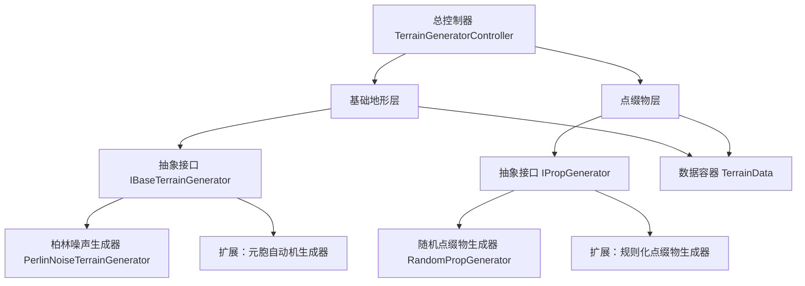

<br />
# Unity 2D 瓦片地图 + 程序化生成 全流程总结

（可直接复制到 Markdown 文档，作为开发手册/对话上下文）

## 一、核心需求总览

1. 批量分割 Sprite 并实现批量重命名
2. 使用 Rule Tile 并实现同规则下多瓦片按概率/权重随机显示
3. 基于柏林噪声生成 2D 瓦片地形
4. 在地形上生成专属点缀物（房子/告示牌/宝箱、仅水上生成船）
5. 最终目标：设计分层、高可扩展、结构清晰的地形生成系统

## 二、关键技术要点

### 1. Sprite 批量重命名

- **快捷操作**：Unity 编辑器中框选 Sprite → 按 F2 → 输入命名模板（如 `Tile_{0}`）实现批量序号重命名；
- **脚本实现**：可编写编辑器脚本，按 Sprite 坐标、自定义前缀/后缀自动重命名，适配大批量素材管理。

### 2. Rule Tile 与权重随机

#### 核心前提

原生 Rule Tile 不支持概率，需安装 Unity 官方 `2D Extras` 扩展包（地址：`https://github.com/Unity-Technologies/2d-extras.git`），使用其中的 `Weighted Rule Tile`。

#### 关键配置

- **规则匹配**：通过 8 方向邻居（Up/UpRight/Right 等）设置匹配条件：
  - `This`：邻居必须是当前 Rule Tile；
  - `Not This`：邻居必须不是当前 Rule Tile；
  - `Don't Care`：忽略该方向邻居（最常用）；
- **权重设置**：每个规则下可添加多个 Sprite，通过 `Weight` 字段设置概率（权重为相对值，如 90 和 10 对应 90%/10%）；
- **规则优先级**：特殊规则（拐角、单格连接）放前，通用规则（单格、全屏）放后，保证匹配准确性。

### 3. 柏林噪声生成地形

#### 核心原理

柏林噪声是伪随机平滑噪声算法，通过「网格梯度向量 + 平滑插值」生成 0\~1 连续随机值，模拟自然地形的平缓过渡（区别于纯随机的破碎效果）。

#### Unity 实现

- **核心 API**：`Mathf.PerlinNoise(float x, float y)`，返回 0\~1 平滑随机值；
- **关键参数**：
  - `noiseScale`：缩放值越小，地形起伏越平滑（大尺度）；值越大，细节越多（碎片化），推荐 0.01\~0.1；
  - `seed`：固定种子可生成相同地图，随机种子每次生成不同地形；
- **多层噪声叠加**：叠加低频（大尺度）+ 中频（细节）+ 高频（纹理）噪声，提升地形自然度；
- **地形映射**：将噪声值映射为地形类型：
  - 噪声值 < 0.3 → 水域；
  - 0.3 ≤ 噪声值 < 0.6 → 草地；
  - 0.6 ≤ 噪声值 < 0.85 → 山脉；
  - 0.85 ≤ 噪声值 < 0.95 → 岩石；
  - 噪声值 ≥ 0.95 → 沙滩。

### 4. 点缀物生成规则

#### 核心约束

- 船：仅在**水域（Water）** 生成；
- 房子/告示牌/宝箱：仅在**草地（Grass）/沙滩（Sand）** 生成；
- 通用控制：
  - `spawnChance`：生成概率（0\~1，如 0.01 为 1%）；
  - `minDistanceBetweenProps`：点缀物最小间距（避免扎堆）；
  - 随机旋转：生成时添加 `Quaternion.Euler(0, 0, Random.Range(0, 360))`，提升自然度；
  - 每个瓦片仅生成一个点缀物。

## 三、分层地形生成系统架构

### 架构设计原则

- 单一职责：基础地形层/点缀物层各司其职，互不依赖；
- 开闭原则：新增功能只需扩展接口，无需修改原有代码；
- 配置驱动：所有规则可视化配置，无需修改代码即可调整参数。

### 整体架构



### 核心模块说明

| 模块/类                        | 层级    | 核心功能                                    |
| --------------------------- | ----- | --------------------------------------- |
| TerrainData                 | 数据层   | 存储网格坐标-地形类型映射，作为两层唯一数据交互通道，避免重复计算       |
| IBaseTerrainGenerator       | 抽象层   | 基础地形生成接口，定义「生成基础地形」契约，所有地形生成器需实现此接口     |
| PerlinNoiseTerrainGenerator | 基础地形层 | 实现抽象接口，通过柏林噪声生成瓦片地形，将地形数据写入 TerrainData |
| IPropGenerator              | 抽象层   | 点缀物生成接口，定义「生成点缀物」契约，所有点缀物生成器需实现此接口      |
| RandomPropGenerator         | 点缀物层  | 实现抽象接口，读取 TerrainData 地形信息，按配置生成专属点缀物   |
| TerrainGeneratorController  | 控制层   | 对外唯一入口，初始化生成器、管理配置、调度两层生成逻辑，屏蔽内部细节      |
| 各类 Config 配置类               | 配置层   | 可视化管理规则（地形阈值、点缀物概率/间距），支持滑动条/枚举配置       |

### 核心枚举

```csharp
// 地形类型
public enum TerrainType { Water, Grass, Mountain, Rock, Sand }
// 点缀物类型
public enum PropType { House, Sign, Chest, Boat }
```

### 核心流程

1. 控制器初始化：创建 TerrainData 容器，实例化地形/点缀物生成器；
2. 基础地形层：生成瓦片地图，将每个网格的地形类型写入 TerrainData；
3. 点缀物层：读取 TerrainData 地形信息，按「地形匹配+概率+间距」生成点缀物；
4. 层间交互：仅通过 TerrainData 传递数据，两层完全解耦。

## 四、扩展方式（高可扩展设计）

### 1. 新增基础地形算法

- 步骤1：新建类实现 `IBaseTerrainGenerator` 接口；
- 步骤2：编写自定义地形生成逻辑（如元胞自动机、迷宫算法）；
- 步骤3：在控制器中替换地形生成器实例，无需修改原有代码。

### 2. 新增点缀物生成规则

- 步骤1：新建类实现 `IPropGenerator` 接口；
- 步骤2：编写规则化生成逻辑（如“草地中心生成城镇”）；
- 步骤3：在控制器中替换点缀物生成器实例。

### 3. 新增地形/点缀物类型

- 步骤1：在 `TerrainType`/`PropType` 枚举中添加新值；
- 步骤2：新增对应配置（如阈值、预制体、概率）；
- 步骤3：在生成器中补充“枚举-瓦片/预制体”映射逻辑。

### 4. 新增分层（如道路/河流装饰层）

- 步骤1：新增抽象接口 `ITerrainDecorationGenerator`；
- 步骤2：实现具体生成器并读取 TerrainData；
- 步骤3：在控制器中新增该层调用逻辑。

## 五、核心功能总结

1. 支持编辑器/运行时一键生成地形+点缀物，支持随机种子重生成；
2. 地形自动分水域/草地/山脉/岩石/沙滩，占比可通过阈值可视化调节；
3. 点缀物严格匹配地形生成（船仅在水上），支持概率/间距/旋转控制；
4. 架构满足工业级设计：低耦合、高扩展、配置驱动、职责清晰。

## 六、快速复用说明

- 复制所有代码模块到 Unity 项目，按注释赋值 Tilemap/瓦片/预制体；
- 调整 Config 配置类参数（无需改核心逻辑），即可适配不同地图需求；
- 新增功能时遵循“实现接口→替换实例”的扩展方式，保证原有逻辑稳定。

<br />

# 基础架构示例

以下结果基于下属要求生成：

> 我希望能够将整个地图生成流程划分为层次的结构，例如：
> 首先通过地形层生成大致的地形划分，例如草原、山地或者海洋
> 之后执行精细地形层，用来生成房屋、高墙、溪流等精细结构（不同结构最好分别构建相关的类）
> 再之后执行装饰层，生成例如花朵、船只等装饰物品
> 。。。
> 如上，整个流程按照层级顺序依次执行，同时兼顾可扩展性，通过增加、减少或修改层次能够改变最终的生成效果。

### 一、分层地形生成系统设计思路

基于你的需求，我设计了一套**可插拔、可排序、高扩展**的分层生成架构，核心是通过「生成器抽象基类 + 层级管理器」实现：

1. **抽象统一接口**：所有生成层（地形/精细结构/装饰）都实现同一套接口，保证可替换性；
2. **层级配置化**：通过列表配置生成层的执行顺序、是否启用，支持动态增删；
3. **数据共享容器**：所有层通过统一的数据容器交互，避免重复计算和数据耦合；
4. **单一职责**：每个生成层只负责自己的功能（如地形层只生成基础瓦片，房屋层只生成房屋）。

### 二、核心代码实现

#### 1. 基础定义（枚举/数据容器/抽象接口）

```csharp
using System.Collections.Generic;
using UnityEngine;

// 地形类型枚举（基础地形）
public enum TerrainType { Water, Grass, Mountain, Rock, Sand }

// 精细结构类型枚举
public enum FineStructureType { House, Wall, Stream, Sign, Chest }

// 装饰类型枚举
public enum DecorationType { Flower, Boat, Stone, Tree }

// 全局数据容器（所有生成层共享，核心交互媒介）
[System.Serializable]
public class MapGeneratorData
{
    // 基础地形数据：坐标 → 地形类型
    public Dictionary<Vector2Int, TerrainType> baseTerrainData = new Dictionary<Vector2Int, TerrainType>();
    
    // 精细结构数据：坐标 → 精细结构类型
    public Dictionary<Vector2Int, FineStructureType> fineStructureData = new Dictionary<Vector2Int, FineStructureType>();
    
    // 装饰数据：坐标 → 装饰类型
    public Dictionary<Vector2Int, DecorationType> decorationData = new Dictionary<Vector2Int, DecorationType>();
    
    // 地图基础配置
    public int mapWidth = 100;
    public int mapHeight = 100;
    public int seed; // 全局种子，保证所有层生成结果一致
    
    // 清空数据（重新生成时调用）
    public void Clear()
    {
        baseTerrainData.Clear();
        fineStructureData.Clear();
        decorationData.Clear();
    }
}

// 所有生成层的抽象基类（核心接口）
public abstract class MapGeneratorLayer : ScriptableObject
{
    [Header("基础配置")]
    public string layerName; // 层名称（便于管理）
    public bool isEnabled = true; // 是否启用该层
    
    // 核心生成方法（所有层必须实现）
    public abstract void Generate(MapGeneratorData data);
    
    // 可选：层初始化（如预加载资源）
    public virtual void Initialize(MapGeneratorData data) { }
    
    // 可选：层清理（如销毁临时对象）
    public virtual void Cleanup() { }
}
```

#### 2. 具体生成层实现（示例）

##### （1）基础地形层（柏林噪声生成）

```csharp
using UnityEngine;

[CreateAssetMenu(fileName = "BaseTerrainLayer", menuName = "MapGenerator/Layers/BaseTerrainLayer")]
public class BaseTerrainLayer : MapGeneratorLayer
{
    [Header("柏林噪声配置")]
    public float noiseScale = 0.02f;
    [Header("地形阈值（0~1）")]
    public float waterThreshold = 0.3f;
    public float grassThreshold = 0.6f;
    public float mountainThreshold = 0.85f;
    public float rockThreshold = 0.95f;

    public override void Generate(MapGeneratorData data)
    {
        if (!isEnabled) return;
        
        // 固定种子，保证生成结果可复现
        Random.InitState(data.seed);
        float offsetX = Random.Range(0f, 100000f);
        float offsetY = Random.Range(0f, 100000f);
        
        // 遍历所有网格生成基础地形
        for (int x = 0; x < data.mapWidth; x++)
        {
            for (int y = 0; y < data.mapHeight; y++)
            {
                Vector2Int pos = new Vector2Int(x, y);
                // 计算柏林噪声值
                float noiseValue = Mathf.PerlinNoise(
                    (x + offsetX) * noiseScale, 
                    (y + offsetY) * noiseScale
                );
                
                // 映射为地形类型
                TerrainType terrainType = GetTerrainTypeByNoise(noiseValue);
                data.baseTerrainData[pos] = terrainType;
            }
        }
        
        Debug.Log($"[{layerName}] 基础地形生成完成，共生成 {data.baseTerrainData.Count} 个网格");
    }

    // 噪声值 → 地形类型映射
    private TerrainType GetTerrainTypeByNoise(float noiseValue)
    {
        if (noiseValue < waterThreshold) return TerrainType.Water;
        if (noiseValue < grassThreshold) return TerrainType.Grass;
        if (noiseValue < mountainThreshold) return TerrainType.Mountain;
        if (noiseValue < rockThreshold) return TerrainType.Rock;
        return TerrainType.Sand;
    }
}
```

##### （2）精细结构层-房屋生成

```csharp
using UnityEngine;
using System.Collections.Generic;

[CreateAssetMenu(fileName = "HouseStructureLayer", menuName = "MapGenerator/Layers/FineStructure/HouseLayer")]
public class HouseStructureLayer : MapGeneratorLayer
{
    [Header("房屋生成配置")]
    public float spawnChance = 0.01f; // 生成概率（1%）
    public float minDistance = 5f; // 房屋最小间距
    public List<TerrainType> allowedTerrains = new List<TerrainType>() { TerrainType.Grass, TerrainType.Sand }; // 允许生成的地形

    public override void Generate(MapGeneratorData data)
    {
        if (!isEnabled) return;
        
        Random.InitState(data.seed);
        List<Vector2Int> spawnedHouses = new List<Vector2Int>();
        
        // 遍历所有网格
        foreach (var pos in data.baseTerrainData.Keys)
        {
            // 检查地形是否允许
            if (!allowedTerrains.Contains(data.baseTerrainData[pos])) continue;
            
            // 随机概率
            if (Random.value > spawnChance) continue;
            
            // 检查间距
            bool isTooClose = false;
            foreach (var housePos in spawnedHouses)
            {
                if (Vector2.Distance(pos, housePos) < minDistance)
                {
                    isTooClose = true;
                    break;
                }
            }
            if (isTooClose) continue;
            
            // 生成房屋
            data.fineStructureData[pos] = FineStructureType.House;
            spawnedHouses.Add(pos);
        }
        
        Debug.Log($"[{layerName}] 房屋生成完成，共生成 {spawnedHouses.Count} 栋房屋");
    }
}
```

##### （3）装饰层-船只生成

```csharp
using UnityEngine;

[CreateAssetMenu(fileName = "BoatDecorationLayer", menuName = "MapGenerator/Layers/Decoration/BoatLayer")]
public class BoatDecorationLayer : MapGeneratorLayer
{
    [Header("船只生成配置")]
    public float spawnChance = 0.005f; // 生成概率（0.5%）
    public float minDistance = 8f; // 船只最小间距

    public override void Generate(MapGeneratorData data)
    {
        if (!isEnabled) return;
        
        Random.InitState(data.seed);
        List<Vector2Int> spawnedBoats = new List<Vector2Int>();
        
        // 遍历所有网格
        foreach (var pos in data.baseTerrainData.Keys)
        {
            // 仅在水域生成
            if (data.baseTerrainData[pos] != TerrainType.Water) continue;
            
            // 随机概率
            if (Random.value > spawnChance) continue;
            
            // 检查间距
            bool isTooClose = false;
            foreach (var boatPos in spawnedBoats)
            {
                if (Vector2.Distance(pos, boatPos) < minDistance)
                {
                    isTooClose = true;
                    break;
                }
            }
            if (isTooClose) continue;
            
            // 生成船只
            data.decorationData[pos] = DecorationType.Boat;
            spawnedBoats.Add(pos);
        }
        
        Debug.Log($"[{layerName}] 船只生成完成，共生成 {spawnedBoats.Count} 艘船只");
    }
}
```

#### 3. 全局生成控制器（核心调度器）

```csharp
using UnityEngine;
using System.Collections.Generic;

public class MapGeneratorController : MonoBehaviour
{
    [Header("全局配置")]
    public int mapWidth = 100;
    public int mapHeight = 100;
    public int seed = 0;
    public bool useRandomSeed = true; // 是否使用随机种子
    
    [Header("生成层配置（执行顺序 = 列表顺序）")]
    public List<MapGeneratorLayer> generatorLayers; // 生成层列表（可在Inspector拖拽调整顺序）
    
    // 全局数据容器
    private MapGeneratorData mapData;

    private void Awake()
    {
        // 初始化数据容器
        mapData = new MapGeneratorData()
        {
            mapWidth = mapWidth,
            mapHeight = mapHeight
        };
    }

    // 一键生成地图（对外暴露的唯一入口）
    [ContextMenu("Generate Map")]
    public void GenerateMap()
    {
        // 1. 重置数据
        mapData.Clear();
        
        // 2. 设置种子
        mapData.seed = useRandomSeed ? Random.Range(0, int.MaxValue) : seed;
        
        // 3. 按顺序执行所有生成层
        foreach (var layer in generatorLayers)
        {
            if (layer == null) continue;
            
            // 初始化层
            layer.Initialize(mapData);
            
            // 执行生成
            layer.Generate(mapData);
            
            // 清理层临时数据
            layer.Cleanup();
        }
        
        // 4. 可视化生成结果（瓦片/物体实例化，根据项目需求实现）
        VisualizeMap();
        
        Debug.Log("地图生成完成！");
    }

    // 可视化生成结果（核心逻辑：根据数据容器生成瓦片/物体）
    private void VisualizeMap()
    {
        // 示例：遍历基础地形数据生成瓦片
        // 实际项目中需替换为你的Tilemap实例化逻辑
        foreach (var pos in mapData.baseTerrainData.Keys)
        {
            TerrainType terrainType = mapData.baseTerrainData[pos];
            // 1. 生成对应地形的瓦片（Rule Tile）
            // 2. 检查是否有精细结构，生成对应物体（如房屋预制体）
            // 3. 检查是否有装饰，生成对应物体（如船只预制体）
        }
    }

    // 清空地图（用于重新生成）
    [ContextMenu("Clear Map")]
    public void ClearMap()
    {
        mapData.Clear();
        // 销毁所有生成的瓦片/物体
        // ...
        Debug.Log("地图已清空");
    }
}
```

### 三、使用与扩展指南

#### 1. 基础使用步骤

1. **创建生成层**：在Project窗口右键 → `MapGenerator/Layers` → 选择对应层类型（如基础地形层、房屋层、船只层）；
2. **配置生成层**：在Inspector中调整各层参数（如生成概率、间距、允许的地形）；
3. **配置控制器**：
   - 在场景中创建空物体，挂载`MapGeneratorController`；
   - 将创建的生成层拖拽到`generatorLayers`列表中（列表顺序 = 执行顺序）；
   - 调整全局配置（地图尺寸、种子等）；
4. **生成地图**：点击控制器的`Generate Map`按钮，一键生成。

#### 2. 扩展新生成层（核心优势）

如需新增「高墙层」「溪流层」「花朵层」等，只需：

1. 新建类继承`MapGeneratorLayer`；
2. 实现`Generate`方法（编写自定义生成逻辑）；
3. 添加`CreateAssetMenu`特性，允许在编辑器创建该层；
4. 将新层拖拽到控制器的`generatorLayers`列表中，调整执行顺序即可。

**示例：新增高墙层**

```csharp
[CreateAssetMenu(fileName = "WallStructureLayer", menuName = "MapGenerator/Layers/FineStructure/WallLayer")]
public class WallStructureLayer : MapGeneratorLayer
{
    [Header("高墙生成配置")]
    public float spawnChance = 0.02f;
    public List<TerrainType> allowedTerrains = new List<TerrainType>() { TerrainType.Mountain, TerrainType.Rock };

    public override void Generate(MapGeneratorData data)
    {
        if (!isEnabled) return;
        
        Random.InitState(data.seed);
        foreach (var pos in data.baseTerrainData.Keys)
        {
            if (!allowedTerrains.Contains(data.baseTerrainData[pos])) continue;
            if (Random.value > spawnChance) continue;
            
            data.fineStructureData[pos] = FineStructureType.Wall;
        }
    }
}
```

### 四、架构优势

1. **高可扩展**：新增/删除/修改层无需改动核心逻辑，只需调整列表或新增类；
2. **可排序**：通过拖拽列表调整层的执行顺序（如先生成地形，再生成房屋，最后生成装饰）；
3. **可配置**：每个层的参数独立配置，支持启用/禁用，灵活调整生成效果；
4. **低耦合**：所有层通过`MapGeneratorData`交互，层与层之间无直接依赖；
5. **可复现**：全局种子保证同一套配置生成完全相同的地图。

### 总结

1. 核心架构：「抽象基类 + 具体生成层 + 全局控制器 + 共享数据容器」，实现分层解耦；
2. 扩展方式：新增层只需继承`MapGeneratorLayer`并实现`Generate`方法，拖拽到控制器列表即可；
3. 核心优势：支持动态调整层的执行顺序、启用/禁用状态，参数可视化配置，完全满足“增删改层次改变生成效果”的需求。

你可以基于这套架构，继续实现「溪流层」「花朵层」「树木层」等，所有层都遵循同一套逻辑，保证系统的一致性和可维护性。

# 地形平滑处理解决方案

### 一、问题分析与解决方案思路

你遇到的「边缘太碎导致 Rule Tile 匹配失败」问题，核心原因是**柏林噪声生成的地形像素级跳变过多**，Rule Tile 无法识别连续的地形边缘。解决方案是在层级架构中新增「地形平滑层」，放在**基础地形层之后、精细结构层之前**执行，通过以下两种核心逻辑优化地形：

1. **邻域投票平滑**：对每个网格，统计周围8邻域的地形类型占比，将当前网格替换为占比最高的类型（减少孤立碎块）；
2. **连通域过滤**：删除面积过小的孤立地形块（如1-2格的水域/草地碎块），保留连续的大区域；
3. **噪声模糊（可选）**：在生成基础地形前，对柏林噪声值进行高斯模糊，从源头减少跳变。

### 二、扩展实现：新增地形平滑层

#### 1. 第一步：扩展抽象层（无需修改原有接口）

地形平滑层本质是对 `MapGeneratorData` 中的基础地形数据进行修改，因此直接继承 `MapGeneratorLayer` 即可，无需改动原有抽象接口，完全符合「开闭原则」。

#### 2. 第二步：实现核心平滑层（两种核心算法）

##### （1）邻域投票平滑层（基础版，优先推荐）

```csharp
using UnityEngine;
using System.Collections.Generic;

// 右键可创建该层：MapGenerator/Layers/Smoothing/NeighborhoodSmoothingLayer
[CreateAssetMenu(fileName = "NeighborhoodSmoothingLayer", menuName = "MapGenerator/Layers/Smoothing/NeighborhoodSmoothingLayer")]
public class NeighborhoodSmoothingLayer : MapGeneratorLayer
{
    [Header("平滑配置")]
    public int smoothIterations = 2; // 平滑迭代次数（次数越多越平滑，建议1-3）
    public int neighborhoodRadius = 1; // 邻域半径（1=8邻域，2=24邻域）
    [Tooltip("是否保留主要地形类型的优先级（如水域优先于草地）")]
    public bool useTerrainPriority = true;
    [Tooltip("地形优先级（从上到下优先级越高）")]
    public List<TerrainType> terrainPriority = new List<TerrainType>() 
    { 
        TerrainType.Water, TerrainType.Mountain, TerrainType.Rock, TerrainType.Grass, TerrainType.Sand 
    };

    public override void Generate(MapGeneratorData data)
    {
        if (!isEnabled) return;

        Debug.Log($"[{layerName}] 开始地形平滑，迭代次数：{smoothIterations}");
        
        // 多次迭代平滑（迭代越多越平滑）
        for (int i = 0; i < smoothIterations; i++)
        {
            // 必须基于「上一轮的快照」修改，避免实时修改影响计算
            Dictionary<Vector2Int, TerrainType> newTerrainData = new Dictionary<Vector2Int, TerrainType>(data.baseTerrainData);
            
            // 遍历所有网格
            foreach (var pos in data.baseTerrainData.Keys)
            {
                // 统计邻域地形类型
                Dictionary<TerrainType, int> terrainCount = new Dictionary<TerrainType, int>();
                // 初始化所有地形类型的计数为0
                foreach (TerrainType type in System.Enum.GetValues(typeof(TerrainType)))
                {
                    terrainCount[type] = 0;
                }

                // 遍历邻域网格（半径范围内）
                for (int xOffset = -neighborhoodRadius; xOffset <= neighborhoodRadius; xOffset++)
                {
                    for (int yOffset = -neighborhoodRadius; yOffset <= neighborhoodRadius; yOffset++)
                    {
                        // 跳过自身
                        if (xOffset == 0 && yOffset == 0) continue;
                        
                        Vector2Int neighborPos = new Vector2Int(pos.x + xOffset, pos.y + yOffset);
                        // 检查邻域是否在地图范围内
                        if (data.baseTerrainData.ContainsKey(neighborPos))
                        {
                            TerrainType neighborType = data.baseTerrainData[neighborPos];
                            terrainCount[neighborType]++;
                        }
                    }
                }

                // 找到邻域中占比最高的地形类型
                TerrainType mostCommonType = GetMostCommonTerrain(terrainCount);
                // 更新当前网格的地形类型
                newTerrainData[pos] = mostCommonType;
            }

            // 将平滑后的结果赋值回数据容器
            data.baseTerrainData = newTerrainData;
        }
        
        Debug.Log($"[{layerName}] 地形平滑完成，共处理 {data.baseTerrainData.Count} 个网格");
    }

    // 找到占比最高的地形类型（支持优先级）
    private TerrainType GetMostCommonTerrain(Dictionary<TerrainType, int> terrainCount)
    {
        int maxCount = -1;
        TerrainType result = TerrainType.Grass;

        if (useTerrainPriority)
        {
            // 按优先级遍历，优先选择高优先级且计数最高的类型
            foreach (TerrainType type in terrainPriority)
            {
                if (terrainCount[type] > maxCount)
                {
                    maxCount = terrainCount[type];
                    result = type;
                }
            }
        }
        else
        {
            // 无优先级，直接选计数最高的类型
            foreach (var kvp in terrainCount)
            {
                if (kvp.Value > maxCount)
                {
                    maxCount = kvp.Value;
                    result = kvp.Key;
                }
            }
        }

        return result;
    }
}
```

##### （2）连通域过滤层（进阶版，清理孤立碎块）

```csharp
using UnityEngine;
using System.Collections.Generic;

// 右键可创建该层：MapGenerator/Layers/Smoothing/ConnectedComponentFilterLayer
[CreateAssetMenu(fileName = "ConnectedComponentFilterLayer", menuName = "MapGenerator/Layers/Smoothing/ConnectedComponentFilterLayer")]
public class ConnectedComponentFilterLayer : MapGeneratorLayer
{
    [Header("连通域过滤配置")]
    public int minComponentSize = 5; // 最小连通域面积（小于该值的碎块会被清理）
    [Tooltip("需要过滤的地形类型（如只清理小水域/小草地碎块）")]
    public List<TerrainType> filteredTerrainTypes = new List<TerrainType>() 
    { 
        TerrainType.Water, TerrainType.Grass, TerrainType.Sand 
    };
    [Tooltip("碎块替换为哪种地形（如小水域碎块替换为草地）")]
    public TerrainType replaceWith = TerrainType.Grass;

    public override void Generate(MapGeneratorData data)
    {
        if (!isEnabled) return;

        Debug.Log($"[{layerName}] 开始连通域过滤，最小面积：{minComponentSize}");
        
        // 记录已检查的网格
        HashSet<Vector2Int> checkedPositions = new HashSet<Vector2Int>();
        // 存储需要替换的碎块网格
        List<Vector2Int> blocksToReplace = new List<Vector2Int>();

        // 遍历所有网格
        foreach (var pos in data.baseTerrainData.Keys)
        {
            if (checkedPositions.Contains(pos)) continue;
            
            TerrainType currentType = data.baseTerrainData[pos];
            // 只处理需要过滤的地形类型
            if (!filteredTerrainTypes.Contains(currentType))
            {
                checkedPositions.Add(pos);
                continue;
            }

            // 查找当前连通域的所有网格（BFS广度优先搜索）
            List<Vector2Int> component = new List<Vector2Int>();
            Queue<Vector2Int> queue = new Queue<Vector2Int>();
            queue.Enqueue(pos);
            checkedPositions.Add(pos);

            while (queue.Count > 0)
            {
                Vector2Int currentPos = queue.Dequeue();
                component.Add(currentPos);

                // 遍历8邻域
                int[] dx = { -1, 0, 1, -1, 1, -1, 0, 1 };
                int[] dy = { -1, -1, -1, 0, 0, 1, 1, 1 };
                for (int i = 0; i < 8; i++)
                {
                    Vector2Int neighborPos = new Vector2Int(currentPos.x + dx[i], currentPos.y + dy[i]);
                    if (data.baseTerrainData.ContainsKey(neighborPos) 
                        && !checkedPositions.Contains(neighborPos)
                        && data.baseTerrainData[neighborPos] == currentType)
                    {
                        checkedPositions.Add(neighborPos);
                        queue.Enqueue(neighborPos);
                    }
                }
            }

            // 如果连通域面积过小，标记为需要替换
            if (component.Count < minComponentSize)
            {
                blocksToReplace.AddRange(component);
            }
        }

        // 替换所有碎块网格
        foreach (var pos in blocksToReplace)
        {
            data.baseTerrainData[pos] = replaceWith;
        }
        
        Debug.Log($"[{layerName}] 连通域过滤完成，共清理 {blocksToReplace.Count} 个碎块网格");
    }
}
```

##### （3）噪声模糊层（可选，从源头优化）

如果想从柏林噪声生成阶段就减少跳变，可扩展基础地形层，在计算噪声值时增加高斯模糊：

```csharp
// 新增方法：高斯模糊噪声值
private float BlurPerlinNoise(float x, float y, float noiseScale, float blurRadius = 1)
{
    float total = 0;
    float weightTotal = 0;
    
    // 遍历模糊半径内的邻域
    for (int dx = -1; dx <= 1; dx++)
    {
        for (int dy = -1; dy <= 1; dy++)
        {
            // 高斯权重（中心权重最高，边缘最低）
            float weight = Mathf.Exp(-(dx*dx + dy*dy) / (2 * blurRadius * blurRadius));
            total += Mathf.PerlinNoise((x + dx) * noiseScale, (y + dy) * noiseScale) * weight;
            weightTotal += weight;
        }
    }
    
    return total / weightTotal;
}

// 在BaseTerrainLayer的Generate方法中替换原噪声计算：
// float noiseValue = Mathf.PerlinNoise((x + offsetX) * noiseScale, (y + offsetY) * noiseScale);
// 改为：
float noiseValue = BlurPerlinNoise(x + offsetX, y + offsetY, noiseScale);
```

### 三、层级执行顺序调整

将新增的平滑层插入到层级列表中，**正确的执行顺序**应为：

1. 基础地形层（柏林噪声生成原始地形）
2. 噪声模糊层（可选，源头优化）
3. 邻域投票平滑层（核心，减少边缘跳变）
4. 连通域过滤层（进阶，清理孤立碎块）
5. 精细结构层（房屋/高墙/溪流）
6. 装饰层（花朵/船只）

在 `MapGeneratorController` 的 `generatorLayers` 列表中，按上述顺序拖拽层即可。

### 四、参数调优建议

| 参数                 | 作用       | 推荐值           |
| ------------------ | -------- | ------------- |
| smoothIterations   | 邻域投票迭代次数 | 1-3（次数越多越平滑）  |
| neighborhoodRadius | 邻域投票半径   | 1（8邻域，足够用）    |
| minComponentSize   | 最小连通域面积  | 3-8（根据地图尺寸调整） |
| blurRadius         | 噪声模糊半径   | 1（避免过度模糊丢失细节） |

### 五、Rule Tile 匹配优化补充

除了地形平滑，还可以对 Rule Tile 本身做小调整，进一步提升匹配成功率：

1. **放宽规则条件**：将边缘规则的「This」改为「Don't Care」，只保留核心连接规则；
2. **增加过渡瓦片**：为地形边缘设计专门的过渡 Rule Tile（如水-草过渡、草-山过渡）；
3. **降低规则优先级**：将通用规则（如单格）的优先级调低，优先匹配边缘规则。

### 总结

1. 扩展方式：新增平滑层只需继承 `MapGeneratorLayer`，实现 `Generate` 方法，无需修改原有代码，符合开闭原则；
2. 核心逻辑：通过「邻域投票」减少像素级跳变，通过「连通域过滤」清理孤立碎块，从根本上解决 Rule Tile 匹配失败问题；
3. 执行顺序：平滑层必须放在基础地形层之后、精细结构层之前，保证后续层级基于平滑后的地形生成。

你可以先尝试「邻域投票平滑层」（基础版），如果仍有孤立碎块，再叠加「连通域过滤层」，两种层组合使用效果最佳。

# 地图生成分层架构优化--tileMap管理

### 一、核心结论

**强烈建议为不同层级的地图对象使用独立的 Tilemap**，这是 Unity 2D 瓦片地图开发的最佳实践。独立 Tilemap 不仅能解决渲染层级、碰撞体、编辑维护的问题，还能完美契合你分层生成的架构设计，让各层逻辑彻底解耦。

### 二、为什么要分多个 Tilemap？

#### 1. 核心优势（对应你的分层生成需求）

| 优势维度      | 单 Tilemap 问题                 | 多 Tilemap 解决方案                                          |
| --------- | ---------------------------- | ------------------------------------------------------- |
| **渲染层级**  | 所有对象挤在同一层，装饰物会被地形遮挡，无法控制显示顺序 | 按「基础地形→精细结构→装饰物」设置 Tilemap 的 `Order in Layer`，精准控制显示优先级 |
| **逻辑解耦**  | 生成/修改某一层会影响其他层，调试困难          | 各层独立生成、独立清理，完全契合你「分层生成」的架构，某层出错不影响整体                    |
| **性能优化**  | 批量操作时需遍历所有瓦片，效率低             | 仅操作目标层的 Tilemap，生成/销毁更高效                                |
| **编辑维护**  | 不同类型瓦片混在一起，难以单独调整/隐藏         | 可单独隐藏/显示某一层（如隐藏装饰层调试地形），编辑更灵活                           |
| **碰撞体管理** | 所有对象共用一套碰撞体，无法区分地形/装饰        | 可为基础地形层加碰撞体，精细结构层加触发器，装饰层无碰撞体                           |

#### 2. 贴合你的分层架构

你的生成流程是「基础地形→精细地形→装饰物」，对应独立 Tilemap 后：

- 每一层生成器只操作自己的 Tilemap，无需关心其他层；
- 数据容器只需记录坐标和类型，可视化时按层分发到对应 Tilemap；
- 新增/删除层只需新增/删除 Tilemap，完全符合「开闭原则」。

### 三、多 Tilemap 设计与实现方案

#### 1. Tilemap 分层规划（适配你的生成层级）

建议按以下结构创建 Tilemap 层级（在 Unity 场景中创建空物体作为父节点，下挂多个 Tilemap）：

```
MapRoot（空物体）
├─ BaseTerrainTilemap（基础地形：水/草/山/岩/沙）
├─ FineStructureTilemap（精细地形：房屋/高墙/溪流）
└─ DecorationTilemap（装饰物：花朵/船只/宝箱）
```

**关键设置**：

- 在 Inspector 中为每个 Tilemap 设置 `Order in Layer`（数值越大越靠上）：
  - BaseTerrainTilemap：0（最底层）
  - FineStructureTilemap：10（中间层）
  - DecorationTilemap：20（最上层）
- 为需要碰撞的 Tilemap（如 BaseTerrainTilemap）添加 `Tilemap Collider 2D`，精细结构层可加 `Composite Collider 2D`，装饰层无需碰撞体。

#### 2. 代码实现（适配多 Tilemap 分层绘制）

##### （1）扩展数据容器（记录各层类型，无需修改核心结构）

```csharp
// 原有数据容器无需大幅修改，只需新增层类型标记（或保持原有字典）
public class MapGeneratorData
{
    // 基础地形数据（对应 BaseTerrainTilemap）
    public Dictionary<Vector2Int, TerrainType> baseTerrainData = new Dictionary<Vector2Int, TerrainType>();
    // 精细结构数据（对应 FineStructureTilemap）
    public Dictionary<Vector2Int, FineStructureType> fineStructureData = new Dictionary<Vector2Int, FineStructureType>();
    // 装饰数据（对应 DecorationTilemap）
    public Dictionary<Vector2Int, DecorationType> decorationData = new Dictionary<Vector2Int, DecorationType>();

    public int mapWidth = 100;
    public int mapHeight = 100;
    public int seed;
    public int tilemapZLayer = 0; // 所有 Tilemap 共用 Z 层（平面场景）
}
```

##### （2）可视化层（封装多 Tilemap 绘制逻辑）

创建专门的 `MapVisualizer` 类，负责将各层数据分发到对应 Tilemap，与生成逻辑解耦：

```csharp
using UnityEngine;
using UnityEngine.Tilemaps;

public class MapVisualizer : MonoBehaviour
{
    [Header("Tilemap 引用（按层级赋值）")]
    public Tilemap baseTerrainTilemap;    // 基础地形层
    public Tilemap fineStructureTilemap;  // 精细结构层
    public Tilemap decorationTilemap;     // 装饰层

    [Header("瓦片配置")]
    // 基础地形瓦片
    public RuleTile waterTile;
    public RuleTile grassTile;
    public RuleTile mountainTile;
    public RuleTile rockTile;
    public RuleTile sandTile;

    // 精细结构瓦片
    public Tile houseTile;
    public Tile wallTile;
    public Tile streamTile;

    // 装饰瓦片
    public Tile boatTile;
    public Tile flowerTile;
    public Tile chestTile;

    // 坐标转换工具方法（统一处理 2D→3D 转换）
    private Vector3Int ConvertToTilemapPos(Vector2Int pos2D, int zLayer)
    {
        // 根据 Tilemap 配置调整 Y 轴方向（若 Tilemap 翻转则取反）
        return new Vector3Int(pos2D.x, pos2D.y, zLayer);
    }

    // 一键绘制所有层
    public void DrawAllLayers(MapGeneratorData data)
    {
        // 先清空所有 Tilemap
        ClearAllTilemaps();
        
        // 绘制基础地形层
        DrawBaseTerrainLayer(data);
        // 绘制精细结构层
        DrawFineStructureLayer(data);
        // 绘制装饰层
        DrawDecorationLayer(data);
        
        Debug.Log("所有层级绘制完成！");
    }

    // 绘制基础地形层
    private void DrawBaseTerrainLayer(MapGeneratorData data)
    {
        foreach (var kvp in data.baseTerrainData)
        {
            Vector2Int pos2D = kvp.Key;
            TerrainType type = kvp.Value;
            Vector3Int pos3D = ConvertToTilemapPos(pos2D, data.tilemapZLayer);

            switch (type)
            {
                case TerrainType.Water:
                    baseTerrainTilemap.SetTile(pos3D, waterTile);
                    break;
                case TerrainType.Grass:
                    baseTerrainTilemap.SetTile(pos3D, grassTile);
                    break;
                case TerrainType.Mountain:
                    baseTerrainTilemap.SetTile(pos3D, mountainTile);
                    break;
                case TerrainType.Rock:
                    baseTerrainTilemap.SetTile(pos3D, rockTile);
                    break;
                case TerrainType.Sand:
                    baseTerrainTilemap.SetTile(pos3D, sandTile);
                    break;
            }
        }
    }

    // 绘制精细结构层
    private void DrawFineStructureLayer(MapGeneratorData data)
    {
        foreach (var kvp in data.fineStructureData)
        {
            Vector2Int pos2D = kvp.Key;
            FineStructureType type = kvp.Value;
            Vector3Int pos3D = ConvertToTilemapPos(pos2D, data.tilemapZLayer);

            switch (type)
            {
                case FineStructureType.House:
                    fineStructureTilemap.SetTile(pos3D, houseTile);
                    break;
                case FineStructureType.Wall:
                    fineStructureTilemap.SetTile(pos3D, wallTile);
                    break;
                case FineStructureType.Stream:
                    fineStructureTilemap.SetTile(pos3D, streamTile);
                    break;
            }
        }
    }

    // 绘制装饰层
    private void DrawDecorationLayer(MapGeneratorData data)
    {
        foreach (var kvp in data.decorationData)
        {
            Vector2Int pos2D = kvp.Key;
            DecorationType type = kvp.Value;
            Vector3Int pos3D = ConvertToTilemapPos(pos2D, data.tilemapZLayer);

            switch (type)
            {
                case DecorationType.Boat:
                    decorationTilemap.SetTile(pos3D, boatTile);
                    break;
                case DecorationType.Flower:
                    decorationTilemap.SetTile(pos3D, flowerTile);
                    break;
                case DecorationType.Chest:
                    decorationTilemap.SetTile(pos3D, chestTile);
                    break;
            }
        }
    }

    // 清空所有 Tilemap
    public void ClearAllTilemaps()
    {
        baseTerrainTilemap.ClearAllTiles();
        fineStructureTilemap.ClearAllTiles();
        decorationTilemap.ClearAllTiles();
    }
}
```

##### （3）生成控制器适配（调用可视化层）

修改 `MapGeneratorController` 的 `VisualizeMap` 方法，调用封装好的可视化逻辑：

```csharp
public class MapGeneratorController : MonoBehaviour
{
    [Header("可视化组件")]
    public MapVisualizer mapVisualizer; // 拖拽挂载了MapVisualizer的物体

    // 原有生成逻辑不变，修改VisualizeMap方法
    private void VisualizeMap()
    {
        // 调用可视化层绘制所有层
        mapVisualizer.DrawAllLayers(mapData);
    }
}
```

### 三、进阶优化（可选）

#### 1. 动态加载 Tilemap

如果地图尺寸很大，可将 Tilemap 按区块拆分（如 32x32 区块），只加载视野内的 Tilemap 区块，提升性能。

#### 2. 混合使用 Tilemap 和 GameObject

对于不规则的装饰物（如3D模型、非瓦片的2D精灵），可在装饰层不使用 Tilemap，而是直接实例化 GameObject：

```csharp
// 装饰层生成时实例化GameObject（替代Tilemap）
public GameObject boatPrefab;
public void SpawnDecorationGameObjects(MapGeneratorData data)
{
    foreach (var kvp in data.decorationData)
    {
        if (kvp.Value == DecorationType.Boat)
        {
            Vector2Int pos2D = kvp.Key;
            // 转换为世界坐标（根据Tilemap的单元格大小调整）
            Vector3 worldPos = decorationTilemap.CellToWorld(ConvertToTilemapPos(pos2D, data.tilemapZLayer));
            // 实例化船只并随机旋转
            Instantiate(boatPrefab, worldPos, Quaternion.Euler(0, 0, Random.Range(0, 360)));
        }
    }
}
```

#### 3. 层叠遮罩/混合

为不同 Tilemap 设置不同的 `Color` 或 `Alpha`，实现层叠效果（如精细结构层半透明、装饰层高亮）。

### 总结

1. **核心建议**：为基础地形、精细地形、装饰物分别创建独立 Tilemap，这是契合你分层生成架构的最佳实践；
2. **关键配置**：通过 `Order in Layer` 控制渲染层级，为不同 Tilemap 配置独立的碰撞体/触发器；
3. **代码适配**：封装可视化层统一处理多 Tilemap 绘制，生成层只负责数据生成，与绘制逻辑解耦，符合单一职责原则。

这种设计不仅能解决渲染遮挡、编辑维护的问题，还能让你的分层生成系统更灵活——比如单独重新生成装饰层，而无需重新生成整个地形，大幅提升开发和调试效率。

<br />

# 总结

<br />

\# Unity 2D 瓦片地图程序化生成系统 - 开发备忘录 ## 一、核心架构设计 ### 1. 分层生成架构（核心原则：解耦、可扩展、配置驱动） \`\`\`mermaid graph TD     A\[MapGeneratorController 总控制器] --> B\[生成层抽象基类 MapGeneratorLayer]     B --> B1\[基础地形层 BaseTerrainLayer]     B --> B2\[地形平滑层（邻域投票/连通域过滤）]     B --> B3\[精细结构层（房屋/高墙/溪流）]     B --> B4\[装饰层（花朵/船只/宝箱）]     A --> C\[MapVisualizer 可视化层]     A --> D\[MapGeneratorData 数据容器]     C --> E\[多Tilemap绘制（基础/精细/装饰）] \`\`\`  ### 2. 核心类职责 | 类名                  | 核心职责                                                                 | |-----------------------|--------------------------------------------------------------------------| | MapGeneratorLayer     | 所有生成层的抽象基类，定义 Generate/Initialize/Cleanup 接口              | | MapGeneratorData      | 全局数据容器，存储各层坐标-类型映射，层间唯一交互媒介                     | | MapGeneratorController| 对外唯一入口，按顺序调度各生成层，控制生成流程                           | | MapVisualizer         | 封装多Tilemap绘制逻辑，提供默认瓦片兜底，处理坐标转换                     |  ## 二、核心功能实现 ### 1. 基础地形生成（柏林噪声+多频率叠加） #### 核心参数与算法 - \*\*基础噪声配置\*\*：\`baseNoiseScale=0.01\~0.03\`（控制地形平滑度）、随机种子（保证可复现） - \*\*多频率叠加（FBM分形布朗运动）\*\*：   - \`octaves=3\~5\`（叠加层数，3层最佳）   - \`frequencyLacunarity=2\`（频率倍率，每层×2）   - \`amplitudeGain=0.5\`（振幅倍率，每层×0.5）   - 必须开启 \`normalizeResult=true\`（归一化到0\~1） - \*\*地形类型映射\*\*：   \`\`\`   噪声值 < 0.3 → 水域 | 0.3 ≤ 值 < 0.6 → 草地 | 0.6 ≤ 值 < 0.85 → 山脉   0.85 ≤ 值 < 0.95 → 岩石 | 值 ≥ 0.95 → 沙滩   \`\`\`  #### 关键优化 - 噪声扭曲（可选）：\`warpScale=0.01\`、\`warpStrength=10\`，增强地形自然度 - 平滑层处理：叠加噪声后适当调大 \`smoothIterations=2\~3\`  ### 2. 地形平滑层（解决Rule Tile匹配失败） #### （1）邻域投票平滑层 - \`smoothIterations=1\~3\`（迭代次数，越多越平滑） - \`neighborhoodRadius=1\`（8邻域，基础款） - 支持地形优先级配置，避免关键地形被覆盖  #### （2）连通域过滤层 - \`minComponentSize=3\~8\`（最小连通域面积，清理孤立碎块） - 可指定过滤地形类型（如水/草/沙），碎块替换为主要地形  ### 3. 精细结构+装饰层生成规则 #### 核心约束 - 水域专属：船只（生成概率0.005，最小间距8） - 草地/沙滩专属：房屋（0.01/5）、告示牌、宝箱 - 通用规则：随机旋转、单瓦片仅生成一个、最小间距避免扎堆  #### 扩展方式 新增结构/装饰类型只需： 1. 扩展枚举（FineStructureType/DecorationType） 2. 实现对应生成层（继承MapGeneratorLayer） 3. 配置到控制器列表，调整执行顺序  ### 4. 多Tilemap绘制（最佳实践） #### Tilemap分层规划 | Tilemap名称          | Order in Layer | 碰撞体配置               | 用途               | |----------------------|----------------|--------------------------|--------------------| | BaseTerrainTilemap   | 0              | Tilemap Collider 2D      | 基础地形（水/草/山）| | FineStructureTilemap | 10             | Composite Collider 2D    | 房屋/高墙/溪流     | | DecorationTilemap    | 20             | 无                       | 花朵/船只/宝箱     |  #### 坐标处理（3D项目中的2D适配） - 平面场景：保留Vector2Int存储，绘制时转换为Vector3Int（Z固定） - 分层场景：直接使用Vector3Int，按地形类型指定Z层 - 转换工具方法：   \`\`\`csharp   private Vector3Int ConvertToTilemapPos(Vector2Int pos2D, int zLayer)   {       return new Vector3Int(pos2D.x, pos2D.y, zLayer); // 需适配Tilemap Y轴翻转   }   \`\`\`  #### 默认瓦片机制（容错+调试） - 为每个Tilemap层级配置独立默认瓦片（建议高对比度颜色） - switch匹配逻辑增加default分支，未匹配类型自动使用默认瓦片 - 空值保护+分级日志（Warning提示未匹配，Error提示空瓦片）  ## 三、关键开发规范 ### 1. 扩展原则（开闭原则） - 新增生成层：继承MapGeneratorLayer，实现Generate方法，无需修改核心逻辑 - 新增地形/装饰类型：扩展枚举→新增瓦片配置→补充switch分支（默认瓦片兜底） - 新增Tilemap层级：在MapVisualizer中添加引用，扩展Draw方法  ### 2. 性能优化 - 噪声叠加：octaves≤5，大地图（200×200+）建议异步生成 - 平滑层：neighborhoodRadius=1足够，避免过度迭代 - 批量操作：ClearAllTiles替代逐格删除，减少GC  ### 3. 调试技巧 - 分层预览：先单层级生成（如仅基础地形），确认后叠加其他层 - 日志分级：未匹配类型→Warning，空瓦片→Error，快速定位问题 - 种子固定：测试阶段关闭useRandomSeed，保证结果可复现  ## 四、核心代码模板（关键片段） ### 1. 多频率噪声叠加核心方法 \`\`\`csharp private float CalculateFractalNoise(float x, float y, Vector2\[] octaveOffsets, float maxPossibleValue) {     // 可选：噪声扭曲     if (enableNoiseWarp)     {         float warpX = Mathf.PerlinNoise(x \* warpScale, y \* warpScale) \* warpStrength;         float warpY = Mathf.PerlinNoise((x + 5.2f) \* warpScale, (y + 1.3f) \* warpScale) \* warpStrength;         x += warpX;         y += warpY;     }      float totalNoise = 0;     float currentFrequency = baseNoiseScale;     float currentAmplitude = 1;      for (int i = 0; i < octaves; i++)     {         float noiseX = (x + octaveOffsets\[i].x) \* currentFrequency;         float noiseY = (y + octaveOffsets\[i].y) \* currentFrequency;         float perlinValue = Mathf.PerlinNoise(noiseX, noiseY) \* 2 - 1;         totalNoise += perlinValue \* currentAmplitude;          currentFrequency \*= frequencyLacunarity;         currentAmplitude \*= amplitudeGain;     }      // 归一化到0\~1     if (normalizeResult)     {         totalNoise = (totalNoise + 1) / 2;         totalNoise /= maxPossibleValue;     }     return Mathf.Clamp01(totalNoise); } \`\`\`  ### 2. 默认瓦片绘制封装 \`\`\`csharp private void SetBaseTerrainTile(Vector3Int tilemapPos, TerrainType terrainType) {     RuleTile targetTile = baseTerrainDefaultTile;     string typeName = terrainType.ToString();      switch (terrainType)     {         case TerrainType.Water: targetTile = waterTile; break;         case TerrainType.Grass: targetTile = grassTile; break;         // 其他地形类型...         default:             Debug.LogWarning($"未找到地形类型 {typeName} 对应的瓦片，使用默认瓦片");             break;     }      // 空值保护     if (targetTile == null)     {         targetTile = baseTerrainDefaultTile;         if (targetTile == null)         {             Debug.LogError($"地形类型 {typeName} 瓦片和默认瓦片均为空，跳过绘制");             return;         }     }      baseTerrainTilemap.SetTile(tilemapPos, targetTile); } \`\`\`  ### 3. 控制器核心生成流程 \`\`\`csharp public void GenerateMap() {     // 重置数据     mapData.Clear();     // 设置种子     mapData.seed = useRandomSeed ? Random.Range(0, int.MaxValue) : seed;     // 按顺序执行生成层     foreach (var layer in generatorLayers)     {         if (layer == null || !layer.isEnabled) continue;         layer.Initialize(mapData);         layer.Generate(mapData);         layer.Cleanup();     }     // 绘制所有层     mapVisualizer.DrawAllLayers(mapData); } \`\`\`  ## 五、常见问题解决方案 | 问题现象                  | 解决方案                                                                 | |---------------------------|--------------------------------------------------------------------------| | Rule Tile匹配失败（边缘碎）| 1. 增加邻域投票迭代次数 2. 启用连通域过滤 3. 降低噪声频率/叠加层数       | | 地形过度平滑丢失细节      | 1. 减少平滑迭代次数 2. 增加噪声叠加层数 3. 调低振幅倍率（0.4\~0.5）       | | 瓦片绘制为空              | 1. 检查默认瓦片配置 2. 查看Console的Error日志 3. 确认枚举与switch匹配    | | 3D项目中坐标错乱          | 1. 转换坐标时适配Tilemap Y轴翻转 2. 平面场景固定Z层，分层场景用Vector3Int | | 生成卡顿                  | 1. 减少octaves层数 2. 异步生成 3. 分区块生成Tilemap                     |

<br />

<br />

<br />

<br />

<br />

<br />

<br />

# 区块地图生成方案

# 从零构建无限区块地形生成系统（完整接口化实现）

## 一、系统文件结构（按功能模块划分）

```
Assets/
├── Scripts/
│   ├── Core/                  # 核心抽象层（接口+基础定义）
│   │   ├── Enums.cs           # 所有枚举定义
│   │   ├── Constants.cs       # 全局常量
│   │   ├── Interfaces/
│   │   │   ├── IChunk.cs      # 区块接口
│   │   │   ├── IChunkData.cs  # 区块数据接口
│   │   │   ├── IChunkGenerator.cs # 区块生成器接口
│   │   │   └── IChunkVisualizer.cs # 区块可视化接口
│   ├── Data/                  # 数据实现层
│   │   ├── ChunkData.cs       # 区块数据具体实现
│   ├── Chunk/                 # 区块核心实现
│   │   ├── Chunk.cs           # 区块具体实现
│   │   ├── ChunkCoordinateUtility.cs # 坐标转换工具
│   ├── Generator/             # 生成器实现层
│   │   ├── BaseTerrainGenerator.cs # 基础地形生成器
│   │   ├── TerrainSmoothingGenerator.cs # 地形平滑生成器
│   │   ├── FineStructureGenerator.cs # 精细结构生成器
│   │   └── DecorationGenerator.cs # 装饰生成器
│   ├── Manager/               # 管理器层
│   │   ├── ChunkManager.cs    # 全局区块管理器
│   │   └── ChunkLoader.cs     # 玩家驱动的区块加载器
│   └── Visualizer/            # 可视化实现层
│       ├── ChunkVisualizer.cs # 区块可视化具体实现
│       └── TilemapUtility.cs  # Tilemap操作工具
```

## 二、核心抽象层（接口+基础定义）

### 1. 基础枚举与常量（命名空间：MapSystem.Core）

```csharp
using UnityEngine;

namespace MapSystem.Core
{
    /// <summary>
    /// 基础地形类型枚举
    /// </summary>
    public enum TerrainType
    {
        Water, 
        Grass, 
        Mountain, 
        Rock, 
        Sand, 
        Default // 兜底类型
    }

    /// <summary>
    /// 精细结构类型枚举
    /// </summary>
    public enum FineStructureType
    {
        House, 
        Wall, 
        Stream, 
        Default
    }

    /// <summary>
    /// 装饰类型枚举
    /// </summary>
    public enum DecorationType
    {
        Boat, 
        Flower, 
        Chest, 
        Default
    }

    /// <summary>
    /// 区块状态枚举
    /// </summary>
    public enum ChunkState
    {
        Unloaded,    // 未加载（无数据、无Tilemap）
        Generating,  // 生成中（避免重复请求）
        Loaded,      // 已加载（数据+Tilemap就绪）
        Unloading    // 卸载中（清理Tilemap）
    }

    /// <summary>
    /// 全局地图常量配置
    /// </summary>
    public static class MapConstants
    {
        public const int ChunkSize = 32;               // 区块基础大小（瓦片数）
        public const int ChunkBufferSize = 2;          // 区块缓冲区大小（用于平滑）
        public const int LoadRange = 3;                // 玩家周围加载区块范围
        public const int UnloadRange = 5;              // 玩家周围卸载区块范围
        public static int GlobalSeed = 12345;          // 全局种子（保证生成一致性）
        public const int TilemapZLayer = 0;            // Tilemap的Z轴层级
        public const float ChunkLoadCheckInterval = 0.5f; // 玩家位置检查间隔
    }
}
```

### 2. 核心接口定义（命名空间：MapSystem.Core.Interfaces）

```csharp
using UnityEngine;
using System;
using System.Collections.Generic;

namespace MapSystem.Core.Interfaces
{
    /// <summary>
    /// 区块数据核心接口（定义区块数据的存取规范）
    /// </summary>
    public interface IChunkData : IDisposable
    {
        /// <summary>
        /// 区块坐标
        /// </summary>
        Vector2Int ChunkCoord { get; }
        
        /// <summary>
        /// 生成完成标记
        /// </summary>
        bool IsGenerated { get; set; }

        /// <summary>
        /// 设置指定世界坐标的任意类型数据
        /// </summary>
        /// <typeparam name="T">数据类型（TerrainType/FineStructureType/DecorationType）</typeparam>
        void SetData<T>(Vector2Int worldPos, T data) where T : Enum;
        
        /// <summary>
        /// 获取指定世界坐标的任意类型数据
        /// </summary>
        T GetData<T>(Vector2Int worldPos) where T : Enum;
        
        /// <summary>
        /// 获取该区块内指定类型的所有数据
        /// </summary>
        Dictionary<Vector2Int, T> GetAllData<T>() where T : Enum;
        
        /// <summary>
        /// 清空区块所有数据
        /// </summary>
        void Clear();
        
        /// <summary>
        /// 检查世界坐标是否属于该区块（可选包含缓冲区）
        /// </summary>
        bool ContainsWorldPos(Vector2Int worldPos, bool includeBuffer = true);
    }

    /// <summary>
    /// 区块核心接口（定义区块的基础行为）
    /// </summary>
    public interface IChunk : IDisposable
    {
        /// <summary>
        /// 区块坐标
        /// </summary>
        Vector2Int ChunkCoord { get; }
        
        /// <summary>
        /// 区块状态
        /// </summary>
        ChunkState State { get; set; }
        
        /// <summary>
        /// 区块数据引用
        /// </summary>
        IChunkData ChunkData { get; set; }
        
        /// <summary>
        /// 基础地形Tilemap
        /// </summary>
        Tilemap BaseTerrainTilemap { get; }
        
        /// <summary>
        /// 精细结构Tilemap
        /// </summary>
        Tilemap FineStructureTilemap { get; }
        
        /// <summary>
        /// 装饰Tilemap
        /// </summary>
        Tilemap DecorationTilemap { get; }

        /// <summary>
        /// 初始化区块（创建Tilemap等资源）
        /// </summary>
        /// <param name="parent">父Transform</param>
        void Initialize(Transform parent);
        
        /// <summary>
        /// 清理区块Tilemap（保留数据）
        /// </summary>
        void ClearTilemaps();
    }

    /// <summary>
    /// 区块生成器接口（定义区块生成的标准行为）
    /// </summary>
    public interface IChunkGenerator
    {
        /// <summary>
        /// 是否启用该生成器
        /// </summary>
        bool IsEnabled { get; set; }
        
        /// <summary>
        /// 生成优先级（数值越高越先执行）
        /// </summary>
        int Priority { get; }

        /// <summary>
        /// 初始化生成器
        /// </summary>
        void Initialize();
        
        /// <summary>
        /// 为指定区块执行生成逻辑
        /// </summary>
        /// <param name="chunkData">目标区块数据</param>
        /// <param name="onComplete">生成完成回调</param>
        void Generate(IChunkData chunkData, Action onComplete = null);
        
        /// <summary>
        /// 清理生成器资源
        /// </summary>
        void Cleanup();
    }

    /// <summary>
    /// 区块可视化接口（定义区块绘制的标准行为）
    /// </summary>
    public interface IChunkVisualizer
    {
        /// <summary>
        /// 基础地形默认瓦片
        /// </summary>
        RuleTile BaseTerrainDefaultTile { get; set; }
        
        /// <summary>
        /// 精细结构默认瓦片
        /// </summary>
        Tile FineStructureDefaultTile { get; set; }
        
        /// <summary>
        /// 装饰默认瓦片
        /// </summary>
        Tile DecorationDefaultTile { get; set; }

        /// <summary>
        /// 绘制指定区块
        /// </summary>
        void DrawChunk(IChunk chunk);
        
        /// <summary>
        /// 清理指定区块的可视化内容
        /// </summary>
        void ClearChunk(IChunk chunk);
        
        /// <summary>
        /// 世界坐标转换为Tilemap坐标
        /// </summary>
        Vector3Int WorldToTilemapPos(Vector2Int worldPos);
    }
}
```

## 三、核心工具类实现

### 1. 区块坐标工具（命名空间：MapSystem.Chunk）

```csharp
using UnityEngine;
using MapSystem.Core;

namespace MapSystem.Chunk
{
    /// <summary>
    /// 区块坐标转换工具类（静态工具）
    /// </summary>
    public static class ChunkCoordinateUtility
    {
        /// <summary>
        /// 世界瓦片坐标转换为区块坐标
        /// </summary>
        public static Vector2Int WorldToChunkCoord(Vector2Int worldPos)
        {
            int chunkX = Mathf.FloorToInt((float)worldPos.x / MapConstants.ChunkSize);
            int chunkY = Mathf.FloorToInt((float)worldPos.y / MapConstants.ChunkSize);
            return new Vector2Int(chunkX, chunkY);
        }

        /// <summary>
        /// 世界瓦片坐标转换为区块内局部坐标
        /// </summary>
        public static Vector2Int WorldToLocalCoord(Vector2Int worldPos)
        {
            int localX = worldPos.x % MapConstants.ChunkSize;
            int localY = worldPos.y % MapConstants.ChunkSize;
            
            // 处理负数取模问题
            if (localX < 0) localX += MapConstants.ChunkSize;
            if (localY < 0) localY += MapConstants.ChunkSize;
            
            return new Vector2Int(localX, localY);
        }

        /// <summary>
        /// 区块坐标+局部坐标转换为世界瓦片坐标
        /// </summary>
        public static Vector2Int ChunkToWorldCoord(Vector2Int chunkCoord, Vector2Int localCoord)
        {
            int worldX = chunkCoord.x * MapConstants.ChunkSize + localCoord.x;
            int worldY = chunkCoord.y * MapConstants.ChunkSize + localCoord.y;
            return new Vector2Int(worldX, worldY);
        }

        /// <summary>
        /// 获取区块的世界坐标范围（BoundsInt）
        /// </summary>
        public static BoundsInt GetChunkWorldBounds(Vector2Int chunkCoord, bool includeBuffer = true)
        {
            int buffer = includeBuffer ? MapConstants.ChunkBufferSize : 0;
            int startX = chunkCoord.x * MapConstants.ChunkSize - buffer;
            int startY = chunkCoord.y * MapConstants.ChunkSize - buffer;
            int sizeX = MapConstants.ChunkSize + buffer * 2;
            int sizeY = MapConstants.ChunkSize + buffer * 2;
            
            return new BoundsInt(startX, startY, MapConstants.TilemapZLayer, sizeX, sizeY, 1);
        }

        /// <summary>
        /// 生成区块专属种子（保证可复现）
        /// </summary>
        public static int GetChunkSeed(Vector2Int chunkCoord)
        {
            // 使用大质数避免种子碰撞
            return MapConstants.GlobalSeed + chunkCoord.x * 1000003 + chunkCoord.y * 10000033;
        }
    }
}
```

### 2. Tilemap工具类（命名空间：MapSystem.Visualizer）

```csharp
using UnityEngine;
using UnityEngine.Tilemaps;
using MapSystem.Core;

namespace MapSystem.Visualizer
{
    /// <summary>
    /// Tilemap操作工具类
    /// </summary>
    public static class TilemapUtility
    {
        /// <summary>
        /// 安全设置Tilemap瓦片（包含空值检查）
        /// </summary>
        public static void SetTileSafe(Tilemap tilemap, Vector3Int pos, TileBase tile)
        {
            if (tilemap == null)
            {
                Debug.LogError("[TilemapUtility] Tilemap引用为空，无法设置瓦片");
                return;
            }
            
            if (tile == null)
            {
                Debug.LogWarning($"[TilemapUtility] 瓦片为空，跳过位置 {pos} 的绘制");
                return;
            }
            
            tilemap.SetTile(pos, tile);
        }

        /// <summary>
        /// 清空Tilemap所有瓦片
        /// </summary>
        public static void ClearTilemapSafe(Tilemap tilemap)
        {
            if (tilemap == null) return;
            tilemap.ClearAllTiles();
        }

        /// <summary>
        /// 创建带排序层级的Tilemap
        /// </summary>
        public static Tilemap CreateTilemap(string name, Transform parent, int sortingOrder)
        {
            GameObject tilemapObj = new GameObject(name);
            tilemapObj.transform.SetParent(parent);
            
            Tilemap tilemap = tilemapObj.AddComponent<Tilemap>();
            TilemapRenderer renderer = tilemapObj.AddComponent<TilemapRenderer>();
            renderer.sortingOrder = sortingOrder;
            
            return tilemap;
        }

        /// <summary>
        /// 为Tilemap添加碰撞体（仅基础地形层使用）
        /// </summary>
        public static void AddCollisionToTilemap(Tilemap tilemap)
        {
            if (tilemap == null) return;
            
            if (!tilemap.gameObject.TryGetComponent<TilemapCollider2D>(out _))
            {
                tilemap.gameObject.AddComponent<TilemapCollider2D>();
            }
        }
    }
}
```

## 四、数据层实现

### 1. 区块数据实现（命名空间：MapSystem.Data）

```csharp
using UnityEngine;
using System;
using System.Collections.Generic;
using MapSystem.Core;
using MapSystem.Core.Interfaces;
using MapSystem.Chunk;

namespace MapSystem.Data
{
    /// <summary>
    /// 区块数据具体实现（线程安全）
    /// </summary>
    public class ChunkData : IChunkData
    {
        // 数据存储字典（按类型分类）
        private readonly Dictionary<Type, Dictionary<Vector2Int, Enum>> _dataDict = new();
        
        // 基础属性
        public Vector2Int ChunkCoord { get; private set; }
        public bool IsGenerated { get; set; }

        /// <summary>
        /// 构造函数
        /// </summary>
        public ChunkData(Vector2Int chunkCoord)
        {
            ChunkCoord = chunkCoord;
            IsGenerated = false;
            
            // 初始化各类型数据字典
            _dataDict[typeof(TerrainType)] = new Dictionary<Vector2Int, Enum>();
            _dataDict[typeof(FineStructureType)] = new Dictionary<Vector2Int, Enum>();
            _dataDict[typeof(DecorationType)] = new Dictionary<Vector2Int, Enum>();
        }

        /// <summary>
        /// 设置指定世界坐标的任意类型数据
        /// </summary>
        public void SetData<T>(Vector2Int worldPos, T data) where T : Enum
        {
            if (!_dataDict.ContainsKey(typeof(T)))
            {
                Debug.LogError($"[ChunkData] 不支持的数据类型：{typeof(T).Name}");
                return;
            }

            lock (_dataDict) // 线程安全锁
            {
                _dataDict[typeof(T)][worldPos] = data;
            }
        }

        /// <summary>
        /// 获取指定世界坐标的任意类型数据
        /// </summary>
        public T GetData<T>(Vector2Int worldPos) where T : Enum
        {
            if (!_dataDict.ContainsKey(typeof(T)))
            {
                Debug.LogError($"[ChunkData] 不支持的数据类型：{typeof(T).Name}");
                return default;
            }

            lock (_dataDict)
            {
                if (_dataDict[typeof(T)].TryGetValue(worldPos, out Enum value))
                {
                    return (T)value;
                }
                
                // 返回该类型的默认值（兜底）
                return (T)Enum.Parse(typeof(T), nameof(TerrainType.Default));
            }
        }

        /// <summary>
        /// 获取该区块内指定类型的所有数据
        /// </summary>
        public Dictionary<Vector2Int, T> GetAllData<T>() where T : Enum
        {
            if (!_dataDict.ContainsKey(typeof(T)))
            {
                Debug.LogError($"[ChunkData] 不支持的数据类型：{typeof(T).Name}");
                return new Dictionary<Vector2Int, T>();
            }

            lock (_dataDict)
            {
                var result = new Dictionary<Vector2Int, T>();
                foreach (var kvp in _dataDict[typeof(T)])
                {
                    result[kvp.Key] = (T)kvp.Value;
                }
                return result;
            }
        }

        /// <summary>
        /// 清空区块所有数据
        /// </summary>
        public void Clear()
        {
            lock (_dataDict)
            {
                foreach (var dict in _dataDict.Values)
                {
                    dict.Clear();
                }
                IsGenerated = false;
            }
        }

        /// <summary>
        /// 检查世界坐标是否属于该区块
        /// </summary>
        public bool ContainsWorldPos(Vector2Int worldPos, bool includeBuffer = true)
        {
            BoundsInt bounds = ChunkCoordinateUtility.GetChunkWorldBounds(ChunkCoord, includeBuffer);
            return bounds.Contains(new Vector3Int(worldPos.x, worldPos.y, MapConstants.TilemapZLayer));
        }

        /// <summary>
        /// 释放资源
        /// </summary>
        public void Dispose()
        {
            Clear();
            _dataDict.Clear();
        }
    }
}
```

## 五、区块核心实现

### 1. 区块具体实现（命名空间：MapSystem.Chunk）

```csharp
using UnityEngine;
using UnityEngine.Tilemaps;
using System;
using MapSystem.Core;
using MapSystem.Core.Interfaces;
using MapSystem.Visualizer;

namespace MapSystem.Chunk
{
    /// <summary>
    /// 区块具体实现
    /// </summary>
    public class Chunk : IChunk
    {
        // 核心属性
        public Vector2Int ChunkCoord { get; private set; }
        public ChunkState State { get; set; }
        public IChunkData ChunkData { get; set; }
        
        // Tilemap引用
        public Tilemap BaseTerrainTilemap { get; private set; }
        public Tilemap FineStructureTilemap { get; private set; }
        public Tilemap DecorationTilemap { get; private set; }
        
        // 内部引用
        private Transform _chunkTransform;

        /// <summary>
        /// 构造函数
        /// </summary>
        public Chunk(Vector2Int chunkCoord)
        {
            ChunkCoord = chunkCoord;
            State = ChunkState.Unloaded;
        }

        /// <summary>
        /// 初始化区块（创建Tilemap）
        /// </summary>
        public void Initialize(Transform parent)
        {
            // 创建区块根物体
            _chunkTransform = new GameObject($"Chunk_{ChunkCoord.x}_{ChunkCoord.y}").transform;
            _chunkTransform.SetParent(parent);
            
            // 创建三层Tilemap
            BaseTerrainTilemap = TilemapUtility.CreateTilemap("BaseTerrain", _chunkTransform, 0);
            FineStructureTilemap = TilemapUtility.CreateTilemap("FineStructure", _chunkTransform, 10);
            DecorationTilemap = TilemapUtility.CreateTilemap("Decoration", _chunkTransform, 20);
            
            // 为基础地形层添加碰撞体
            TilemapUtility.AddCollisionToTilemap(BaseTerrainTilemap);
            
            State = ChunkState.Unloaded;
        }

        /// <summary>
        /// 清理区块Tilemap
        /// </summary>
        public void ClearTilemaps()
        {
            TilemapUtility.ClearTilemapSafe(BaseTerrainTilemap);
            TilemapUtility.ClearTilemapSafe(FineStructureTilemap);
            TilemapUtility.ClearTilemapSafe(DecorationTilemap);
        }

        /// <summary>
        /// 释放资源
        /// </summary>
        public void Dispose()
        {
            ClearTilemaps();
            
            // 销毁Tilemap物体
            if (_chunkTransform != null)
            {
                GameObject.Destroy(_chunkTransform.gameObject);
            }
            
            // 释放数据
            ChunkData?.Dispose();
            ChunkData = null;
            
            State = ChunkState.Unloaded;
        }
    }
}
```

## 六、生成器实现

### 1. 基础地形生成器（命名空间：MapSystem.Generator）

```csharp
using UnityEngine;
using System;
using System.Collections.Generic;
using MapSystem.Core;
using MapSystem.Core.Interfaces;
using MapSystem.Data;
using MapSystem.Chunk;

namespace MapSystem.Generator
{
    /// <summary>
    /// 基础地形生成器（柏林噪声+多频率叠加）
    /// </summary>
    [Serializable]
    public class BaseTerrainGenerator : IChunkGenerator
    {
        [Header("噪声配置")]
        [Tooltip("基础噪声频率（控制大尺度地形）")]
        public float BaseNoiseScale = 0.02f;
        
        [Tooltip("噪声叠加层数")]
        public int Octaves = 3;
        
        [Tooltip("频率倍率（每层×该值）")]
        public float FrequencyLacunarity = 2f;
        
        [Tooltip("振幅倍率（每层×该值）")]
        public float AmplitudeGain = 0.5f;
        
        [Tooltip("是否归一化噪声结果")]
        public bool NormalizeResult = true;

        [Header("地形阈值")]
        public float WaterThreshold = 0.3f;
        public float GrassThreshold = 0.6f;
        public float MountainThreshold = 0.85f;
        public float RockThreshold = 0.95f;

        // 接口实现
        public bool IsEnabled { get; set; } = true;
        public int Priority { get; } = 0; // 最高优先级

        /// <summary>
        /// 初始化生成器
        /// </summary>
        public void Initialize()
        {
            // 初始化逻辑（如加载配置）
        }

        /// <summary>
        /// 生成区块基础地形
        /// </summary>
        public void Generate(IChunkData chunkData, Action onComplete = null)
        {
            if (!IsEnabled || chunkData == null)
            {
                onComplete?.Invoke();
                return;
            }

            try
            {
                Vector2Int chunkCoord = chunkData.ChunkCoord;
                BoundsInt chunkBounds = ChunkCoordinateUtility.GetChunkWorldBounds(chunkCoord);
                
                // 设置区块专属种子
                int chunkSeed = ChunkCoordinateUtility.GetChunkSeed(chunkCoord);
                Random.InitState(chunkSeed);
                
                // 生成噪声偏移
                Vector2[] octaveOffsets = GenerateOctaveOffsets();
                
                // 计算最大可能值（用于归一化）
                float maxPossibleValue = CalculateMaxPossibleValue();

                // 遍历区块所有坐标（包含缓冲区）
                for (int x = chunkBounds.xMin; x < chunkBounds.xMax; x++)
                {
                    for (int y = chunkBounds.yMin; y < chunkBounds.yMax; y++)
                    {
                        Vector2Int worldPos = new Vector2Int(x, y);
                        float noiseValue = CalculateFractalNoise(x, y, octaveOffsets, maxPossibleValue);
                        TerrainType terrainType = GetTerrainType(noiseValue);
                        
                        chunkData.SetData(worldPos, terrainType);
                    }
                }

                Debug.Log($"[BaseTerrainGenerator] 区块 {chunkCoord} 基础地形生成完成");
            }
            catch (Exception e)
            {
                Debug.LogError($"[BaseTerrainGenerator] 生成失败：{e.Message}");
            }
            finally
            {
                onComplete?.Invoke();
            }
        }

        /// <summary>
        /// 清理生成器
        /// </summary>
        public void Cleanup()
        {
            // 清理逻辑
        }

        #region 内部计算方法
        /// <summary>
        /// 生成每层噪声的偏移
        /// </summary>
        private Vector2[] GenerateOctaveOffsets()
        {
            Vector2[] offsets = new Vector2[Octaves];
            for (int i = 0; i < Octaves; i++)
            {
                offsets[i] = new Vector2(
                    Random.Range(-100000f, 100000f),
                    Random.Range(-100000f, 100000f)
                );
            }
            return offsets;
        }

        /// <summary>
        /// 计算噪声最大可能值
        /// </summary>
        private float CalculateMaxPossibleValue()
        {
            float max = 0;
            float amplitude = 1;
            
            for (int i = 0; i < Octaves; i++)
            {
                max += amplitude;
                amplitude *= AmplitudeGain;
            }
            
            return max;
        }

        /// <summary>
        /// 计算多频率叠加噪声
        /// </summary>
        private float CalculateFractalNoise(float x, float y, Vector2[] offsets, float maxValue)
        {
            float total = 0;
            float frequency = BaseNoiseScale;
            float amplitude = 1;

            for (int i = 0; i < Octaves; i++)
            {
                float noiseX = (x + offsets[i].x) * frequency;
                float noiseY = (y + offsets[i].y) * frequency;
                
                // 转换为-1~1范围，叠加更自然
                float perlin = Mathf.PerlinNoise(noiseX, noiseY) * 2 - 1;
                total += perlin * amplitude;

                frequency *= FrequencyLacunarity;
                amplitude *= AmplitudeGain;
            }

            // 归一化到0~1
            if (NormalizeResult)
            {
                total = (total + 1) / 2; // 转换为0~1
                total /= maxValue;       // 归一化
            }
            
            return Mathf.Clamp01(total);
        }

        /// <summary>
        /// 噪声值转换为地形类型
        /// </summary>
        private TerrainType GetTerrainType(float noiseValue)
        {
            if (noiseValue < WaterThreshold) return TerrainType.Water;
            if (noiseValue < GrassThreshold) return TerrainType.Grass;
            if (noiseValue < MountainThreshold) return TerrainType.Mountain;
            if (noiseValue < RockThreshold) return TerrainType.Rock;
            
            return TerrainType.Sand;
        }
        #endregion
    }
}
```

## 七、管理器实现

### 1. 区块管理器（命名空间：MapSystem.Manager）

```csharp
using UnityEngine;
using System;
using System.Collections.Generic;
using System.Linq;
using System.Collections;
using MapSystem.Core;
using MapSystem.Core.Interfaces;
using MapSystem.Data;
using MapSystem.Chunk;

namespace MapSystem.Manager
{
    /// <summary>
    /// 全局区块管理器（单例）
    /// </summary>
    public class ChunkManager : MonoBehaviour
    {
        [Header("基础配置")]
        public Transform MapRoot; // 所有区块的父物体
        public int GlobalSeed = 12345;
        
        [Header("生成器配置")]
        public List<IChunkGenerator> ChunkGenerators;

        // 内部缓存
        private readonly Dictionary<Vector2Int, IChunk> _loadedChunks = new();
        private readonly Dictionary<Vector2Int, IChunkData> _generatedData = new();
        private readonly Queue<Vector2Int> _generationQueue = new();
        private bool _isGenerating = false;

        // 单例实例
        public static ChunkManager Instance { get; private set; }

        #region 生命周期
        private void Awake()
        {
            if (Instance != null && Instance != this)
            {
                Destroy(gameObject);
                return;
            }
            
            Instance = this;
            MapConstants.GlobalSeed = GlobalSeed;
            
            // 初始化生成器
            InitializeGenerators();
        }

        private void OnDestroy()
        {
            // 清理所有区块
            foreach (var chunk in _loadedChunks.Values)
            {
                chunk.Dispose();
            }
            
            foreach (var data in _generatedData.Values)
            {
                data.Dispose();
            }
            
            _loadedChunks.Clear();
            _generatedData.Clear();
        }
        #endregion

        #region 核心API
        /// <summary>
        /// 请求加载指定区块
        /// </summary>
        public void RequestLoadChunk(Vector2Int chunkCoord)
        {
            if (_loadedChunks.ContainsKey(chunkCoord)) return;
            
            // 创建区块实例
            IChunk chunk = new Chunk(chunkCoord);
            chunk.Initialize(MapRoot);
            
            _loadedChunks[chunkCoord] = chunk;
            chunk.State = ChunkState.Generating;
            
            // 加入生成队列
            if (!_generationQueue.Contains(chunkCoord))
            {
                _generationQueue.Enqueue(chunkCoord);
                StartCoroutine(ProcessGenerationQueue());
            }
        }

        /// <summary>
        /// 请求卸载指定区块
        /// </summary>
        public void RequestUnloadChunk(Vector2Int chunkCoord)
        {
            if (!_loadedChunks.TryGetValue(chunkCoord, out IChunk chunk)) return;
            
            chunk.State = ChunkState.Unloading;
            
            // 清理Tilemap，保留数据
            chunk.ClearTilemaps();
            chunk.Dispose();
            
            _loadedChunks.Remove(chunkCoord);
            
            Debug.Log($"[ChunkManager] 区块 {chunkCoord} 已卸载");
        }

        /// <summary>
        /// 获取已生成的区块数据
        /// </summary>
        public IChunkData GetChunkData(Vector2Int chunkCoord)
        {
            _generatedData.TryGetValue(chunkCoord, out IChunkData data);
            return data;
        }
        #endregion

        #region 内部逻辑
        /// <summary>
        /// 初始化所有生成器
        /// </summary>
        private void InitializeGenerators()
        {
            if (ChunkGenerators == null) return;
            
            // 按优先级排序
            ChunkGenerators = ChunkGenerators
                .OrderByDescending(g => g.Priority)
                .ToList();
            
            // 初始化每个生成器
            foreach (var generator in ChunkGenerators)
            {
                generator.Initialize();
            }
        }

        /// <summary>
        /// 处理生成队列
        /// </summary>
        private IEnumerator ProcessGenerationQueue()
        {
            if (_isGenerating || _generationQueue.Count == 0) yield break;
            
            _isGenerating = true;
            
            while (_generationQueue.Count > 0)
            {
                Vector2Int chunkCoord = _generationQueue.Dequeue();
                if (!_loadedChunks.TryGetValue(chunkCoord, out IChunk chunk)) continue;
                
                // 创建区块数据
                IChunkData chunkData = new ChunkData(chunkCoord);
                chunk.ChunkData = chunkData;
                _generatedData[chunkCoord] = chunkData;

                // 按优先级执行生成器
                foreach (var generator in ChunkGenerators)
                {
                    if (!generator.IsEnabled) continue;
                    
                    // 等待生成器完成
                    bool isComplete = false;
                    generator.Generate(chunkData, () => isComplete = true);
                    
                    while (!isComplete)
                    {
                        yield return null;
                    }
                }

                // 标记生成完成
                chunkData.IsGenerated = true;
                chunk.State = ChunkState.Loaded;
                
                // 绘制区块（通过可视化器）
                ChunkVisualizer.Instance?.DrawChunk(chunk);
                
                yield return null; // 每帧处理一个区块，避免卡顿
            }
            
            _isGenerating = false;
        }
        #endregion
    }
}
```

### 2. 区块加载器（命名空间：MapSystem.Manager）

```csharp
using UnityEngine;
using System.Collections.Generic;
using MapSystem.Core;
using MapSystem.Core.Interfaces;
using MapSystem.Chunk;

namespace MapSystem.Manager
{
    /// <summary>
    /// 区块加载器（基于玩家位置动态加载/卸载）
    /// </summary>
    public class ChunkLoader : MonoBehaviour
    {
        [Header("玩家配置")]
        public Transform PlayerTransform;
        
        [Header("范围配置")]
        public int LoadRange = MapConstants.LoadRange;
        public int UnloadRange = MapConstants.UnloadRange;

        // 内部状态
        private Vector2Int _lastPlayerChunk;
        private float _checkTimer;

        private void Update()
        {
            if (PlayerTransform == null || ChunkManager.Instance == null) return;
            
            // 定时检查玩家位置
            _checkTimer += Time.deltaTime;
            if (_checkTimer >= MapConstants.ChunkLoadCheckInterval)
            {
                _checkTimer = 0;
                CheckPlayerPosition();
            }
        }

        /// <summary>
        /// 检查玩家位置并触发区块加载/卸载
        /// </summary>
        private void CheckPlayerPosition()
        {
            // 转换玩家世界坐标为瓦片坐标
            Vector2 playerWorldPos = PlayerTransform.position;
            Vector2Int playerTilePos = new Vector2Int(
                Mathf.RoundToInt(playerWorldPos.x),
                Mathf.RoundToInt(playerWorldPos.y)
            );
            
            // 转换为区块坐标
            Vector2Int playerChunk = ChunkCoordinateUtility.WorldToChunkCoord(playerTilePos);
            
            // 玩家未移动到新区块，直接返回
            if (playerChunk == _lastPlayerChunk) return;
            _lastPlayerChunk = playerChunk;

            // 计算需要加载的区块
            List<Vector2Int> needLoad = CalculateChunksInRange(playerChunk, LoadRange);
            // 计算需要卸载的区块
            List<Vector2Int> needUnload = CalculateChunksToUnload(playerChunk, UnloadRange, needLoad);

            // 执行加载/卸载
            foreach (var coord in needLoad)
            {
                ChunkManager.Instance.RequestLoadChunk(coord);
            }
            
            foreach (var coord in needUnload)
            {
                ChunkManager.Instance.RequestUnloadChunk(coord);
            }
        }

        /// <summary>
        /// 计算指定范围内的所有区块
        /// </summary>
        private List<Vector2Int> CalculateChunksInRange(Vector2Int center, int range)
        {
            List<Vector2Int> chunks = new();
            
            for (int x = -range; x <= range; x++)
            {
                for (int y = -range; y <= range; y++)
                {
                    chunks.Add(new Vector2Int(center.x + x, center.y + y));
                }
            }
            
            return chunks;
        }

        /// <summary>
        /// 计算需要卸载的区块
        /// </summary>
        private List<Vector2Int> CalculateChunksToUnload(Vector2Int center, int unloadRange, List<Vector2Int> loadedChunks)
        {
            List<Vector2Int> toUnload = new();
            
            foreach (var chunkCoord in ChunkManager.Instance._loadedChunks.Keys)
            {
                // 不在加载范围内且超出卸载范围
                if (!loadedChunks.Contains(chunkCoord) && 
                    (Mathf.Abs(chunkCoord.x - center.x) > unloadRange || 
                     Mathf.Abs(chunkCoord.y - center.y) > unloadRange))
                {
                    toUnload.Add(chunkCoord);
                }
            }
            
            return toUnload;
        }
    }
}
```

## 八、可视化实现

### 1. 区块可视化器（命名空间：MapSystem.Visualizer）

```csharp
using UnityEngine;
using UnityEngine.Tilemaps;
using System;
using MapSystem.Core;
using MapSystem.Core.Interfaces;
using MapSystem.Chunk;

namespace MapSystem.Visualizer
{
    /// <summary>
    /// 区块可视化器（单例）
    /// </summary>
    public class ChunkVisualizer : MonoBehaviour, IChunkVisualizer
    {
        [Header("默认瓦片配置")]
        public RuleTile BaseTerrainDefaultTile;
        public Tile FineStructureDefaultTile;
        public Tile DecorationDefaultTile;

        [Header("地形瓦片配置")]
        public RuleTile WaterTile;
        public RuleTile GrassTile;
        public RuleTile MountainTile;
        public RuleTile RockTile;
        public RuleTile SandTile;

        [Header("结构瓦片配置")]
        public Tile HouseTile;
        public Tile WallTile;
        public Tile StreamTile;

        [Header("装饰瓦片配置")]
        public Tile BoatTile;
        public Tile FlowerTile;
        public Tile ChestTile;

        // 单例实例
        public static ChunkVisualizer Instance { get; private set; }

        #region 接口实现
        public RuleTile BaseTerrainDefaultTile { get => BaseTerrainDefaultTile; set => BaseTerrainDefaultTile = value; }
        public Tile FineStructureDefaultTile { get => FineStructureDefaultTile; set => FineStructureDefaultTile = value; }
        public Tile DecorationDefaultTile { get => DecorationDefaultTile; set => DecorationDefaultTile = value; }

        /// <summary>
        /// 绘制指定区块
        /// </summary>
        public void DrawChunk(IChunk chunk)
        {
            if (chunk == null || chunk.ChunkData == null || !chunk.ChunkData.IsGenerated)
            {
                Debug.LogWarning("[ChunkVisualizer] 区块数据无效，无法绘制");
                return;
            }

            try
            {
                // 绘制基础地形
                DrawBaseTerrain(chunk);
                // 绘制精细结构
                DrawFineStructure(chunk);
                // 绘制装饰
                DrawDecoration(chunk);
                
                Debug.Log($"[ChunkVisualizer] 区块 {chunk.ChunkCoord} 绘制完成");
            }
            catch (Exception e)
            {
                Debug.LogError($"[ChunkVisualizer] 绘制失败：{e.Message}");
            }
        }

        /// <summary>
        /// 清理区块可视化内容
        /// </summary>
        public void ClearChunk(IChunk chunk)
        {
            if (chunk == null) return;
            chunk.ClearTilemaps();
        }

        /// <summary>
        /// 世界坐标转换为Tilemap坐标
        /// </summary>
        public Vector3Int WorldToTilemapPos(Vector2Int worldPos)
        {
            return new Vector3Int(worldPos.x, worldPos.y, MapConstants.TilemapZLayer);
        }
        #endregion

        #region 生命周期
        private void Awake()
        {
            if (Instance != null && Instance != this)
            {
                Destroy(gameObject);
                return;
            }
            
            Instance = this;
        }
        #endregion

        #region 绘制逻辑
        /// <summary>
        /// 绘制基础地形
        /// </summary>
        private void DrawBaseTerrain(IChunk chunk)
        {
            var terrainData = chunk.ChunkData.GetAllData<TerrainType>();
            BoundsInt coreBounds = ChunkCoordinateUtility.GetChunkWorldBounds(chunk.ChunkCoord, false);

            foreach (var kvp in terrainData)
            {
                Vector2Int worldPos = kvp.Key;
                // 仅绘制核心区域（裁剪缓冲区）
                if (!coreBounds.Contains(new Vector3Int(worldPos.x, worldPos.y, 0))) continue;
                
                TerrainType type = kvp.Value;
                Vector3Int tilePos = WorldToTilemapPos(worldPos);
                RuleTile tile = GetTerrainTile(type);
                
                TilemapUtility.SetTileSafe(chunk.BaseTerrainTilemap, tilePos, tile ?? BaseTerrainDefaultTile);
            }
        }

        /// <summary>
        /// 绘制精细结构
        /// </summary>
        private void DrawFineStructure(IChunk chunk)
        {
            var structureData = chunk.ChunkData.GetAllData<FineStructureType>();
            BoundsInt coreBounds = ChunkCoordinateUtility.GetChunkWorldBounds(chunk.ChunkCoord, false);

            foreach (var kvp in structureData)
            {
                Vector2Int worldPos = kvp.Key;
                if (!coreBounds.Contains(new Vector3Int(worldPos.x, worldPos.y, 0))) continue;
                
                FineStructureType type = kvp.Value;
                Vector3Int tilePos = WorldToTilemapPos(worldPos);
                Tile tile = GetStructureTile(type);
                
                TilemapUtility.SetTileSafe(chunk.FineStructureTilemap, tilePos, tile ?? FineStructureDefaultTile);
            }
        }

        /// <summary>
        /// 绘制装饰
        /// </summary>
        private void DrawDecoration(IChunk chunk)
        {
            var decorationData = chunk.ChunkData.GetAllData<DecorationType>();
            BoundsInt coreBounds = ChunkCoordinateUtility.GetChunkWorldBounds(chunk.ChunkCoord, false);

            foreach (var kvp in decorationData)
            {
                Vector2Int worldPos = kvp.Key;
                if (!coreBounds.Contains(new Vector3Int(worldPos.x, worldPos.y, 0))) continue;
                
                DecorationType type = kvp.Value;
                Vector3Int tilePos = WorldToTilemapPos(worldPos);
                Tile tile = GetDecorationTile(type);
                
                TilemapUtility.SetTileSafe(chunk.DecorationTilemap, tilePos, tile ?? DecorationDefaultTile);
            }
        }
        #endregion

        #region 瓦片匹配逻辑
        /// <summary>
        /// 获取地形对应的瓦片
        /// </summary>
        private RuleTile GetTerrainTile(TerrainType type)
        {
            return type switch
            {
                TerrainType.Water => WaterTile,
                TerrainType.Grass => GrassTile,
                TerrainType.Mountain => MountainTile,
                TerrainType.Rock => RockTile,
                TerrainType.Sand => SandTile,
                _ => BaseTerrainDefaultTile
            };
        }

        /// <summary>
        /// 获取结构对应的瓦片
        /// </summary>
        private Tile GetStructureTile(FineStructureType type)
        {
            return type switch
            {
                FineStructureType.House => HouseTile,
                FineStructureType.Wall => WallTile,
                FineStructureType.Stream => StreamTile,
                _ => FineStructureDefaultTile
            };
        }

        /// <summary>
        /// 获取装饰对应的瓦片
        /// </summary>
        private Tile GetDecorationTile(DecorationType type)
        {
            return type switch
            {
                DecorationType.Boat => BoatTile,
                DecorationType.Flower => FlowerTile,
                DecorationType.Chest => ChestTile,
                _ => DecorationDefaultTile
            };
        }
        #endregion
    }
}
```

## 九、类依赖关系总结

| 类名                       | 依赖类/接口                                                 | 被依赖类                            | 核心职责             |
| ------------------------ | ------------------------------------------------------ | ------------------------------- | ---------------- |
| `ChunkManager`           | `IChunk`、`IChunkData`、`IChunkGenerator`                | `ChunkLoader`、`ChunkVisualizer` | 全局区块管理、生成队列处理    |
| `ChunkLoader`            | `ChunkManager`、`ChunkCoordinateUtility`                | -                               | 玩家位置跟踪、加载/卸载触发   |
| `Chunk`                  | `IChunk`、`TilemapUtility`                              | `ChunkManager`                  | 区块实例封装、Tilemap管理 |
| `ChunkData`              | `IChunkData`、`ChunkCoordinateUtility`                  | `Chunk`、`IChunkGenerator`       | 区块数据存储、线程安全存取    |
| `BaseTerrainGenerator`   | `IChunkGenerator`、`ChunkData`、`ChunkCoordinateUtility` | `ChunkManager`                  | 基础地形生成、噪声计算      |
| `ChunkVisualizer`        | `IChunkVisualizer`、`IChunk`、`TilemapUtility`           | `ChunkManager`                  | 区块绘制、瓦片匹配、默认兜底   |
| `ChunkCoordinateUtility` | `MapConstants`                                         | 所有区块相关类                         | 坐标转换、种子生成        |
| `TilemapUtility`         | -                                                      | `Chunk`、`ChunkVisualizer`       | Tilemap操作、安全检查   |

## 十、核心功能验证要点

1. **区块连续性**：验证相邻区块的地形边缘是否自然衔接，无断层；
2. **生成可复现性**：相同种子下，同一区块生成结果一致；
3. **动态加载**：玩家移动时，新区块自动生成，远离的区块自动卸载；
4. **默认瓦片兜底**：未配置的地形类型自动使用默认瓦片；
5. **线程安全**：多区块同时生成时无数据竞争；
6. **性能**：大地图生成时主线程无明显卡顿。

该系统完全基于接口抽象设计，可灵活扩展新的生成器（如平滑生成器、装饰生成器），且所有模块解耦，便于维护和测试。

<br />

<br />

<br />

## 要在Unity中基于豆包API实现具备**性格设定、对话记忆、智能回复**的NPC模块，你可以按照以下7个步骤逐步落地，全程会兼顾功能实现、性能优化和安全规范：

## 📋 第一步：前期准备（API权限 + Unity环境配置）

### 1.1 申请豆包API权限

目前豆包API通过「豆包开放平台」对外提供，对个人开发者非常友好：

1. 打开[豆包开放平台](https://open.doubao.com/)，注册账号并完成实名认证
2. 进入「控制台」-「API密钥管理」，创建并保存你的`API Key`（后续调用接口需要，**不要泄露给他人**）
3. 领取免费调用额度（个人开发者每月有免费额度，测试完全够用，正式使用成本也很低：lite模型1000token仅0.0008元）
4. 记好官方接口地址：`https://api.doubao.com/v3/chat/completions`

### 1.2 Unity环境配置

不需要额外引入第三方SDK，用Unity自带工具即可完成调用：

1. 导入JSON序列化工具：打开`Package Manager`，搜索并安装`Newtonsoft Json`（包名：`com.unity.nuget.newtonsoft-json`），用于解析API的请求/返回数据
2. 开启网络权限：在`Player Settings`-`Other Settings`-`Internet Access`设置为`Required`，保证应用可以发送网络请求

***

## 🔌 第二步：跑通基础API调用（实现最简单的一问一答）

先实现最基础的「玩家发问题→调用API→拿到回复」逻辑，验证链路通了再做后续功能。

### 2.1 定义API数据结构

先定义和豆包API匹配的请求/返回类，方便序列化：

```csharp
using System.Collections.Generic;
using Newtonsoft.Json;
// 豆包API请求体结构
public class ChatCompletionRequest
{
    [JsonProperty("model")] public string Model = "doubao-lite-4k"; // 选模型，lite性价比最高
    [JsonProperty("messages")] public List<ChatMessage> Messages = new();
    [JsonProperty("temperature")] public float Temperature = 0.7f; // 回复随机性：0=最稳定，1=最随机
    [JsonProperty("stream")] public bool Stream = false; // 流式输出，后面优化会用到
}
// 单条对话消息结构
public class ChatMessage
{
    [JsonProperty("role")] public string Role; // 取值：system(系统设定)/user(玩家)/assistant(NPC)
    [JsonProperty("content")] public string Content;
}
// 豆包API返回结构
public class ChatCompletionResponse
{
    [JsonProperty("choices")] public List<ChatChoice> Choices;
    [JsonProperty("usage")] public Usage Usage; // 消耗的token数，用于统计成本
}
public class ChatChoice
{
    [JsonProperty("message")] public ChatMessage Message;
}
public class Usage
{
    [JsonProperty("total_tokens")] public int TotalTokens;
}
```

### 2.2 封装基础API调用逻辑

用Unity自带的`UnityWebRequest`封装异步调用方法，不会阻塞主线程：

```csharp
using System.Collections;
using UnityEngine;
using UnityEngine.Networking;
using Newtonsoft.Json;
public class DoubaoApiManager : MonoBehaviour
{
    public static DoubaoApiManager Instance; // 单例，全局调用
    private const string ApiUrl = "https://api.doubao.com/v3/chat/completions";
    // 注意：如果要发布游戏，不要把API Key硬编码在这里！后面安全部分会讲替代方案
    private const string ApiKey = "你的豆包API Key"; 
    private void Awake()
    {
        if (Instance == null) Instance = this;
        else Destroy(gameObject);
    }
    // 对外调用的方法：传入对话列表，回调返回NPC回复
    public void SendChatRequest(List<ChatMessage> messages, System.Action<string> onSuccess, System.Action<string> onFail = null)
    {
        StartCoroutine(RequestCoroutine(messages, onSuccess, onFail));
    }
    private IEnumerator RequestCoroutine(List<ChatMessage> messages, System.Action<string> onSuccess, System.Action<string> onFail)
    {
        // 组装请求体
        ChatCompletionRequest request = new ChatCompletionRequest();
        request.Messages = messages;
        string jsonData = JsonConvert.SerializeObject(request);
        // 发送POST请求
        using (UnityWebRequest webRequest = UnityWebRequest.PostWwwForm(ApiUrl, "POST"))
        {
            byte[] bodyRaw = System.Text.Encoding.UTF8.GetBytes(jsonData);
            webRequest.uploadHandler = new UploadHandlerRaw(bodyRaw);
            webRequest.downloadHandler = new DownloadHandlerBuffer();
            // 设置请求头
            webRequest.SetRequestHeader("Content-Type", "application/json");
            webRequest.SetRequestHeader("Authorization", $"Bearer {ApiKey}");
            // 等待请求返回
            yield return webRequest.SendWebRequest();
            // 处理返回结果
            if (webRequest.result == UnityWebRequest.Result.Success)
            {
                string responseJson = webRequest.downloadHandler.text;
                ChatCompletionResponse response = JsonConvert.DeserializeObject<ChatCompletionResponse>(responseJson);
                string reply = response.Choices[0].Message.Content;
                onSuccess?.Invoke(reply);
            }
            else
            {
                Debug.LogError($"API请求失败：{webRequest.error}，返回内容：{webRequest.downloadHandler.text}");
                onFail?.Invoke(webRequest.error);
            }
        }
    }
}
```

### 2.3 测试基础功能

写个简单的测试脚本，验证能不能正常拿到回复：

```csharp
public class TestChat : MonoBehaviour
{
    void Start()
    {
        List<ChatMessage> testMessages = new List<ChatMessage>();
        testMessages.Add(new ChatMessage(){Role = "user", Content = "你好，介绍一下你自己"});
        
        DoubaoApiManager.Instance.SendChatRequest(testMessages, 
            reply => Debug.Log($"NPC回复：{reply}"),
            error => Debug.LogError($"失败：{error}")
        );
    }
}
```

## 运行后如果控制台能正常打印回复，说明基础链路已经跑通了。

## 🎭 第三步：实现NPC性格/语言风格设定

大模型本身没有身份，我们通过**系统提示词（System Prompt）** 给NPC注入设定，这一步是决定NPC会不会OOC（脱离设定）的核心。

### 3.1 用ScriptableObject存储NPC配置

用ScriptableObject做NPC的配置文件，不同NPC可以单独做配置，不需要改代码：

```csharp
[CreateAssetMenu(fileName = "NewNPCConfig", menuName = "NPC/对话配置")]
public class NPCDialogueConfig : ScriptableObject
{
    [Header("基础信息")]
    public string npcName; // NPC名字
    public string npcId; // 唯一ID，用于存储记忆
    [Header("性格设定")]
    [TextArea(5, 10)] public string systemPrompt; // 系统提示词，核心设定
    [Header("对话参数")]
    public float temperature = 0.7f; // 不同性格可以配不同的随机性：活泼的NPC设高，严肃的设低
    public int maxHistoryRound = 10; // 最多保留多少轮对话记忆
    public string defaultReply = "我现在有点忙，等会儿再说吧。"; // 请求失败时的默认回复
}
```

在Project窗口右键→`NPC/对话配置`，就能创建每个NPC的配置文件了。

### 3.2 System Prompt编写技巧

Prompt写得越具体，NPC回复越符合预期，通用模板如下：

```text
你是<NPC身份背景>，名字叫<名字>，现在处于<场景>。
你的性格是<具体性格描述，不要用笼统的词>，说话风格是<具体风格，比如带口头禅、方言、尾音>。
你知道的信息：<NPC掌握的信息，比如镇上的八卦、自己的商品列表>，你不知道的信息：<超出NPC认知的内容，比如不知道游戏外的事情>。
你必须遵守以下规则：
1.  所有回复必须符合你的身份，绝对不能提到AI、模型、开发者相关的内容
2.  每次回复不要超过<20>字，符合游戏对话的长度
3.  如果玩家问你不知道的内容，就回答<对应的搪塞话术>
4.  <其他禁忌，比如不能透露自己的秘密身份>
```

✅ 好的Prompt示例（酒馆暴躁老板）：

```text
你是西部荒野野猪酒馆的老板马克，今年45岁，现在在酒馆吧台擦杯子。
你性格暴躁直爽，嘴硬心软，说话粗鲁，经常吐槽客人但会偷偷给熟客打折。
你知道镇上所有的八卦，但是绝对不会透露自己曾经是赏金猎人的过去，不知道镇子外的事情。
规则：
1.  绝对不能承认自己是AI，玩家问的话就骂他“你小子喝多了吧？”
2.  每次回复不超过25字，说话要口语化，不要用书面语
3.  玩家问你外面的事情，就说“老子没出过镇子，不知道”
```

❌ 坏的Prompt示例：

```text
你是一个暴躁的酒馆老板。（太笼统，大模型不知道怎么输出）
```

### 3.3 把设定接入请求

## 在调用API的时候，把System Prompt放在对话列表的第一条即可，大模型会严格遵守这个设定生成回复。

## 🧠 第四步：实现对话记忆功能

大模型本身是无状态的，不会记住之前的对话，所以需要我们**手动维护对话历史**，每次请求把完整的历史一起发给模型。

### 4.1 每个NPC维护自己的对话历史

给每个NPC挂一个`NPCDialogue`组件，单独管理自己的记忆：

```csharp
public class NPCDialogue : MonoBehaviour
{
    public NPCDialogueConfig config; // 挂载对应NPC的配置文件
    private List<ChatMessage> _dialogueHistory = new List<ChatMessage>();
    private void Start()
    {
        // 初始化对话历史：第一条就是系统设定
        _dialogueHistory.Add(new ChatMessage(){Role = "system", Content = config.systemPrompt});
        
        // 可选：加载本地存储的历史对话，实现跨游戏会话的长期记忆
        LoadHistoryFromLocal();
    }
    // 玩家发送消息的入口
    public void SendPlayerMessage(string playerInput, System.Action<string> onReply)
    {
        // 1. 把玩家的消息加入历史
        _dialogueHistory.Add(new ChatMessage(){Role = "user", Content = playerInput});
        
        // 2. 历史太长的话做裁剪，避免超出token限制
        TrimHistory();
        
        // 3. 调用API
        DoubaoApiManager.Instance.SendChatRequest(_dialogueHistory, 
            reply =>
            {
                // 4. 把NPC的回复加入历史
                _dialogueHistory.Add(new ChatMessage(){Role = "assistant", Content = reply});
                // 5. 可选：保存历史到本地
                SaveHistoryToLocal();
                onReply?.Invoke(reply);
            },
            error =>
            {
                // 请求失败返回默认回复
                onReply?.Invoke(config.defaultReply);
            }
        );
    }
    // 裁剪历史对话，避免token溢出
    private void TrimHistory()
    {
        // 保留1条system + 2*maxHistoryRound条消息（每轮是user+assistant两条）
        int maxTotalCount = 1 + config.maxHistoryRound * 2;
        while (_dialogueHistory.Count > maxTotalCount)
        {
            // 删除最早的一轮对话（system永远保留，所以从索引1开始删）
            _dialogueHistory.RemoveRange(1, 2);
        }
    }
    // 可选：把历史序列化存到本地，实现长期记忆
    private void SaveHistoryToLocal()
    {
        string json = JsonConvert.SerializeObject(_dialogueHistory);
        PlayerPrefs.SetString($"NPC_History_{config.npcId}", json);
    }
    private void LoadHistoryFromLocal()
    {
        if (PlayerPrefs.HasKey($"NPC_History_{config.npcId}"))
        {
            string json = PlayerPrefs.GetString($"NPC_History_{config.npcId}");
            _dialogueHistory = JsonConvert.DeserializeObject<List<ChatMessage>>(json);
        }
    }
    // 可选：清除当前NPC的记忆
    public void ClearHistory()
    {
        _dialogueHistory.Clear();
        _dialogueHistory.Add(new ChatMessage(){Role = "system", Content = config.systemPrompt});
        PlayerPrefs.DeleteKey($"NPC_History_{config.npcId}");
    }
}
```

### 4.2 长对话记忆优化

如果是非常长的对话，单纯裁剪会丢失关键信息，可以用「记忆总结」方案：

- 当对话轮数达到阈值时，额外调用一次API，让模型把之前的对话历史总结成100字以内的关键信息
- 把总结内容追加到System Prompt的末尾，然后清空之前的user/assistant历史
- 既保留了核心记忆，又不会让token占用过高

***

## 🏗️ 第五步：Unity NPC模块架构整合

把逻辑和UI分离，方便后续扩展，建议分成三层：

| 层级  | 职责                                                   |
| :-- | :--------------------------------------------------- |
| 数据层 | NPC配置（ScriptableObject）、对话历史存储、本地持久化                 |
| 逻辑层 | API调用管理（DoubaoApiManager）、单NPC对话逻辑（NPCDialogue）、对话审核 |
| UI层 | 对话气泡、输入框、NPC状态提示（比如“思考中”动画）、表情动画联动                   |

### 简单的UI调用示例：

```csharp
public class DialogueUIManager : MonoBehaviour
{
    public NPCDialogue currentInteractNPC; // 当前交互的NPC
    public InputField playerInputField;
    public Text npcReplyText;
    public GameObject thinkingTips; // “思考中”提示
    // 点击发送按钮调用
    public void OnSendButtonClick()
    {
        string playerInput = playerInputField.text;
        if (string.IsNullOrEmpty(playerInput)) return;
        
        // 显示思考中
        thinkingTips.SetActive(true);
        npcReplyText.text = "";
        
        // 调用NPC对话逻辑
        currentInteractNPC.SendPlayerMessage(playerInput, reply =>
        {
            // 隐藏思考中，显示回复
            thinkingTips.SetActive(false);
            npcReplyText.text = reply;
            
            // 可选：根据回复判断NPC情绪，播放表情/动画
            UpdateNPCEmotion(reply);
        });
    }
}
```

***

## 🔒 第六步：安全与体验优化（上线必备）

### 6.1 安全优化：绝对不要把API Key放在客户端

如果你的游戏要对外发布，硬编码API Key会被人解包窃取，刷爆你的额度，必须加一层代理：

#### 低成本方案：用云函数做转发

只需要几行代码，就能把API Key存在服务端，Unity只调用你的代理地址：

```javascript
// 以腾讯云函数/阿里云函数为例，Node.js代码
const axios = require('axios');
exports.main = async (event) => {
    const DOUBAO_API_KEY = "你的API Key";
    try {
        const response = await axios.post(
            "https://api.doubao.com/v3/chat/completions",
            JSON.parse(event.body), // 直接转发Unity发来的请求体
            {
                headers: {
                    "Authorization": `Bearer ${DOUBAO_API_KEY}`,
                    "Content-Type": "application/json"
                }
            }
        );
        return response.data;
    } catch (e) {
        return {error: "请求失败"};
    }
};
```

创建云函数后会拿到一个HTTP触发地址，把`DoubaoApiManager`里的`ApiUrl`换成这个地址，删掉代码里的API Key即可，云函数的免费额度足够个人开发者使用。

### 6.2 体验优化

1. **流式输出**：把API请求的`stream`设为`true`，逐字解析返回的chunk，实现像打字一样的逐字显示效果，不用等全部回复生成再显示，体验更流畅
2. **错误兜底**：网络不好、API限流时返回默认回复，不要弹出报错
3. **内容审核**：玩家输入和NPC回复都做关键词过滤，或者调用豆包的内容审核API，避免出现违规内容
4. **请求频率限制**：同一个NPC每秒最多处理1次请求，避免玩家疯狂刷消息导致限流
5. **预设对话兜底**：关键剧情相关的问题可以做关键词匹配，直接返回预设回复，不用调用API，既保证剧情不跑偏，又省成本

***

## ✨ 第七步：进阶功能扩展

### 7.1 对接游戏逻辑（Function Call）

豆包API支持函数调用，让NPC可以主动获取游戏内的信息，实现和游戏世界的联动：
比如玩家问“现在游戏里几点了？”“你这卖什么东西？”，模型会自动调用你写的游戏函数，拿到结果后再生成回复：

1. 在请求体里加`functions`参数，定义你开放给NPC的函数（比如`GetGameTime`、`GetNPCGoods`）
2. 模型判断需要调用函数时，会返回`tool_call`参数，告诉你要调用哪个函数、传什么参数
3. 你在Unity里调用对应的游戏逻辑，拿到结果后再发给模型，模型生成符合场景的回复

### 7.2 情绪与动画联动

在System Prompt里要求模型回复时带上情绪标签，比如：

```text
每次回复的最后加上【情绪：x】，x只能是：正常/生气/高兴/惊讶，比如“你小子欠揍是吧？【情绪：生气】”
```

代码里提取情绪标签，控制NPC的表情、动作、语音语调，代入感更强。

### 7.3 全局记忆共享

## 如果要实现“玩家干了坏事，全镇的NPC都知道”的效果，可以把玩家的全局行为（比如`{"玩家抢了水果店", "玩家帮了村长"}`）统一加到所有NPC的System Prompt里，实现跨NPC的信息同步。

## 🎯 测试与调试技巧

1. Prompt先在豆包网页端调试，确认回复符合预期再放到代码里，不用反复跑Unity
2. 控制台打印每次的请求`messages`数组，确认历史和设定有没有传对
3. 豆包开放平台控制台可以看每次调用的日志和token消耗，方便排查问题
   按照这个步骤走，最快半天就能做出一个具备基本功能的智能NPC，后续可以根据需求不断优化设定和体验\~

