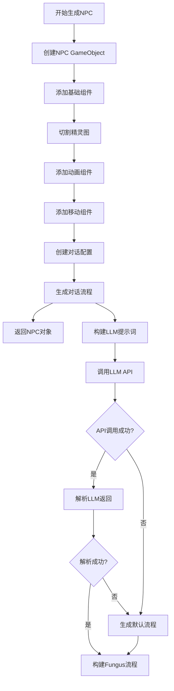

# 知识图谱更新 - NPC生成与对话流程

## 1. 新增API结构

### 1.1 NPCSpriteTool 类

#### 核心方法

| 方法名 | 参数 | 返回值 | 功能描述 |
|--------|------|--------|----------|
| `CreateNPCFromSprite` | Sprite fourDirWalkSprite | GameObject | 从精灵图创建NPC |
| `CreateNPCFromSprite` | Sprite fourDirWalkSprite, Vector3 position, string name, string personalitySetting | GameObject | 从精灵图创建NPC（带位置、名称和性格设定） |
| `CreateNPCFrom4DirSprite` | Sprite fourDirWalkSprite, Vector3 position, string name, string personalitySetting | GameObject | 核心创建方法 |
| `CreateDialogConfiguration` | GameObject npcObj, string name, string personalitySetting | void | 创建对话配置 |
| `GenerateDialogueFlowchart` | GameObject npcObj, string name, string personalitySetting, Flowchart flowchart | void | 使用LLM生成对话流程 |
| `ParseDialogueFromResponse` | string response | List<DialogueNode> | 解析LLM返回的对话数据 |
| `GenerateDefaultDialogueFlowchart` | Flowchart flowchart, string name | void | 生成默认对话流程 |
| `Split4Dir3FrameSprite` | Sprite fullSprite | Sprite[,] | 切割4行3列精灵图 |

### 1.2 DoubaoApiManager 类

#### 核心方法

| 方法名 | 参数 | 返回值 | 功能描述 |
|--------|------|--------|----------|
| `SendChatRequest` | string setting, Action<ChatCompletionResponse> onSuccess, Action<string> onFail | void | 发送LLM请求 |
| `RequestCoroutine` | string setting, Action<ChatCompletionResponse> onSuccess, Action<string> onFail | IEnumerator | 协程请求方法 |

#### 数据结构

| 类名 | 字段 | 类型 | 描述 |
|------|------|------|------|
| `ChatCompletionRequest` | Model | string | 模型名称 |
| | Messages | List<ChatMessage> | 消息列表 |
| | Temperature | float | 温度参数 |
| | Stream | bool | 流式输出 |
| `ChatMessage` | Role | string | 角色（system/user/assistant） |
| | Content | string | 内容 |
| `ChatCompletionResponse` | Choices | List<ChatChoice> | 选项列表 |
| `ChatChoice` | Message | ChatMessage | 消息内容 |
| `StreamOptions` | IncludeUsage | bool | 是否包含使用情况 |

### 1.3 FungusNodeBuilder 类

#### 核心方法

| 方法名 | 参数 | 返回值 | 功能描述 |
|--------|------|--------|----------|
| `BuildNodeDialogue` | Flowchart flowchart, AIDialogueConfig config | void | 构建Fungus对话流程 |
| `CreateNodeBlock` | Flowchart flowchart, DialogueNode node, string npcName | Block | 创建对话节点块 |
| `BindBranchToBlock` | Block block, DialogueBranch[] branches, Dictionary<string, Block> dict | void | 绑定选项分支 |
| `CreateCustomInputBlock` | Flowchart flowchart | Block | 创建自定义输入块 |
| `AddCommandToBlock<T>` | Block block | T | 添加命令到块 |

#### 数据结构

| 类名 | 字段 | 类型 | 描述 |
|------|------|------|------|
| `AIDialogueConfig` | character | string | 角色名称 |
| | dialogue | List<DialogueNode> | 对话节点列表 |
| `DialogueNode` | id | string | 节点ID |
| | text | string | 对话文本 |
| | waitTime | float | 等待时间 |
| | branches | DialogueBranch[] | 分支选项 |
| `DialogueBranch` | optionText | string | 选项文本 |
| | nextDialogue | string | 下一个对话ID |

## 2. NPC生成流程

### 2.1 完整流程



### 2.2 对话流程生成

1. **构建LLM提示词**：包含NPC名称、性格设定、对话节点要求
2. **调用LLM API**：使用DoubaoApiManager发送请求
3. **解析LLM返回**：提取JSON格式的对话数据
4. **构建Fungus流程**：使用FungusNodeBuilder创建对话节点
5. **失败处理**：API调用失败或解析失败时生成默认对话流程

### 2.3 生成的NPC组件

- **基础组件**：SpriteRenderer、BoxCollider2D
- **动画组件**：NPC4DirFrameAnimator
- **移动组件**：NPCMovement
- **对话组件**：NPCDialogue、NPCDialogueConfig、Dialogable
- **Fungus组件**：Flowchart、Character

## 3. API调用示例

### 3.1 生成NPC

```csharp
// 从精灵图生成NPC
Sprite sprite = TextureConverter.CreateSpriteFromPath("path/to/sprite.png");
GameObject npc = NPCSpriteTool.CreateNPCFromSprite(sprite, transform.position, "守卫", "勇敢、忠诚的守卫，负责保护村庄安全");
```

### 3.2 调用LLM API

```csharp
// 构建提示词
string prompt = "为名为守卫的NPC生成对话流程...";

// 调用API
DoubaoApiManager.Instance.SendChatRequest(prompt, 
    (response) => {
        // 处理成功响应
        string llmResponse = response.Choices[0].Message.Content;
        // 解析并构建对话流程
    }, 
    (error) => {
        // 处理错误
        Debug.LogError($"API调用失败：{error}");
    });
```

### 3.3 构建Fungus流程

```csharp
// 创建AIDialogueConfig
AIDialogueConfig aiConfig = new AIDialogueConfig();
aiConfig.character = "守卫";

// 添加对话节点
DialogueNode node1 = new DialogueNode();
node1.id = "1";
node1.text = "你好，冒险者！";
node1.branches = new DialogueBranch[] {
    new DialogueBranch() { optionText = "你好", nextDialogue = "2" },
    new DialogueBranch() { optionText = "再见", nextDialogue = "3" }
};
aiConfig.dialogue.Add(node1);

// 构建流程
FungusNodeBuilder.BuildNodeDialogue(flowchart, aiConfig);
```

## 4. 错误处理

### 4.1 LLM API调用失败
- 生成默认对话流程
- 记录错误日志

### 4.2 JSON解析失败
- 生成默认对话流程
- 记录错误日志

### 4.3 精灵图无效
- 检查精灵图尺寸是否为4行3列
- 记录错误日志

## 5. 性能优化

### 5.1 异步处理
- 使用协程处理LLM API调用
- 避免阻塞主线程

### 5.2 缓存机制
- 缓存生成的对话流程
- 避免重复调用LLM API

### 5.3 错误处理
- 提供默认对话流程作为 fallback
- 确保游戏体验不受API调用失败影响

## 6. 未来扩展

### 6.1 支持更多对话类型
- 分支对话
- 条件对话
- 随机对话

### 6.2 支持更多LLM模型
- OpenAI GPT
- Anthropic Claude
- Google Gemini

### 6.3 对话数据持久化
- 保存生成的对话流程
- 支持对话历史记录

## 7. 代码结构

```
Assets/
├── ProjectResources/
│   ├── Entity/
│   │   ├── Colliable/
│   │   │   ├── Damageable/
│   │   │   │   ├── Character/
│   │   │   │   │   ├── NPC/
│   │   │   │   │   │   ├── Script/
│   │   │   │   │   │   │   ├── ApiCore.cs         # API核心数据结构
│   │   │   │   │   │   │   ├── Utility/
│   │   │   │   │   │   │   │   └── DialogJSONAPI.cs  # LLM API调用
│   │   ├── Generator/
│   │   │   ├── Script/
│   │   │   │   ├── NPCSpriteTool.cs                 # NPC生成工具
│   │   │   │   └── Manager/
│   │   │   │       └── NPCSettingManager.cs         # NPC设置管理器
│   ├── Utils/
│   │   ├── FungusNodeBuilder.cs                      # Fungus流程构建器
│   │   └── Files/
│   │       └── FileUtil.cs                          # 文件工具
├── Texts/
│   ├── APISystemSetting.md                           # API系统设置
│   └── 知识图谱更新.md                               # 本文档
```

## 8. 总结

本更新实现了以下功能：

1. **智能对话流程生成**：使用LLM根据NPC性格设定自动生成对话流程
2. **Fungus流程构建**：将LLM生成的对话数据转换为Fungus对话流程
3. **错误处理机制**：API调用失败时生成默认对话流程
4. **完整的NPC生成**：从精灵图到对话系统的完整生成流程

这些功能为游戏添加了更丰富的NPC交互体验，使每个NPC都有独特的对话风格和性格特点。