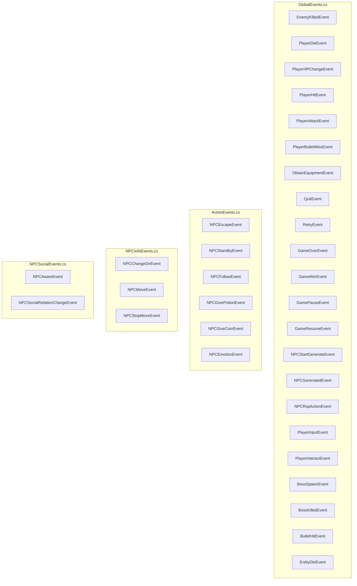
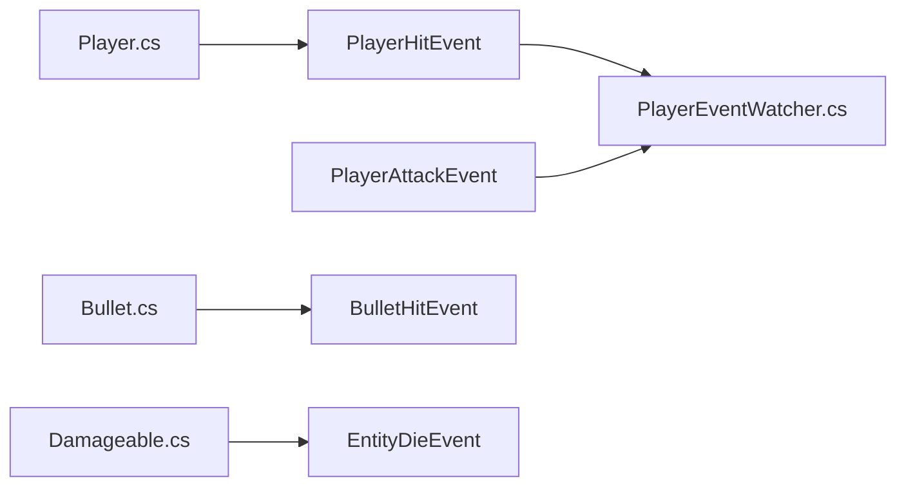
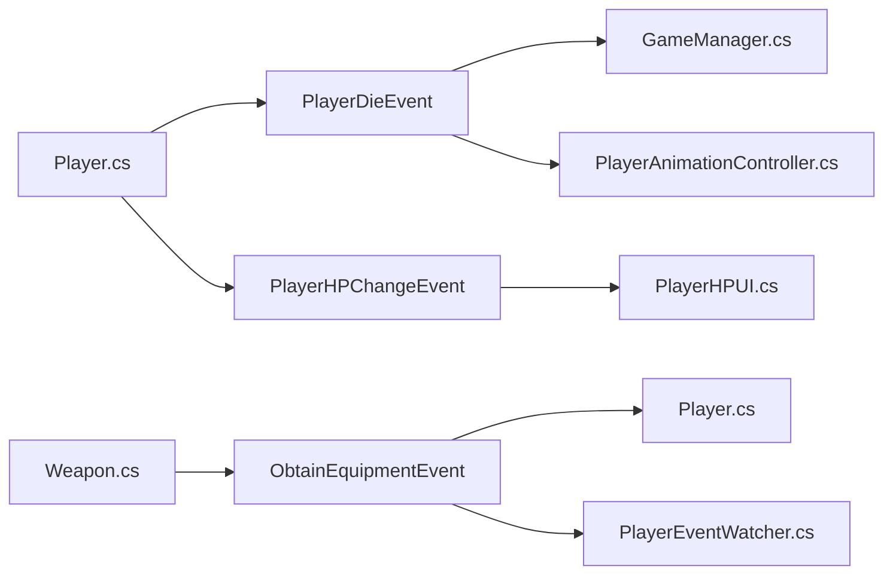
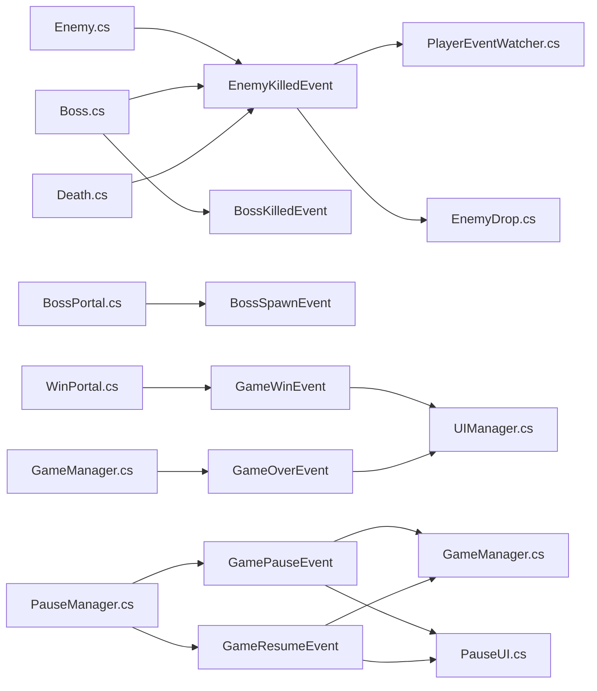
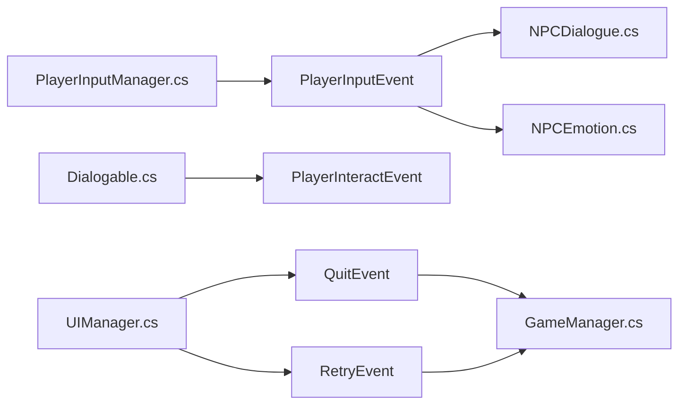
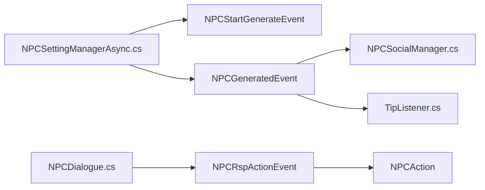
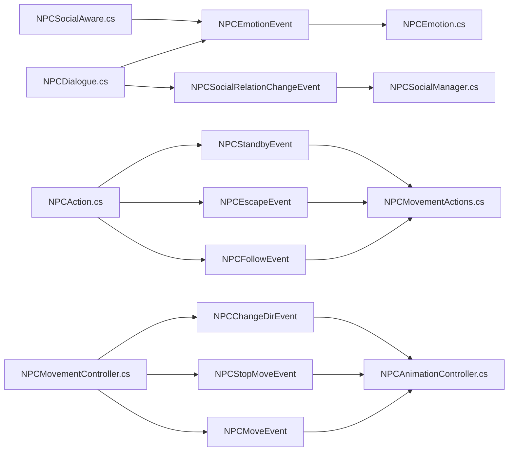

# EventBus 事件发布与订阅关系

## 全局事件总线 (EventBus)

```mermaid
graph LR
    %% 左列：发布者（使用实际文件名）
    Enemy["Enemy.cs"]
    Boss["Boss.cs"]
    Death["Death.cs"]
    Player["Player.cs"]
    Damageable["Damageable.cs"]
    Bullet["Bullet.cs"]
    Weapon["Weapon.cs"]
    UIManager["UIManager.cs"]
    PauseManager["PauseManager.cs"]
    GameManager["GameManager.cs"]
    WinPortal["WinPortal.cs"]
    NPCSettingManagerAsync["NPCSettingManagerAsync.cs"]
    NPCDialogue["NPCDialogue.cs"]
    PlayerInputManager["PlayerInputManager.cs"]
    Dialogable["Dialogable.cs"]
    BossPortal["BossPortal.cs"]
    PlayerLevelSystem["PlayerLevelSystem.cs"]

    %% 中列：事件（按定义文件分组）
    subgraph Events_Global["GlobalEvents.cs"]
        direction TB
        EnemyKilledEvent["EnemyKilledEvent"]
        PlayerDieEvent["PlayerDieEvent"]
        PlayerHPChangeEvent["PlayerHPChangeEvent"]
        PlayerHitEvent["PlayerHitEvent"]
        PlayerAttackEvent["PlayerAttackEvent"]
        ObtainEquipmentEvent["ObtainEquipmentEvent"]
        QuitEvent["QuitEvent"]
        RetryEvent["RetryEvent"]
        GameOverEvent["GameOverEvent"]
        GameWinEvent["GameWinEvent"]
        GamePauseEvent["GamePauseEvent"]
        GameResumeEvent["GameResumeEvent"]
        PlayerInputEvent["PlayerInputEvent"]
        PlayerInteractEvent["PlayerInteractEvent"]
        BossSpawnEvent["BossSpawnEvent"]
        BossKilledEvent["BossKilledEvent"]
        BulletHitEvent["BulletHitEvent"]
        EntityDieEvent["EntityDieEvent"]
        NPCStartGenerateEvent["NPCStartGenerateEvent"]
        NPCGeneratedEvent["NPCGeneratedEvent"]
        NPCRspActionEvent["NPCRspActionEvent"]
        PlayerGainExpEvent["PlayerGainExpEvent"]
        PlayerLevelUpEvent["PlayerLevelUpEvent"]
    end

    %% 右列：订阅者（使用实际文件名）
    PlayerEventWatcher["PlayerEventWatcher.cs"]
    GameManager_Sub["GameManager.cs"]
    UIManager_Sub["UIManager.cs"]
    PlayerHPUI["PlayerHPUI.cs"]
    PlayerAnimationController["PlayerAnimationController.cs"]
    EnemyDrop["EnemyDrop.cs"]
    Damageable_Sub["Damageable.cs"]
    Player_Sub["Player.cs"]
    PauseUI["PauseUI.cs"]
    TipListener["TipListener.cs"]
    NPCAction["NPCAction.cs"]
    NPCDialogue_Sub["NPCDialogue.cs"]
    NPCEmotion["NPCEmotion.cs"]
    NPCSocialManager["NPCSocialManager.cs"]
    PlayerLevelSystem_Sub["PlayerLevelSystem.cs"]

    %% 发布者 → 事件
    Enemy --> EnemyKilledEvent
    Boss --> EnemyKilledEvent
    Boss --> BossKilledEvent
    Death --> EnemyKilledEvent
    Player --> PlayerDieEvent
    Player --> PlayerHPChangeEvent
    Player --> PlayerHitEvent
    Player --> ObtainEquipmentEvent
    Bullet --> BulletHitEvent
    Weapon --> ObtainEquipmentEvent
    Weapon --> PlayerAttackEvent
    UIManager --> QuitEvent
    UIManager --> RetryEvent
    PauseManager --> GamePauseEvent
    PauseManager --> GameResumeEvent
    GameManager --> GameOverEvent
    WinPortal --> GameWinEvent
    NPCSettingManagerAsync --> NPCStartGenerateEvent
    NPCSettingManagerAsync --> NPCGeneratedEvent
    NPCDialogue --> NPCRspActionEvent
    PlayerInputManager --> PlayerInputEvent
    Dialogable --> PlayerInteractEvent
    BossPortal --> BossSpawnEvent
    Damageable --> EntityDieEvent
    PlayerLevelSystem --> PlayerLevelUpEvent

    %% 事件 → 订阅者
    EnemyKilledEvent --> PlayerEventWatcher
    EnemyKilledEvent --> EnemyDrop
    PlayerDieEvent --> GameManager_Sub
    PlayerDieEvent --> PlayerAnimationController
    PlayerHPChangeEvent --> PlayerHPUI
    PlayerHitEvent --> PlayerEventWatcher
    PlayerAttackEvent --> PlayerEventWatcher
    BulletHitEvent --> Damageable_Sub
    BulletHitEvent --> Player_Sub
    ObtainEquipmentEvent --> PlayerEventWatcher
    ObtainEquipmentEvent --> Player_Sub
    QuitEvent --> GameManager_Sub
    RetryEvent --> GameManager_Sub
    GameOverEvent --> UIManager_Sub
    GameWinEvent --> UIManager_Sub
    GamePauseEvent --> GameManager_Sub
    GamePauseEvent --> PauseUI
    GameResumeEvent --> GameManager_Sub
    GameResumeEvent --> PauseUI
    NPCGeneratedEvent --> NPCSocialManager
    NPCGeneratedEvent --> TipListener
    NPCRspActionEvent --> NPCAction
    PlayerInputEvent --> NPCDialogue_Sub
    PlayerInputEvent --> NPCEmotion
    PlayerLevelUpEvent --> TipListener
    PlayerGainExpEvent --> PlayerLevelSystem_Sub
```

## 全局事件总线 - 按事件定义文件分组

## 全局事件总线 - 按功能模块分类（细化到文件）

### 模块一：战斗与伤害系统

### 模块二：玩家状态与属性

### 模块三：游戏进程管理

### 模块四：玩家交互系统

### 模块五：NPC系统

## NPC 本地事件总线 (NPC\_EventBus)

## 图例说明

| 总线类型              | 说明                             | 使用的事件                                                                   |
| ----------------- | ------------------------------ | ----------------------------------------------------------------------- |
| **EventBus**      | 全局事件总线，所有脚本均可访问                | EnemyKilledEvent, PlayerDieEvent, BossKilledEvent, BulletHitEvent 等全局事件 |
| **NPC\_EventBus** | NPC本地事件总线，每个NPC\_Genearted实例独有 | NPCMoveEvent, NPCFollowEvent, NPCEmotionEvent 等NPC相关事件                  |

## 事件流说明

1. **全局事件总线 (EventBus)**：用于游戏范围内需要广播的事件，如玩家受伤、敌人死亡、游戏状态变化等
2. **NPC本地事件总线 (NPC\_EventBus)**：用于NPC个体独有的行为事件，如NPC移动、NPC跟随、NPC表情变化等

## 完整事件关系表

### 发布者 → 事件 → 订阅者

| 序号 | 事件                    | 发布者文件                       | 订阅者文件                                             |
| -- | --------------------- | --------------------------- | ------------------------------------------------- |
| 1  | EnemyKilledEvent      | Enemy.cs, Boss.cs, Death.cs | PlayerEventWatcher.cs, EnemyDrop.cs               |
| 2  | BossKilledEvent       | Boss.cs                     | (无订阅者)                                            |
| 3  | PlayerDieEvent        | Player.cs                   | GameManager.cs, PlayerAnimationController.cs      |
| 4  | PlayerHPChangeEvent   | Player.cs                   | PlayerHPUI.cs                                     |
| 5  | PlayerHitEvent        | Player.cs                   | PlayerEventWatcher.cs                             |
| 6  | PlayerAttackEvent     | (未找到发布者)                    | PlayerEventWatcher.cs                             |
| 9  | BulletHitEvent        | Bullet.cs                   | Damageable.cs, Player.cs                          |
| 10 | ObtainEquipmentEvent  | Weapon.cs                   | Player.cs, PlayerEventWatcher.cs                  |
| 11 | QuitEvent             | UIManager.cs                | GameManager.cs                                    |
| 12 | RetryEvent            | UIManager.cs                | GameManager.cs                                    |
| 13 | GameOverEvent         | GameManager.cs              | UIManager.cs                                      |
| 14 | GameWinEvent          | WinPortal.cs                | UIManager.cs                                      |
| 15 | GamePauseEvent        | PauseManager.cs             | GameManager.cs, PauseUI.cs                        |
| 16 | GameResumeEvent       | PauseManager.cs             | GameManager.cs, PauseUI.cs                        |
| 17 | NPCStartGenerateEvent | NPCSettingManagerAsync.cs   | (无订阅者)                                            |
| 18 | NPCGeneratedEvent     | NPCSettingManagerAsync.cs   | NPCSocialManager.cs, TipListener.cs               |
| 19 | NPCRspActionEvent     | NPCDialogue.cs              | NPCAction.cs                                      |
| 20 | PlayerInputEvent      | PlayerInputManager.cs       | NPCDialogue.cs, NPCEmotion.cs                     |
| 21 | PlayerInteractEvent   | Dialogable.cs               | (无订阅者)                                            |
| 22 | BossSpawnEvent        | BossPortal.cs               | (无订阅者)                                            |
| 23 | EntityDieEvent        | Damageable.cs               | (无订阅者)                                            |

### NPC本地事件关系表

| 序号 | 事件                           | 发布者文件                             | 订阅者文件                     |
| -- | ---------------------------- | --------------------------------- | ------------------------- |
| 1  | NPCMoveEvent                 | NPCMovementController.cs          | NPCAnimationController.cs |
| 2  | NPCStopMoveEvent             | NPCMovementController.cs          | NPCAnimationController.cs |
| 3  | NPCChangeDirEvent            | NPCMovementController.cs          | NPCAnimationController.cs |
| 4  | NPCFollowEvent               | NPCAction.cs                      | NPCMovementActions.cs     |
| 5  | NPCEscapeEvent               | NPCAction.cs                      | NPCMovementActions.cs     |
| 6  | NPCStandbyEvent              | NPCAction.cs                      | NPCMovementActions.cs     |
| 7  | NPCEmotionEvent              | NPCDialogue.cs, NPCSocialAware.cs | NPCEmotion.cs             |
| 8  | NPCSocialRelationChangeEvent | NPCDialogue.cs                    | NPCSocialManager.cs       |

## 事件定义文件汇总表

### 全局事件定义文件

| 序号 | 文件名             | 项目路径                                         | 命名空间         | 包含的事件                                                                                                                                                                                                                                                                                                                                                                                                                |
| -- | --------------- | -------------------------------------------- | ------------ | -------------------------------------------------------------------------------------------------------------------------------------------------------------------------------------------------------------------------------------------------------------------------------------------------------------------------------------------------------------------------------------------------------------------- |
| 1  | GlobalEvents.cs | Assets/ProjectResources/Base/GlobalEvents.cs | GlobalEvents | EnemyKilledEvent, PlayerDieEvent, PlayerHPChangeEvent, PlayerHitEvent, PlayerAttackEvent, ObtainEquipmentEvent, QuitEvent, RetryEvent, GameOverEvent, GameWinEvent, GamePauseEvent, GameResumeEvent, NPCStartGenerateEvent, NPCGeneratedEvent, NPCRspActionEvent, PlayerInputEvent, PlayerInteractEvent, BossSpawnEvent, BossKilledEvent, BulletHitEvent, EntityDieEvent |

### NPC局部事件定义文件

| 序号 | 文件名                | 项目路径                                                                           | 命名空间            | 包含的事件                                                                                                  |
| -- | ------------------ | ------------------------------------------------------------------------------ | --------------- | ------------------------------------------------------------------------------------------------------ |
| 1  | ActionEvents.cs    | Assets/ProjectResources/Entity/Characters/NPC/Script/Action/ActionEvents.cs    | NPCActionEvents | NPCEscapeEvent, NPCStandbyEvent, NPCFollowEvent, NPCGivePotionEvent, NPCGiveCoinEvent, NPCEmotionEvent |
| 2  | NPCInfoEvents.cs   | Assets/ProjectResources/Entity/Characters/NPC/Script/Action/NPCInfoEvents.cs   | NPCInfoEvents   | NPCChangeDirEvent, NPCMoveEvent, NPCStopMoveEvent                                                      |
| 3  | NPCSocialEvents.cs | Assets/ProjectResources/Entity/Characters/NPC/Script/Social/NPCSocialEvents.cs | NPCSocialEvents | NPCAwareEvent, NPCSocialRelationChangeEvent                                                            |

### 基础事件接口定义

| 序号 | 文件名       | 项目路径                                            | 命名空间 | 说明                                      |
| -- | --------- | ----------------------------------------------- | ---- | --------------------------------------- |
| 1  | Events.cs | Assets/ProjectResources/Base/EventBus/Events.cs | (全局) | 定义IEvent接口，TestEvent, PlayerEvent (测试用) |

