# 项目知识图谱

## 项目结构概览

本项目是一个基于Unity的2D RPG射击游戏，包含多个功能模块，以下是项目的脚本结构和功能分析。

## 核心系统

### 游戏管理系统
- **GameManager.cs** - 游戏核心管理器，负责游戏状态、场景切换、玩家引用管理
- **DialogManager.cs** - 对话管理器，管理NPC对话流程
- **MenuManager.cs** - 菜单管理器，处理游戏菜单逻辑
- **SoundManager.cs** - 声音管理器，处理游戏音效
- **StatusIndicator.cs** - 状态指示器
- **MoneyCounterUI.cs** - 金钱计数器UI
- **GameOverUI.cs** - 游戏结束UI
- **GameWinUI.cs** - 游戏胜利UI

### 角色系统
- **Character.cs** - 角色基类，定义角色的基本属性和方法
- **Player.cs** - 玩家控制器，处理玩家移动、武器使用等
- **Enemy.cs** - 敌人基类，处理敌人的基本行为
  - **Zombie.cs** - 僵尸敌人
  - **Treant.cs** - 树人敌人
  - **Ghost.cs** - 幽灵敌人
  - **Boss.cs** -  boss敌人
- **Vendor.cs** - 商人NPC
- **NPCMovementAI.cs** - NPC移动AI
- **NPCSpawner.cs** - NPC生成器

### 武器系统
- **Weapon.cs** - 武器基类，定义武器的基本属性和方法
  - **Gun.cs** - 枪支类，继承自Weapon
- **Shootable.cs** - 处理子弹的发射逻辑
- **Bullet.cs** - 基础子弹类，处理碰撞检测和伤害计算
  - **EnemyBullet.cs** - 敌人子弹类，继承自Bullet
- **BulletEffect.cs** - 子弹效果接口
  - **SplitBulletEffect.cs** - 分裂子弹效果
  - **ClusterBulletEffect.cs** - 子母弹效果
  - **PiercingBulletEffect.cs** - 穿透子弹效果
- **BulletEffectManager.cs** - 子弹效果管理器

### 地图生成系统
- **ChunkManager.cs** - 全局区块管理器，单例模式
- **ChunkLoader.cs** - 基于相机视野动态加载/卸载区块
- **Chunk.cs** - 区块具体实现
- **ChunkData.cs** - 区块数据具体实现
- **ChunkVisualizer.cs** - 将生成的地形数据绘制到Tilemap上
- **BaseTerrainGenerator.cs** - 使用柏林噪声+多频率叠加生成地形
- **TreeGenerator.cs** - 树木生成器
- **RockGenerator.cs** - 岩石生成器
- **BushGenerator.cs** - 灌木生成器
- **DecoratorGenerator.cs** - 装饰生成器
- **MonumentGenerator.cs** - 纪念碑生成器
- **VillageGenerator.cs** - 村庄生成器
- **DebugGenerator.cs** - 调试生成器
- **GeneratorBase.cs** - 生成器基类
- **PrefabGeneratorBase.cs** - 预制体生成器基类
- **TilemapManager.cs** - 管理共享的Tilemap资源
- **TilemapUtility.cs** - Tilemap操作工具类
- **ChunkCoordinateUtility.cs** - 处理世界坐标和区块坐标之间的转换
- **Constants.cs** - 常量定义
- **Enums.cs** - 枚举定义
- **DebugUI.cs** - 调试UI
- **TerrainDetector.cs** - 地形检测器

### UI系统
- **PlayerInputManager.cs** - 单例模式，管理玩家输入UI的显示和隐藏
- **UpgradeMenu.cs** - 升级菜单
- **MapMenu.cs** - 地图菜单
- **HealthBar.cs** - 健康条
- **CoinCounter.cs** - 金币计数器
- **UI_Inventory.cs** - 背包UI
- **UI_Shop.cs** - 商店UI
- **DialogSceneTestCase.cs** - 对话场景测试用例
- **FungusDialogRenderer.cs** - 单例模式，对话渲染工具类
- **FloatingText.cs** - 浮动文本
- **FloatingTextManager.cs** - 浮动文本管理器
- **Dialog.cs** - 传统对话数据结构

### 事件系统
- **RandomEvent.cs** - 随机事件基类
- **RandomEventManager.cs** - 随机事件管理器
  - **EnemyInvasionEvent.cs** - 敌人入侵事件
  - **ItemDropEvent.cs** - 物品掉落事件

### 触发器系统
- **TriggerZone.cs** - 触发区域基类
- **TriggerPoint.cs** - 触发点
- **PortalTrigger.cs** - 传送门触发器
- **BossTriggerZone.cs** - Boss触发区域
- **BossPortalTrigger.cs** - Boss传送门触发器
- **EnemyTriggerZone.cs** - 敌人触发区域
- **Spawner.cs** - 生成器

### 收集系统
- **Collectible.cs** - 可收集物品基类
  - **Coin.cs** - 金币
  - **Potion.cs** - 药水
  - **Chest.cs** - 宝箱
  - **GoldChest.cs** - 金宝箱

### 可破坏物体
- **Destructible.cs** - 可破坏物体基类
  - **Barrel.cs** - 木桶

### 相机系统
- **CameraFollow.cs** - 相机跟随
- **CameraRescale.cs** - 相机缩放
- **Crosshair.cs** - 十字准星

### 其他系统
- **Damageable.cs** - 可伤害对象
- **Collidable.cs** - 可碰撞对象
- **Portal.cs** - 传送门
  - **WinPortal.cs** - 胜利传送门
- **Shop.cs** - 商店系统
- **Sound.cs** - 声音组件
- **Death.cs** - 死亡效果
- **ObjectPoolManager.cs** - 对象池管理器

## 脚本依赖关系

### 核心依赖
- **GameManager** 依赖 **Player**、**Flowchart**
- **Player** 依赖 **Character**、**Weapon**、**Shootable**
- **Enemy** 依赖 **Character**
- **Weapon** 依赖 **Shootable**
- **Shootable** 依赖 **Bullet**
- **Bullet** 依赖 **Damageable**
- **ChunkManager** 依赖 **ChunkLoader**、**Chunk**
- **ChunkLoader** 依赖 **Chunk**
- **Chunk** 依赖 **ChunkData**、**ChunkVisualizer**
- **ChunkVisualizer** 依赖 **TilemapManager**

### 继承关系
- **Player** → **Character**
- **Enemy** → **Character**
- **Zombie** → **Enemy**
- **Treant** → **Enemy**
- **Ghost** → **Enemy**
- **Boss** → **Enemy**
- **Vendor** → **NPC**
- **Weapon** → **MonoBehaviour**
- **Gun** → **Weapon**
- **Bullet** → **MonoBehaviour**
- **EnemyBullet** → **Bullet**
- **RandomEvent** → **MonoBehaviour**
- **EnemyInvasionEvent** → **RandomEvent**
- **ItemDropEvent** → **RandomEvent**
- **Collectible** → **MonoBehaviour**
- **Coin** → **Collectible**
- **Potion** → **Collectible**
- **Chest** → **Collectible**
- **GoldChest** → **Chest**
- **Destructible** → **MonoBehaviour**
- **Barrel** → **Destructible**
- **Portal** → **MonoBehaviour**
- **WinPortal** → **Portal**
- **GeneratorBase** → **MonoBehaviour**
- **BaseTerrainGenerator** → **GeneratorBase**
- **TreeGenerator** → **PrefabGeneratorBase**
- **RockGenerator** → **PrefabGeneratorBase**
- **BushGenerator** → **PrefabGeneratorBase**
- **DecoratorGenerator** → **GeneratorBase**
- **MonumentGenerator** → **PrefabGeneratorBase**
- **VillageGenerator** → **PrefabGeneratorBase**
- **DebugGenerator** → **GeneratorBase**
- **PrefabGeneratorBase** → **GeneratorBase**
- **IChunk** → **Interface**
- **Chunk** → **IChunk**
- **IChunkData** → **Interface**
- **ChunkData** → **IChunkData**
- **IChunkVisualizer** → **Interface**
- **ChunkVisualizer** → **IChunkVisualizer**
- **IChunkGenerator** → **Interface**
- **BulletEffect** → **Interface**
- **SplitBulletEffect** → **BulletEffect**
- **ClusterBulletEffect** → **BulletEffect**
- **PiercingBulletEffect** → **BulletEffect**

## 项目功能模块

### 1. 游戏核心系统
- **游戏管理**：游戏状态控制、场景切换、玩家管理
- **对话系统**：基于Fungus的传统对话
- **菜单系统**：游戏菜单、设置菜单
- **声音系统**：音效和音乐管理

### 2. 角色系统
- **玩家**：移动、攻击、武器使用
- **敌人**：AI行为、攻击、移动
- **NPC**：对话、移动、交互

### 3. 武器系统
- **武器管理**：枪支使用、弹药管理
- **子弹系统**：子弹发射、碰撞检测、伤害计算
- **特效系统**：子弹特效、击中效果

### 4. 地形生成系统
- **区块管理**：动态加载/卸载区块
- **地形生成**：噪声算法生成地形
- **物体生成**：树木、岩石、装饰生成
- **可视化**：Tilemap绘制、碰撞体生成

### 5. UI系统
- **玩家界面**：健康条、金币显示、背包
- **菜单界面**：升级菜单、地图菜单、商店
- **输入系统**：玩家输入管理、对话输入

### 6. 事件系统
- **随机事件**：敌人入侵、物品掉落
- **事件管理**：事件触发、事件处理

### 7. 触发器系统
- **区域触发**：敌人生成、Boss战触发
- **传送系统**：传送门、关卡切换

### 8. 收集系统
- **物品收集**：金币、药水、宝箱
- **背包管理**：物品存储、使用

### 9. 可破坏物体
- **环境互动**：破坏木桶、箱子
- **掉落系统**：破坏后物品掉落

### 10. 相机系统
- **相机跟随**：跟随玩家或十字准星
- **相机缩放**：视野调整、瞄准模式

## 脚本文件结构

```
ProjectResources/
├── Entity/
│   └── Colliable/
│       └── Damageable/
│           ├── Damageable.cs
│           ├── Character/
│           │   ├── Player/
│           │   │   └── Player.cs
│           │   ├── Enemy/
│           │   │   ├── Enemy.cs
│           │   │   ├── EnemyAI.cs
│           │   │   ├── Zombie.cs
│           │   │   ├── Treant.cs
│           │   │   ├── Ghost.cs
│           │   │   ├── Boss.cs
│           │   │   └── Death.cs
│           │   └── NPC_/
│           │       └── Vendor.cs
│           └── Destructibles/
│               ├── Destructible.cs
│               └── Barrel.cs
├── MapGeneration/
│   ├── MapGeneration_chunk/
│   │   ├── Core/
│   │   │   ├── Interfaces/
│   │   │   │   ├── IChunk.cs
│   │   │   │   ├── IChunkData.cs
│   │   │   │   ├── IChunkVisualizer.cs
│   │   │   │   └── IChunkGenerator.cs
│   │   │   ├── Constants.cs
│   │   │   ├── Enums.cs
│   │   │   └── GeneratorBase.cs
│   │   ├── Chunk/
│   │   │   ├── Chunk.cs
│   │   │   └── ChunkCoordinateUtility.cs
│   │   ├── Data/
│   │   │   └── ChunkData.cs
│   │   ├── Debug/
│   │   │   ├── DebugUI.cs
│   │   │   └── TerrainDetector.cs
│   │   ├── Generator/
│   │   │   ├── BaseTerrainGenerator.cs
│   │   │   ├── TreeGenerator.cs
│   │   │   ├── RockGenerator.cs
│   │   │   ├── BushGenerator.cs
│   │   │   ├── DecoratorGenerator.cs
│   │   │   ├── MonumentGenerator.cs
│   │   │   ├── VillageGenerator.cs
│   │   │   ├── DebugGenerator.cs
│   │   │   └── PrefabGeneratorBase.cs
│   │   ├── Manager/
│   │   │   ├── ChunkManager.cs
│   │   │   ├── ChunkLoader.cs
│   │   │   └── ObjectPoolManager.cs
│   │   ├── Utility/
│   │   │   ├── TilemapManager.cs
│   │   │   └── TilemapUtility.cs
│   │   └── Visualizer/
│   │       └── ChunkVisualizer.cs
│   └── Tiles/
│       └── Scripts/
│           └── GrassTile.cs
├── Weapon/
│   └── Scripts/
│       ├── Bullet/
│       │   ├── Bullet.cs
│       │   ├── BulletEffect.cs
│       │   ├── BulletEffectManager.cs
│       │   └── Effects/
│       │       ├── SplitBulletEffect.cs
│       │       ├── ClusterBulletEffect.cs
│       │       └── PiercingBulletEffect.cs
│       ├── Shootable.cs
│       └── Shootable/
│           └── Weapon/
│               └── Gun.cs
├── GameManager/
│   └── Script/
│       ├── GameManager.cs
│       ├── DialogManager.cs
│       ├── MenuManager.cs
│       ├── SoundManager.cs
│       ├── StatusIndicator.cs
│       ├── MoneyCounterUI.cs
│       ├── GameOverUI.cs
│       └── GameWinUI.cs
├── UI/
│   ├── Script/
│   │   ├── PlayerInputManager.cs
│   │   ├── UpgradeMenu.cs
│   │   ├── MapMenu.cs
│   │   ├── HealthBar.cs
│   │   ├── CoinCounter.cs
│   │   ├── DialogSceneTestCase.cs
│   │   ├── Inventory/
│   │   │   ├── UI_Inventory.cs
│   │   │   └── Inventory.cs
│   │   ├── Shop/
│   │   │   ├── UI_Shop.cs
│   │   │   └── Shop.cs
│   │   ├── FloatingText/
│   │   │   ├── FloatingText.cs
│   │   │   └── FloatingTextManager.cs
│   │   └── Dialog/
│   │       ├── DialogManager.cs
│   │       └── Dialog.cs
│   └── Health Bar/
│       └── HealthBarRenderer.cs
├── GameEvent/
│   ├── RandomEvent.cs
│   ├── RandomEventManager.cs
│   └── Events/
│       ├── EnemyInvasionEvent.cs
│       └── ItemDropEvent.cs
├── TriggerZone/
│   ├── TriggerZone.cs
│   ├── TriggerPoint.cs
│   └── TrapSystem/
│       ├── PortalTrigger.cs
│       ├── BossTriggerZone.cs
│       ├── BossPortalTrigger.cs
│       ├── EnemyTriggerZone.cs
│       └── Spawner.cs
├── Portal/
│   └── Script/
│       ├── Portal.cs
│       └── WinPortal.cs
└── Sound/
    ├── SoundManager.cs
    └── Sound.cs
```

## 依赖关系图

```mermaid
graph TD
    subgraph 核心系统
        GameManager --> Player
        GameManager --> Flowchart
        DialogManager --> NPC
        MenuManager --> GameManager
        SoundManager --> GameManager
    end

    subgraph 角色系统
        Player --> Character
        Player --> Weapon
        Enemy --> Character
        Vendor --> NPC
        NPC --> Collidable
        NPC --> NPCMovementAI
        Zombie --> Enemy
        Treant --> Enemy
        Ghost --> Enemy
        Boss --> Enemy
    end

    subgraph 武器系统
        Weapon --> Shootable
        Gun --> Weapon
        Shootable --> Bullet
        Bullet --> Damageable
        EnemyBullet --> Bullet
        BulletEffectManager --> BulletEffect
        SplitBulletEffect --> BulletEffect
        ClusterBulletEffect --> BulletEffect
        PiercingBulletEffect --> BulletEffect
    end

    subgraph 地图生成系统
        ChunkManager --> ChunkLoader
        ChunkManager --> Chunk
        ChunkLoader --> Chunk
        Chunk --> ChunkData
        Chunk --> ChunkVisualizer
        ChunkVisualizer --> TilemapManager
        BaseTerrainGenerator --> GeneratorBase
        TreeGenerator --> PrefabGeneratorBase
        RockGenerator --> PrefabGeneratorBase
        BushGenerator --> PrefabGeneratorBase
        DecoratorGenerator --> GeneratorBase
        MonumentGenerator --> PrefabGeneratorBase
        VillageGenerator --> PrefabGeneratorBase
        DebugGenerator --> GeneratorBase
        PrefabGeneratorBase --> GeneratorBase
    end

    subgraph UI系统
        PlayerInputManager --> GameManager
        UpgradeMenu --> GameManager
        MapMenu --> GameManager
        HealthBar --> Player
        CoinCounter --> Player
        UI_Inventory --> Inventory
        UI_Shop --> Shop
        FungusDialogRenderer --> Flowchart
    end

    subgraph 事件系统
        RandomEventManager --> RandomEvent
        EnemyInvasionEvent --> RandomEvent
        ItemDropEvent --> RandomEvent
    end

    subgraph 触发器系统
        PortalTrigger --> TriggerZone
        BossTriggerZone --> TriggerZone
        BossPortalTrigger --> TriggerZone
        EnemyTriggerZone --> TriggerZone
        Spawner --> TriggerZone
    end

    subgraph 收集系统
        Coin --> Collectible
        Potion --> Collectible
        Chest --> Collectible
        GoldChest --> Chest
    end

    subgraph 可破坏物体
        Barrel --> Destructible
    end

    subgraph 相机系统
        CameraFollow --> Player
        CameraRescale --> GameManager
        Crosshair --> CameraRescale
    end
```



## 总结

本项目是一个功能完整的2D RPG射击游戏，包含以下核心特性：

1. **完整的战斗系统**：武器、子弹、敌人AI
2. **丰富的角色系统**：玩家、敌人、NPC
3. **程序化地形生成**：使用噪声算法生成无限地形
4. **动态事件系统**：随机事件、触发器
5. **物品收集系统**：金币、药水、宝箱
6. **相机系统**：跟随、缩放、瞄准
7. **UI系统**：菜单、背包、商店

项目采用了模块化设计，各系统之间职责明确，依赖关系清晰，便于维护和扩展。通过Fungus插件实现了传统对话系统，为游戏增添了更多互动性和趣味性。

## 项目结构变更

最近项目结构进行了调整，从原来的Scripts目录迁移到了ProjectResources目录，采用了更加规范化的模块组织方式：

- **Entity**：包含所有游戏实体，如角色、敌人、NPC、可破坏物体等
- **MapGeneration**：包含地图生成相关的所有功能
- **Weapon**：包含武器和子弹系统
- **GameManager**：包含游戏核心管理功能
- **UI**：包含所有用户界面相关功能
- **GameEvent**：包含事件系统
- **TriggerZone**：包含触发器系统
- **Portal**：包含传送门系统
- **Sound**：包含声音系统

这种结构更加清晰，便于团队协作和代码维护。